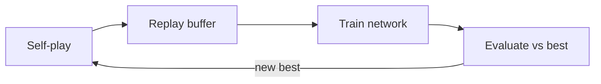

# Documentation Guidelines

This directory is the project's study log. **Every time something is implemented, a record of it goes into `docs/`.**
Write for a reader who has never seen this project: someone who knows basic Python and ML
but hasn't read the code and doesn't know what we tried before.

A good document answers five questions:

1. **What** did we build?
2. **Why** did we need it (what problem from the previous step does it solve)?
3. **How** does it work (concepts + key parts of the implementation)?
4. **What happened** when we ran it (experiments, numbers, figures)?
5. **What did we learn**, and what comes next?

---

## 1. Directory Layout

```
docs/
├── README.md                      # this file: guidelines + index of all documents
├── stage0-foundations/
│   ├── README.md                  # the stage document (main entry point)
│   └── images/
│       ├── arena-winrate.png
│       └── ...
├── stage1-tabular/
│   ├── README.md
│   ├── images/
│   └── experiments/               # optional: one file per larger experiment
│       └── 2026-10-05-epsilon-schedule.md
├── stage2-dqn/
└── ...
```

- One directory per stage, named `stageN-<short-name>` in lowercase kebab-case.
- `README.md` inside each stage directory is the main document for that stage.
- Images live in that stage's `images/` directory, not in a shared folder.
- If a single experiment needs a long write-up, give it its own file in `experiments/`,
  named `YYYY-MM-DD-<topic>.md`, and link it from the stage `README.md`.

## 2. When to Write

| Event | What to record |
|---|---|
| Starting a stage | Create `stageN-*/README.md` with the **Goal** and **Background** sections filled in |
| Finishing a component (agent, algorithm, tool) | Add it to **Implementation** |
| Running an experiment worth keeping | Add it to **Experiments** with setup, results, and a figure |
| Hitting a bug or surprise that taught something | Add it to **Pitfalls & Lessons** |
| Finishing a stage | Fill in **Summary** and **Next Steps**, update the index below and the checklist in the root `README.md` |

Write documentation together with the code, and commit them together. A commit that adds a feature
and a commit that documents it should not be far apart.

## 3. Stage Document Template

Copy this into `docs/stageN-<name>/README.md` and fill it in. Remove sections that don't apply,
but keep the order.

```markdown
# Stage N. <Title>

> **TL;DR** — One to three sentences: what was built and the headline result.
> e.g. "Tabular Q-learning with self-play reaches a never-losing tic-tac-toe policy after ~50k games."

## Goal
- What this stage sets out to do and how we will know it worked (a measurable success criterion).

## Background
- The concepts needed to understand this stage, briefly, in our own words.
- Key equations, with every symbol defined.
- Why the previous stage's approach was not enough.

## Implementation
- Overview of the components and how they fit together (a diagram helps).
- Links to the source files: [`src/omok_rl/agents/q_learning.py`](../../src/omok_rl/agents/q_learning.py)
- Short code excerpts only for the key idea (≤ ~20 lines). Don't paste whole files.
- Design decisions and the alternatives we rejected.

## Experiments
### <Experiment name>
- **Question**: what we wanted to find out.
- **Setup**: board size, rule, hyperparameters, number of games, seeds.
- **Command**: the exact command to reproduce it.
- **Results**: table and/or figure.
- **Observation**: what the results show, in plain words.

## Pitfalls & Lessons
- Bugs, surprises, and things that didn't work — and why.

## Summary
- What we achieved against the Goal.

## Next Steps
- What this stage leaves unsolved and how the next stage addresses it.

## References
- Papers, book chapters, blog posts actually used in this stage.
```

## 4. Writing Style

- **Language**: English.
- **Lead with the conclusion.** Put the result first (TL;DR), details after.
- **Short paragraphs and bullet lists** over long prose. One idea per paragraph.
- **Define terms on first use**, e.g. "afterstate (the board right after our move, before the opponent replies)".
- **Be concrete.** Prefer "win rate vs Random rose from 50% to 97% over 20k games" over "the agent improved a lot".
- **Report failures honestly.** A negative result with an explanation is as valuable as a success.
- **Use consistent names.** Use the same names as the code (class names, CLI flags, config keys) in `code font`.
- **Headings**: `#` for the document title only, `##` for sections, `###` for subsections. Don't go deeper than `####`.
- **Links**: use relative links to code and other docs so they work on GitHub and locally.

### Equations

GitHub renders LaTeX math. Use `$...$` inline and `$$...$$` for display equations, and always explain the symbols:

```markdown
$$
Q(s, a) \leftarrow Q(s, a) + \alpha \left[ r + \gamma \max_{a'} Q(s', a') - Q(s, a) \right]
$$

where $\alpha$ is the learning rate, $\gamma$ the discount factor, and $s'$ the next state.
```

### Tables

Use tables for comparisons and results. Include units, and always state **how many games** a win rate is based on
and **which color** the agent played.

```markdown
| Agent        | vs Random (B / W) | vs Heuristic (B / W) | Games |
|--------------|-------------------|----------------------|-------|
| Q-learning   | 99% / 96%         | 71% / 58%            | 200   |
| Double DQN   | 100% / 99%        | 85% / 77%            | 200   |
```

### Diagrams

For architecture, data flow, or training loops, use [Mermaid](https://mermaid.js.org/) blocks, which GitHub renders directly
and which stay easy to edit:

````markdown

````

Use an image only when Mermaid can't express it.

## 5. Images and Figures

### Rules

- **Generate figures from code, never by hand.** Every figure must be reproducible by a script
  (e.g. `scripts/plot_stage1.py`) that reads saved logs/results. Mention the script under the figure.
- **Format**: PNG for plots and board images; SVG is fine for diagrams. Avoid JPEG.
- **Naming**: lowercase kebab-case describing the content: `q-learning-winrate-vs-random.png`, not `fig1.png` or `Screenshot 2026-10-01.png`.
- **Size**: keep each image under ~500 KB. Save with `dpi=150` and a reasonable size (e.g. `figsize=(8, 5)`).
- **Placement**: in the stage's `images/` directory, referenced with a relative path.

### Plot checklist

- [ ] Title that states what is shown
- [ ] Axis labels **with units** (e.g. "Training games", "Win rate (%)")
- [ ] Legend when there is more than one line
- [ ] Shaded band or error bars when averaged over multiple seeds (state how many)
- [ ] Smoothing window noted if curves are smoothed
- [ ] Readable on a white background; colorblind-friendly palette (e.g. matplotlib `tab10`)

### Embedding

Always add a caption right below the image that says what to look at:

```markdown


*Figure 1. Win rate against Random (200 games per point, alternating colors, 3 seeds, mean ± std).
The agent stops losing after ~30k training games. Generated by `scripts/plot_stage1.py`.*
```

### Board positions

To illustrate a game position, either render it as a PNG with a plotting helper, or use the text board from
`print(env)` in a code block. Mark the move being discussed and say whose turn it is.

## 6. Reproducibility

Every experiment result must include enough information to rerun it:

- The **exact command** (`uv run python scripts/... --flag value`)
- **Hyperparameters** (or the config file path)
- **Random seed(s)**
- **Git commit hash** the result was produced with
- **Hardware and wall-clock time** for anything that takes more than a few minutes

Raw logs, checkpoints, and TensorBoard runs are **not** committed to `docs/`. Only the summarized results
(tables, figures) go here.

## 7. Before Committing — Checklist

- [ ] TL;DR states the headline result
- [ ] Every figure has a caption and is referenced in the text
- [ ] Every result has its command, seeds, and commit hash
- [ ] All links (code, images, other docs) work
- [ ] New terms are defined on first use
- [ ] The index below and the root `README.md` checklist are updated

---

## Index

| Stage | Document | Status |
|---|---|---|
| 0 | [Foundations — Environment & Evaluation](stage0-foundations/README.md) | Done |
| 1 | [Tabular RL — Tic-Tac-Toe](stage1-tabular/README.md) | Done |
| 2 | Value-Based Deep RL — DQN | Not started |
| 3 | Policy Gradients — REINFORCE → A2C → PPO | Not started |
| 4 | Search — MCTS | Not started |
| 5 | AlphaZero | Not started |
| 6 | Advanced | Not started |

Replace each entry with a link (e.g. [`stage0-foundations`](stage0-foundations/README.md)) once the document exists.
