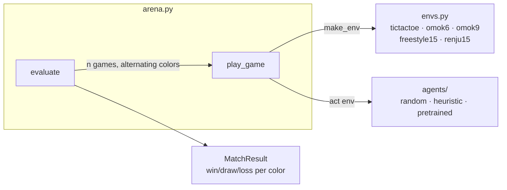
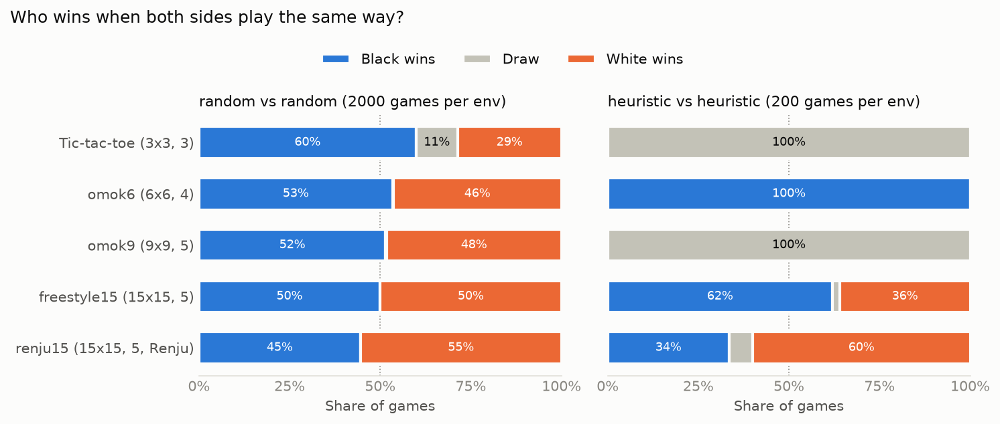
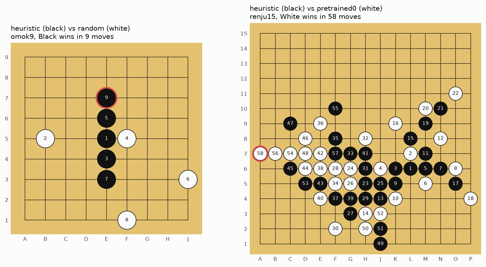
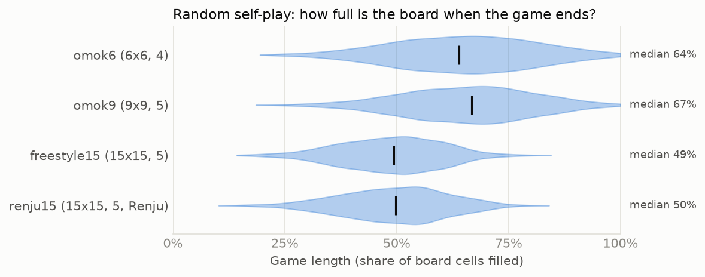

# Stage 0. Foundations — Environment & Evaluation

> **TL;DR** — We set up the project, defined five environments from tic-tac-toe to 15x15 Renju,
> and built three reference opponents (random, a hand-written heuristic, and the `omok` package's pretrained network)
> plus an arena that measures win rates per color. The heuristic beats random **100%** of the time on every Omok board,
> but scores only **0.11–0.25** against the pretrained network. Those three agents are the yardsticks for every later stage.

## Goal

- Get familiar with the `omok` environment API and the two-player game loop.
- Build **baselines** that every learning agent will be measured against.
- Build an **evaluation tool** that gives fair, reproducible numbers.
- **Success criterion**: the heuristic beats random nearly 100% of the time on every board.

## Background

### Omok as a reinforcement learning problem

Reinforcement learning is usually described as an agent interacting with an environment, a
**Markov Decision Process (MDP)**:

| MDP term | In Omok |
|---|---|
| State $s$ | The board and whose turn it is |
| Action $a$ | An empty (and, in Renju, non-forbidden) cell to place a stone on |
| Transition $P(s' \mid s, a)$ | Place the stone, then **the opponent moves** |
| Reward $r$ | $+1$ for winning, $-1$ for losing, $0$ otherwise (only at the end of the game) |
| Episode | One game |

Two things make this different from a textbook single-agent MDP:

1. **Two players, zero-sum.** One player's win is the other's loss. From the point of view of one agent,
   the opponent is part of the environment, so *the environment changes whenever the opponent changes*.
   Training against a copy of yourself (**self-play**) is the standard way to deal with this, and it's what later stages use.
2. **Sparse reward.** The only non-zero reward arrives at the very end of a game, up to 225 moves later.
   Working out which moves deserve credit for the win (**credit assignment**) is the core difficulty.

### The `omok` environment

`omok` provides `Omok` (15x15, `rule='renju'` or `'freestyle'`) and a generic `BoardGame` base class.
The key facts, all used in this stage's code:

- `env.move(pos)` places a stone for the player to move; positions are flat indices `y * size + x`.
- `env.get_legal_mask()` is a boolean array of the legal moves (excludes occupied and Renju-forbidden cells).
- `env.get_winner()` is `0` (draw), `1` (black) or `2` (white). Black always moves first.
- `env.step(a)` returns the reward **for the player who just moved**, while the observation is for
  **the player who moves next**. Keep this in mind when writing learning code from Stage 1 on.
- **Renju rule**: Black may not make a double-three, a double-four, or six or more in a row (an *overline*),
  and wins only with exactly five. White has no restrictions, and an overline counts as a win for White.
  This rule exists to offset the first-move advantage.

## Implementation



| File | What it does |
|---|---|
| [`src/omok_rl/envs.py`](../../src/omok_rl/envs.py) | The five environments and `make_env(name)` |
| [`src/omok_rl/agents/base.py`](../../src/omok_rl/agents/base.py) | `Agent` interface: `act(env) -> pos` |
| [`src/omok_rl/agents/random_agent.py`](../../src/omok_rl/agents/random_agent.py) | Uniformly random legal move |
| [`src/omok_rl/agents/heuristic.py`](../../src/omok_rl/agents/heuristic.py) | Hand-written line-counting agent |
| [`src/omok_rl/agents/pretrained.py`](../../src/omok_rl/agents/pretrained.py) | Wrapper around `omok.OmokAgent` (15x15 only) |
| [`src/omok_rl/arena.py`](../../src/omok_rl/arena.py) | `play_game`, `evaluate`, `MatchResult`, and the `omok-arena` CLI |
| [`src/omok_rl/viz.py`](../../src/omok_rl/viz.py) | `draw_board` for board figures in the docs |
| [`tests/test_stage0.py`](../../tests/test_stage0.py) | Rules, agents, and arena bookkeeping |

### Environments

The small boards only need two class attributes, because `BoardGame` generalizes the win check to any
`size` and `win` length:

```python
class Omok6(BoardGame):
    """6x6 board, four in a row wins."""
    size, win = 6, 4
```

| Name | Board | To win | Rule | Observation planes |
|---|---|---|---|---|
| `tictactoe` | 3x3 | 3 in a row | freestyle | 4 |
| `omok6` | 6x6 | 4 in a row | freestyle | 4 |
| `omok9` | 9x9 | 5 in a row | freestyle | 4 |
| `freestyle15` | 15x15 | 5 in a row | freestyle | 5 |
| `renju15` | 15x15 | 5 in a row | Renju | 5 |

The small boards have 4 observation planes (own stones, opponent stones, black-to-play, last move);
`Omok` adds a 5th plane for forbidden points.

### Agents

All agents implement one method, `act(env) -> pos`. They receive the whole env, so later agents can
read the legal mask or `env.clone()` it for search, but they must not modify it.

**Random** picks uniformly among the legal moves. It's the floor: any agent that has learned anything
should beat it.

**Heuristic** scores every empty cell by the winning lines ("windows") through it. A *window* is any `win`
consecutive cells in a row, column, or diagonal; a 15x15 board with five-in-a-row has 572 of them.
A window that holds stones of only one color can still be completed by that color.

- **Attack**: for each window with none of the opponent's stones, add $A_k$, where $k$ is our stone count *after* playing the cell.
- **Defense**: for each window with none of our stones, add $D_k$, where $k$ is the opponent's count *if they* played the cell.

$$
A_k = 10^k,\quad D_k = 0.5 \cdot 10^k \quad (k < \text{win}), \qquad A_{\text{win}} = 10^{12},\quad D_{\text{win}} = 10^{10}
$$

Since a cell lies on at most $4 \times \text{win} = 20$ windows, the jumps between weight levels guarantee the priority
*win now > block the opponent's win > extend our longest line > block theirs*. Ties are broken at random.
It looks only one move ahead and knows nothing about Renju's forbidden patterns (it just never *plays* a forbidden move,
because illegal cells are masked out).

**Pretrained** (`pretrained0`, `pretrained1`) wraps the two ONNX policy networks shipped with `omok`
(downloaded to `omok_assets/` on first use). Each plays the network's most likely legal move on a randomly
rotated/reflected board. They're the "strong" reference: the eventual target for our own agents.

### Arena

`evaluate(agent_a, agent_b, env_name, n_games)` plays `n_games` on fresh boards, with **agent A playing black in even-numbered
games and white in odd-numbered games**, and returns every game (colors, winner, moves). Results are always reported per color,
because the first player's advantage differs a lot between boards (see below). The **score** is
$(\text{wins} + 0.5 \cdot \text{draws}) / \text{games}$ for agent A.

```bash
uv run omok-arena heuristic random --env omok9 --games 200
```

```
heuristic vs random on omok9 (200 games)
               win    draw    loss
as black    100.0%    0.0%    0.0%
as white    100.0%    0.0%    0.0%
total       100.0%    0.0%    0.0%
score: 1.000, game length: 9.6 moves (mean)
```

Agents get their own seeded `numpy` generator, so matches are reproducible. The pretrained agent uses numpy's global
random state, which the CLI and scripts seed with `np.random.seed`.

## Experiments

All results below come from one run of the experiment script followed by the summary script:

```bash
uv run python scripts/stage0_baselines.py   # 21 matches, ~30 s with 8 worker processes -> runs/stage0/*.json
uv run python scripts/plot_stage0.py        # prints the tables below, writes images/*.png
```

- **Seed**: 0 (agent A uses seed 0, agent B seed 1)
- **Code version**: working tree on top of `efb7c86`, i.e. the Stage 0 commit
- **Hardware**: Intel Core i5-14400F (16 threads), CPU only
- **Precision**: with 200 games, a 50% win rate has a standard error of about ±3.5 percentage points; with 2000 games, about ±1.1.

### Experiment 1 — How much does moving first matter?

- **Question**: before comparing agents, what are the base rates? How often does the first player win when both sides play equally?
- **Setup**: random vs random (2000 games per env) and heuristic vs heuristic (200 games per env).



*Figure 1. Share of games won by Black (first player), drawn, and won by White when both sides use the same agent.
Generated by `scripts/plot_stage0.py`.*

| Env | Random: Black / Draw / White | Heuristic: Black / Draw / White |
|---|---|---|
| `tictactoe` | 59.9% / 11.5% / 28.6% | 0% / 100% / 0% |
| `omok6` | 53.4% / 0.2% / 46.4% | 100% / 0% / 0% |
| `omok9` | 51.5% / 0.2% / 48.2% | 0% / 100% / 0% |
| `freestyle15` | 50.0% / 0.0% / 50.0% | 62.0% / 2.0% / 36.0% |
| `renju15` | 44.5% / 0.0% / 55.5% | 33.5% / 6.5% / 60.0% |

**Observations**

- **Random tic-tac-toe matches theory.** The exact probabilities for random play are 58.5% / 12.7% / 28.8%
  (Black / draw / White); our 2000 games are within 1.4 percentage points of each, a good sanity check of the environment and arena.
- **With random play, the first-move advantage fades as the board grows**, from +31 points in tic-tac-toe to 0 on
  15x15 freestyle. A random player almost never builds a threat on purpose, so the extra stone barely matters.
- **With sensible play, the advantage becomes decisive.** Heuristic self-play is nearly deterministic
  (few ties to break), and Black wins *every* `omok6` game while `tictactoe` and `omok9` are always drawn,
  with `omok9` games filling the whole board (81 moves).
- **Renju flips the balance, even with random play.** On `renju15` White wins 55.5% of random games and 60% of heuristic games.
  With random play, the most likely reason is that Black has fewer ways to win: an overline wins for White but is forbidden for Black.
  For the heuristic, a likely extra reason is that it ignores the rule entirely: it builds lines that Black can't legally
  complete and misses White's threats that exploit Black's forbidden points. In only 11 of the 120 White wins did Black have
  a forbidden point on its last turn, so forbidden cells alone don't explain it. We haven't verified this further.
- **Lesson for later stages**: an agent's win rate must always be reported per color, and a 50% overall
  win rate can hide 100% as Black and 0% as White.

### Experiment 2 — Baseline strength

- **Question**: does the heuristic reach the success criterion, and how far is it from a strong player?
- **Setup**: 200 games per match, alternating colors. Cells show agent A's win / draw / loss in %.

| Agent A | Agent B | Env | A as black | A as white | A score |
|---|---|---|---|---|---:|
| heuristic | random | `tictactoe` | 99 / 1 / 0 | 93 / 7 / 0 | 0.980 |
| heuristic | random | `omok6` | 100 / 0 / 0 | 100 / 0 / 0 | 1.000 |
| heuristic | random | `omok9` | 100 / 0 / 0 | 100 / 0 / 0 | 1.000 |
| heuristic | random | `freestyle15` | 100 / 0 / 0 | 100 / 0 / 0 | 1.000 |
| heuristic | random | `renju15` | 100 / 0 / 0 | 100 / 0 / 0 | 1.000 |
| heuristic | pretrained0 | `freestyle15` | 17 / 0 / 83 | 7 / 0 / 93 | 0.120 |
| heuristic | pretrained0 | `renju15` | 17 / 0 / 83 | 33 / 0 / 67 | 0.250 |
| heuristic | pretrained1 | `freestyle15` | 13 / 0 / 87 | 9 / 0 / 91 | 0.110 |
| heuristic | pretrained1 | `renju15` | 15 / 0 / 85 | 15 / 1 / 84 | 0.152 |
| pretrained0 | pretrained1 | `freestyle15` | 52 / 0 / 48 | 38 / 0 / 62 | 0.450 |
| pretrained0 | pretrained1 | `renju15` | 49 / 1 / 50 | 45 / 0 / 55 | 0.472 |



*Figure 2. Left: a typical heuristic (black) win over random on `omok9`: it simply extends its line while random never blocks.
Right: heuristic (black) losing to `pretrained0` (white) on `renju15`. White builds a long connected group and finally wins
with five on row 7 (moves 42, 48, 54, 56, 58). Numbers are move order; the red ring marks the last move. Generated by `scripts/plot_stage0.py`.*

**Observations**

- **Success criterion met**: the heuristic wins 100% against random on every Omok board. Its only non-wins are
  tic-tac-toe draws (1% as Black, 7% as White).
- **The heuristic is far from strong.** It scores 0.11–0.25 against the pretrained networks. It only looks one move ahead,
  so it can't see double threats (two winning threats at once, which can't both be blocked) coming.
- **The two pretrained models are close**, with `pretrained1` slightly ahead (pretrained0 scores 0.45–0.47).
- The heuristic does best against `pretrained0` as **White in Renju** (33% wins), consistent with Experiment 1's finding that Renju favors White.

### Experiment 3 — Environment speed and game length

- **Question**: how much data can we generate? That sets the budget for the learning stages.
- **Setup**: moves per second of random self-play, from the 2000-game random matches. The 21 matches ran concurrently
  in 8 processes, so treat these as rough single-core numbers.

| Env | Moves / second | Games / second | Mean game length (moves) |
|---|---:|---:|---:|
| `tictactoe` | ~65,000 | ~8,500 | 7.7 |
| `omok6` | ~56,000 | ~2,400 | 23.4 |
| `omok9` | ~35,000 | ~670 | 53.1 |
| `freestyle15` | ~24,000 | ~220 | 109.4 |
| `renju15` | ~12,600 | ~110 | 111.0 |



*Figure 3. Game length of random self-play as a share of the board, 2000 games per env; the black tick is the median.
Tic-tac-toe is omitted because its lengths (5–9 moves) are too discrete for a density plot. Generated by `scripts/plot_stage0.py`.*

**Observations**

- **Renju costs ~2x per move** compared with freestyle, because forbidden points are recomputed for every Black move
  (with the numba-compiled `omok[fast]` extra; without it the gap is 50–70x according to the `omok` docs).
- Random games on 15x15 last ~110 moves, so a single terminal reward has to be credited back over ~55 of our own moves.
  This is the sparse-reward problem in concrete numbers, and a reason to start learning on small boards.
- Raw environment speed is not a bottleneck yet. From Stage 2 on, neural network inference will dominate.

## Pitfalls & Lessons

- **Small samples mislead.** A 20-game trial run showed `pretrained0` beating `pretrained1` 65% of the time; the 200-game run
  shows the opposite (45–47%). With 20 games, the standard error is about ±11 points. Use at least 200 games before drawing conclusions.
- **`git describe --dirty` ignores untracked files.** The first run labeled results with a clean commit hash even though
  all the new code was untracked. The experiment script now checks `git status --porcelain` instead.
- **`omok.OmokAgent` uses numpy's global random state** (for its random board symmetry), not a generator we pass in.
  Seed it with `np.random.seed` to get reproducible matches.
- **`BoardGame` subclasses are always freestyle.** The `rule` argument only exists on `Omok`, so our small boards have no
  forbidden moves and 4 observation planes instead of 5.

## Summary

- Five environments, three reference agents, and a reproducible, color-aware arena are in place (13 tests pass).
- The heuristic meets the success criterion (100% vs random on every Omok board).
- Reference scores for later stages:

| Opponent | What it tells us | Heuristic's score |
|---|---|---:|
| random | "Has the agent learned anything at all?" | 0.98–1.00 |
| heuristic | "Does it beat simple one-move tactics?" | 0.50 (self) |
| pretrained0/1 | "How close is it to a strong player?" | 0.11–0.25 |

## Next Steps

- **Stage 1** — Tabular RL on `tictactoe`: learn a value table by Monte Carlo and TD methods through self-play.
  Tic-tac-toe has only 5,478 reachable positions, so every state can be stored and exact minimax gives the ground truth.
  Goal: a policy that never loses, checked against exact minimax.
- Keep `evaluate` as the single entry point for evaluation; add Elo ratings when there are many checkpoints (Stage 2+).

## References

- Sutton & Barto, *Reinforcement Learning: An Introduction* (2nd ed.), Chapter 1.5 (tic-tac-toe example) and Chapter 3 (finite MDPs)
- [`omok` package documentation](https://pypi.org/project/omok/0.1.0/)
- [Renju International Federation](https://www.renju.net/) (official Renju rules)
