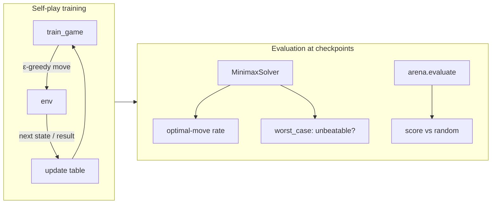
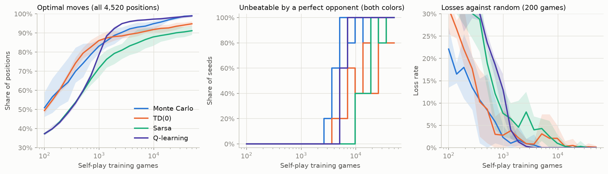
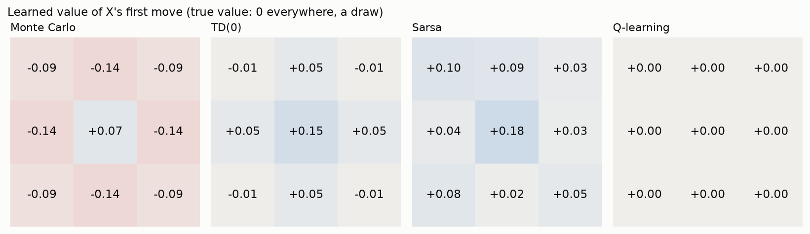
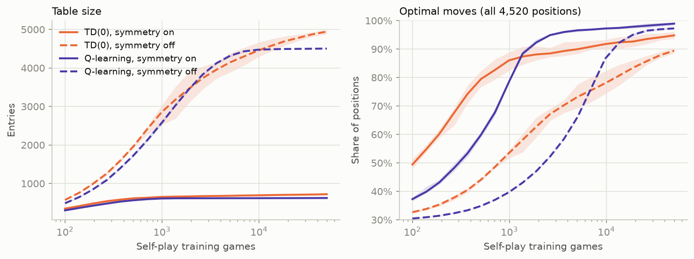
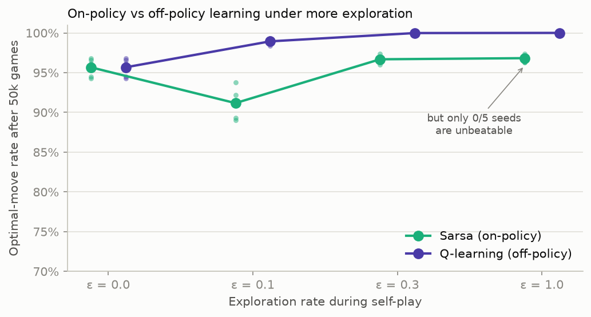
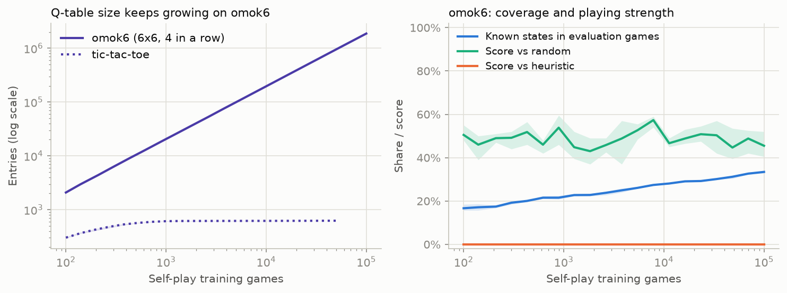

# Stage 1. Tabular RL — Tic-Tac-Toe

> **TL;DR** — Four tabular methods (Monte Carlo, TD(0), Sarsa, Q-learning) learn tic-tac-toe purely from self-play.
> Monte Carlo and Q-learning become **provably unbeatable in ~5,000 games** (all 5 seeds), checked exhaustively against a perfect opponent.
> Off-policy Q-learning still learns perfect play when it explores 100% at random, while on-policy Sarsa then learns an exploitable policy.
> Exploiting the board's 8 symmetries shrinks the table 7x. On a 6x6 board, the same Q-learning fills **1.9 million** table entries
> and still plays no better than random. That is why the next stage needs function approximation.

## Goal

- Learn a value function **from experience alone**: no rules of good play, only win/draw/loss at the end of self-play games.
- Compare the four basic tabular methods: **Monte Carlo vs TD** and **on-policy vs off-policy**.
- **Success criterion**: a policy that *never loses*, verified exactly against a perfect opponent, not just by sampling games.
- See where the tabular approach breaks down.

## Background

### Value functions

A **value function** estimates how good a situation is for the player who acts, as the expected final reward.
In a zero-sum game with rewards $+1$ (win), $0$ (draw), $-1$ (loss), a value of $+0.5$ means "on average, clearly winning".

Two kinds of value functions are used here:

- **Afterstate value** $V(b)$: the value of the board $b$ *right after our move*, before the opponent replies.
  To choose a move, we compute the afterstate of every legal move and pick the best. This is the approach of
  Sutton & Barto's tic-tac-toe example (Chapter 1).
- **Action value** $Q(s, a)$: the value of playing move $a$ in state $s$. To choose a move, pick $\arg\max_a Q(s, a)$.

**Self-play with one table (negamax).** Both colors share one table, and values are always from the point of view of the player who
acts. Since the game is zero-sum, a position worth $+v$ to the player to move is worth $-v$ to the other player. So the value of
our move equals **minus** the value of the opponent's position that follows. All update targets below use this sign flip.

### Monte Carlo vs Temporal Difference

Both methods move an estimate a step of size $\alpha$ (the **learning rate**) toward a **target**:

$$
V(b) \leftarrow V(b) + \alpha \big[\, \text{target} - V(b) \,\big]
$$

| Method | Target for afterstate $b_t$ | Learns when |
|---|---|---|
| **Monte Carlo (MC)** | $G$ = the actual final result for the player who made $b_t$ | After the game ends |
| **TD(0)** | $-V(b_{t+1})$ = minus the value of the opponent's next afterstate | After every move |

MC waits for the true outcome (unbiased, but noisy). TD **bootstraps**: it updates a guess using another guess, so it can
learn before the game ends and its targets vary less, but they're biased while the estimates are still wrong.
A move that ends the game uses the reward $r$ ($+1$ win, $0$ draw) as its target in every method.

### On-policy vs off-policy

To discover good moves the agent must sometimes try moves it currently thinks are bad. We use **ε-greedy** exploration:
with probability $\varepsilon$ play a random legal move, otherwise the best one.

| Method | Target for $Q(s_t, a_t)$ | Learns the value of... |
|---|---|---|
| **Sarsa** (on-policy) | $-Q(s_{t+1}, a_{t+1})$, where $a_{t+1}$ is the move the opponent **actually played** | the ε-greedy policy it follows, exploration included |
| **Q-learning** (off-policy) | $-\max_{a'} Q(s_{t+1}, a')$, the opponent's **best** reply | the greedy policy, whatever policy generated the data |

TD(0) on afterstates is on-policy, like Sarsa. MC here is also on-policy: its returns come from ε-greedy games.

### Symmetry

A tic-tac-toe board has 8 symmetries (4 rotations × optional reflection), and symmetric positions have the same value.
Storing each position under a **canonical key** (the smallest of its 8 variants) lets one experience update all 8 at once.

### Ground truth: minimax

Tic-tac-toe is small enough to solve exactly: there are **4,520** non-terminal positions reachable from the empty board.
**Negamax** search computes the true value of each position and the set of optimal moves. Perfect play from both sides is a draw.
This gives two exact measures that sampled games can't:

- **Optimal-move rate**: the share of all 4,520 positions where *every* move the agent might play (all of its tied greedy moves) is optimal.
- **Unbeatable**: an exhaustive search where the opponent tries every move and the agent's ties are resolved in the worst way.
  The agent is unbeatable if the worst outcome is a draw, as both X and O.

## Implementation



| File | What it does |
|---|---|
| [`src/omok_rl/agents/tabular.py`](../../src/omok_rl/agents/tabular.py) | `AfterstateAgent` (`mc`, `td`), `QAgent` (`sarsa`, `q-learning`), `make_tabular` |
| [`src/omok_rl/symmetry.py`](../../src/omok_rl/symmetry.py) | `canonical(board)`: canonical key + action map under the 8 symmetries |
| [`src/omok_rl/agents/minimax.py`](../../src/omok_rl/agents/minimax.py) | `MinimaxSolver`, `MinimaxAgent`, `all_positions`, `optimal_move_rate`, `worst_case` |
| [`scripts/stage1_tabular.py`](../../scripts/stage1_tabular.py) | All Stage 1 experiments (parallel runs, log-spaced checkpoints) |
| [`scripts/plot_stage1.py`](../../scripts/plot_stage1.py) | Tables and figures in this document |
| [`tests/test_stage1.py`](../../tests/test_stage1.py) | Symmetry, minimax, learning, and bookkeeping tests |

The core of Q-learning self-play, from `QAgent.train_game`. `previous` is the opponent's last move, which is updated once
we know the position it led to:

```python
while not env.is_done():
    row, action_map = self.q_row(env, create=True)          # Q(s, ·) in the canonical frame
    actions = np.flatnonzero(env.get_legal_mask())
    values = row[action_map[actions]]
    i = self.select(values, epsilon)                          # ε-greedy
    if previous is not None:                                  # opponent's move led here
        target = -values.max() if self.method == 'q-learning' else -values[i]
        prev_row, prev_index = previous
        prev_row[prev_index] += self.alpha * (target - prev_row[prev_index])
    env.move(actions[i])
    index = action_map[actions[i]]
    if env.is_done():                                         # winning or drawing move
        row[index] += self.alpha * (terminal_reward(env) - row[index])
    previous = (row, index)
```

The only difference between Sarsa and Q-learning is the `target` line.

**Design decisions**

- **One shared table for both colors** (negamax) instead of one table per color: half the memory, and every game teaches both sides.
- **Evaluation doesn't grow the table.** Looking up an unseen state returns zeros without storing them, so table size counts only
  states visited in training.
- **Tied greedy moves are broken at random**, but the exact metrics consider *all* tied moves. An agent can't pass by luck.
- A trained agent is saved as a `.pkl` and can play in the arena: `uv run omok-arena runs/stage1/agents/<run>.pkl minimax --env tictactoe`.

## Experiments

```bash
uv run python scripts/stage1_tabular.py   # 63 runs, about 3 minutes with 12 worker processes -> runs/stage1/
uv run python scripts/plot_stage1.py      # prints the tables below, writes images/*.png
```

- **Defaults**: `tictactoe`, α = 0.1, ε = 0.1, symmetry on, 50,000 self-play games, all values initialized to 0.
- **Seeds**: 0–4 (5 runs per setting); evaluation games vs random use seed + 1000.
- **Checkpoints**: 20 log-spaced points from 100 to 50,000 games. "±" is the standard deviation over seeds, and shaded bands in figures are min–max.
- **Code version**: working tree on top of `9685c85`, i.e. the Stage 1 commit.
- **Hardware**: Intel Core i5-14400F, CPU only. One 50k-game run takes 21–30 s of training.

### Experiment 1 — Comparing the four methods

- **Question**: do all four methods learn perfect play from self-play, and how fast?



*Figure 1. Left: share of all 4,520 positions where the agent's move is optimal. Middle: share of the 5 seeds that no opponent can beat,
as both X and O. Right: loss rate against random over 200 games. Lines are means over 5 seeds, bands min–max. Generated by `scripts/plot_stage1.py`.*

| Method | Optimal-move rate | Unbeatable seeds | Games until unbeatable (median of those seeds) | Score vs random | Table size |
|---|---:|---:|---:|---:|---:|
| Monte Carlo | 0.990 ± 0.004 | 5/5 | 5,070 | 0.967 ± 0.011 | 731 ± 5 |
| TD(0) | 0.948 ± 0.010 | 4/5 | 22,365 | 0.960 ± 0.020 | 722 ± 9 |
| Sarsa | 0.912 ± 0.018 | 5/5 | 18,740 | 0.974 ± 0.008 | 618 ± 3 |
| Q-learning | 0.989 ± 0.003 | 5/5 | 5,070 | 0.941 ± 0.004 | 623 ± 1 |

**Observations**

- **Success criterion met.** 19 of 20 runs end unbeatable. Monte Carlo and Q-learning get there fastest (about 5k games) and reach
  ~99% optimal moves. The TD(0) seed that isn't unbeatable at 50k games still has a losing line somewhere.
- **The afterstate methods (MC, TD) learn fastest at first**: 83% and 86% optimal moves after 1,000 games, against 78% for Q-learning and 72% for Sarsa.
  One afterstate value is shared by every (state, move) pair that leads to the same board, so each experience generalizes more.
  The Q methods catch up later.
- **On-policy methods plateau lower** (TD 95%, Sarsa 91%). With ε = 0.1 they learn the value of a policy that blunders 10% of the time,
  so a move that is safe only if you never blunder can look worse than it is. Q-learning evaluates the greedy policy directly.
- **Unbeatable ≠ highest score against random.** Q-learning's perfect policy scores 0.941 against random, the lowest of the four, and a
  minimax player scores exactly the same (0.941 over 1,000 games). Minimax only assumes a perfect opponent, so it treats every drawing move
  as equally good. Sarsa's value estimates include its own random mistakes, which happens to favor moves that punish a weak opponent (0.974).
  *Optimal against the best opponent and best against a given opponent are different objectives.*



*Figure 2. Value of each of X's nine opening moves after 50k games (seed 0), from X's point of view. Under perfect play every opening is a draw (0).
Q-learning learns exactly that. The on-policy methods learn values of ε-greedy play instead: TD(0) and Sarsa prefer the center, and
Monte Carlo rates X's afterstates slightly negative. Afterstate methods show the board's symmetry. Sarsa's Q-row doesn't, because the empty
board is its own canonical form, so symmetric moves are separate entries in the row. Generated by `scripts/plot_stage1.py`.*

### Experiment 2 — Does symmetry help?

- **Question**: how much does sharing values across the 8 symmetric variants save?
- **Setup**: TD(0) and Q-learning with symmetry off, compared with Experiment 1.



*Figure 3. Solid lines use canonical keys, dashed lines don't. 5 seeds each. Generated by `scripts/plot_stage1.py`.*

| Method | Symmetry | Table size | Optimal-move rate | Unbeatable seeds |
|---|---|---:|---:|---:|
| TD(0) | on | 722 ± 9 | 0.948 ± 0.010 | 4/5 |
| TD(0) | off | 4,944 ± 41 | 0.894 ± 0.007 | 0/5 |
| Q-learning | on | 623 ± 1 | 0.989 ± 0.003 | 5/5 |
| Q-learning | off | 4,502 ± 2 | 0.972 ± 0.003 | 4/5 |

**Observations**

- **7x fewer entries** with symmetry. The Q-table saturates at 627 = the number of distinct non-terminal positions up to symmetry
  (765 positions in total, 138 of them terminal).
- **Learning is roughly 7x faster**: Q-learning reaches 90% optimal moves after ~1.9k games with symmetry and ~13.5k without
  (TD(0) without symmetry never reaches 90% within 50k games).
  Each game updates the shared entry of 8 positions at once.
- Symmetry is **prior knowledge built into the representation**. Later stages get the same effect through data augmentation
  (`omok.transforms.symmetries`) and convolutional networks.

### Experiment 3 — Exploration, on-policy vs off-policy

- **Question**: how does the exploration rate ε change what Sarsa and Q-learning learn?
- **Setup**: ε ∈ {0, 0.1, 0.3, 1.0}; ε = 1.0 means *every* self-play move is random.



*Figure 4. Final optimal-move rate after 50k games; small dots are individual seeds. All settings produce unbeatable agents on all seeds
except Sarsa at ε = 1.0. Generated by `scripts/plot_stage1.py`.*

| Method | ε | Optimal-move rate | Unbeatable seeds | Score vs random |
|---|---:|---:|---:|---:|
| Sarsa | 0.0 | 0.957 ± 0.011 | 5/5 | 0.942 ± 0.007 |
| Sarsa | 0.1 | 0.912 ± 0.018 | 5/5 | 0.974 ± 0.008 |
| Sarsa | 0.3 | 0.967 ± 0.004 | 5/5 | 0.977 ± 0.005 |
| Sarsa | 1.0 | 0.968 ± 0.004 | **0/5** | 0.968 ± 0.006 |
| Q-learning | 0.0 | 0.957 ± 0.011 | 5/5 | 0.942 ± 0.007 |
| Q-learning | 0.1 | 0.989 ± 0.003 | 5/5 | 0.941 ± 0.004 |
| Q-learning | 0.3 | **1.000 ± 0.000** | 5/5 | 0.933 ± 0.015 |
| Q-learning | 1.0 | **1.000 ± 0.000** | 5/5 | 0.936 ± 0.011 |

**Observations**

- **Q-learning learns perfect play from completely random games (ε = 1.0).** Its target always takes the $\max$, so it learns the value of the
  *greedy* policy no matter who generated the data. This is what "off-policy" buys, and it will matter for experience replay in Stage 2.
- **Sarsa at ε = 1.0 is exploitable on every seed**, even though 96.8% of its moves are optimal. It learns how good each move is
  *against a random player*, and a move that wins often against random can lose to a perfect reply. A high average metric hid a fatal flaw,
  which is why we check "unbeatable" exhaustively.
- **With ε = 0, Sarsa and Q-learning are identical**, down to the random numbers: the greedy action's value *is* the max. Pure greedy
  self-play still works here, most likely because random tie-breaking among the all-zero initial values acts as exploration.
- More exploration covers more positions: both methods improve from ε = 0.1 to 0.3 in optimal-move rate, as rarely visited
  positions get learned. We don't have a verified explanation for Sarsa's dip at ε = 0.1 (below both ε = 0 and 0.3); it is consistent with
  having less coverage than ε = 0.3 while its targets already include exploration mistakes, but we haven't tested that.

### Experiment 4 — Does it scale? Q-learning on 6x6

- **Question**: what happens to the same method on a board that is only slightly larger?
- **Setup**: Q-learning on `omok6` (6x6, four in a row), 100,000 self-play games, 3 seeds. At each checkpoint, 100 games against
  random and 100 against the heuristic, recording how often the agent's position was one it had seen in training.



*Figure 5. Left: Q-table entries (log scale). On tic-tac-toe the table saturates at 627; on omok6 it grows linearly without end.
Right: share of the agent's decisions in evaluation games made in a position seen during training, and its scores. 3 seeds.
Generated by `scripts/plot_stage1.py`.*

| Games | Table size | Known states in evaluation | Score vs random | Score vs heuristic |
|---:|---:|---:|---:|---:|
| 100 | 2,083 | 16.7% | 0.505 | 0.000 |
| 1,830 | 36,968 | 22.8% | 0.430 | 0.000 |
| 33,600 | 642,396 | 30.1% | 0.503 | 0.000 |
| 100,000 | 1,867,566 | 33.4% | 0.455 | 0.000 |

**Observations**

- **The table never stops growing**: about 19 new states per game, 1.87 million entries after 100k games (too large to be worth saving).
  omok6 has on the order of $3^{36} \approx 10^{17}$ board configurations; we have seen about $10^{-11}$ of them.
- **Two-thirds of evaluation positions were never seen.** Already after 100 games 17% are known, which can only be the opening moves,
  so later positions are covered even less than the average suggests. In an unseen position every Q-value is 0 and the agent plays randomly.
- **Result: no better than random** (0.43–0.57, within noise of 0.5), and it never beats the heuristic. The heuristic knows one simple fact:
  four stones in a line are good *wherever they are*. The table can't transfer knowledge from one position to a similar one.
  That is the case for **function approximation**: a model that computes values from *features* of the board, so that learning about one
  position improves its estimates for similar ones.

## Pitfalls & Lessons

- **A shared mutable default argument** (`def search(memo={})`) in the first version of `worst_case` would have silently reused one memo
  across agents and colors. It was caught in review before any results were produced.
- **Looking up a state shouldn't create it.** The first `QAgent` stored a zero row on every lookup, so evaluation games inflated the table.
  Now only training creates entries (see `test_evaluation_does_not_grow_the_table`).
- **Sampled win rates can hide exploitable policies.** Sarsa at ε = 1.0 scores 0.968 against random and has 96.8% optimal moves, yet loses
  to a perfect player on every seed. Exact checks are only possible on tiny games, and we'll miss them later; keep strong opponents in the evaluation pool.
- **"Best move" depends on the opponent model.** Minimax-optimal play is not the best way to beat a weak player (Experiment 1).
  Our training objective (self-play) implicitly assumes a strong opponent.
- **The Stage 0 heuristic is beatable in tic-tac-toe as O** (`worst_case` = −1): it falls for a fork. It still loses only 0.4% of games against random as O,
  another case where sampling against weak opponents hides a flaw.

## Summary

- All four tabular methods learn tic-tac-toe from self-play alone. 19 of 20 default runs become provably unbeatable, and MC and Q-learning do it in ~5k games.
- Off-policy Q-learning learns optimal values under any amount of exploration; on-policy methods learn the values of the policy they follow.
- Symmetry-aware keys cut the table 7x and speed up learning about 7x.
- Tabular learning fails on a 6x6 board: the state space is too large to visit, and a table can't generalize between positions.

| Agent (tic-tac-toe) | Unbeatable | Score vs random |
|---|:---:|---:|
| random | no | 0.50 |
| heuristic (Stage 0) | no (as O) | 0.96 |
| minimax | yes | 0.94 |
| Q-learning, 50k games | yes (5/5) | 0.94 |

## Next Steps

- **Stage 2 — DQN**: replace the table with a neural network $Q_\theta(s, a)$ that reads the board planes from `get_observation()`.
  Start on `omok6`, where Experiment 4 gives a clear baseline to beat: tabular Q-learning ≈ random and 0% against the heuristic.
- Carry over what worked here: negamax targets, off-policy learning (so past games can be replayed), symmetry, and the
  exploration lessons. Tic-tac-toe with exact metrics stays useful as a quick correctness test for new code.

## References

- Sutton & Barto, *Reinforcement Learning: An Introduction* (2nd ed.): Chapter 1.5 (tic-tac-toe and afterstates), Chapter 5 (Monte Carlo),
  Chapter 6 (TD, Sarsa, Q-learning, afterstates in 6.8)
- Watkins & Dayan, *Q-learning*, Machine Learning 8, 1992
- [Tic-tac-toe game-tree counts](https://en.wikipedia.org/wiki/Game_complexity#Example:_tic-tac-toe_(noughts_and_crosses)): 5,478 legal positions, 765 up to symmetry
