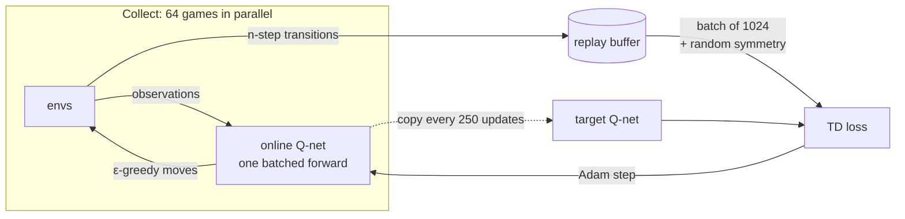
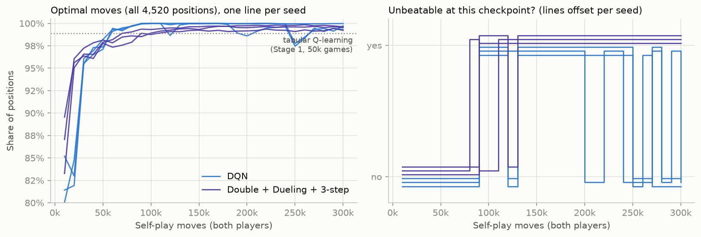
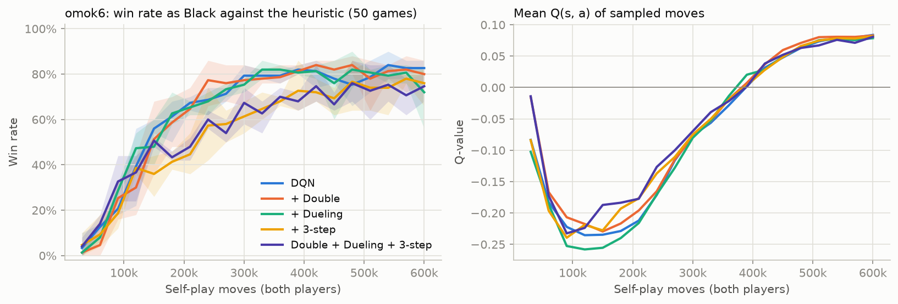
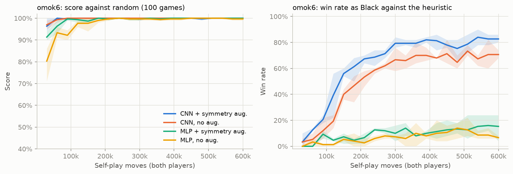
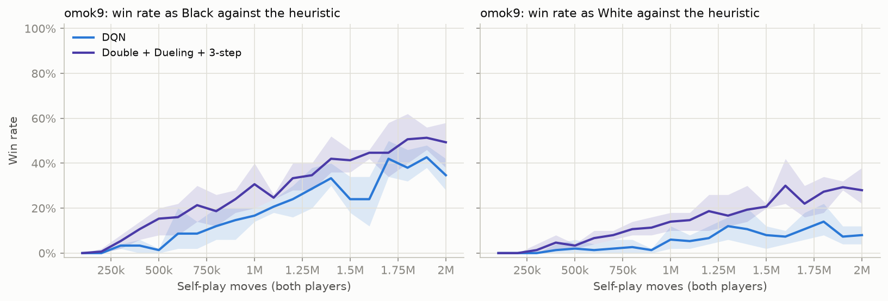
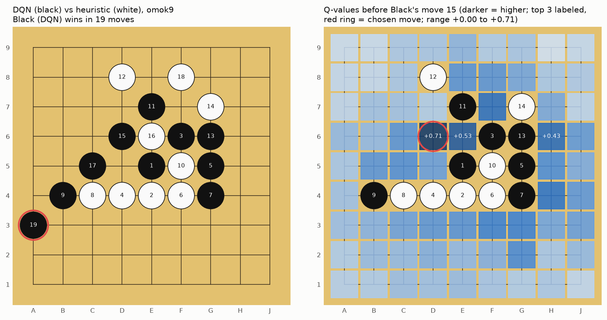

# Stage 2. Value-Based Deep RL — DQN

> **TL;DR** — A convolutional Q-network trained by self-play fixes what broke tabular learning in Stage 1.
> On `omok6` it beats random **100%** of the time (tabular Q-learning: ~50%) and wins **83%** as Black against the Stage 0 heuristic (tabular: 0%),
> with fewer games (54k vs 100k). On `omok9`, Double + Dueling + 3-step DQN scores **0.57** against the heuristic, vs **0.21** for plain DQN.
> The CNN's weight sharing matters far more than any DQN improvement: an MLP with the same training only wins 7–15% as Black.
> We also see the price of function approximation: on tic-tac-toe DQN reaches 100% optimal moves, then keeps drifting in and out of "unbeatable".

## Goal

- Replace Stage 1's lookup table with a **neural network** $Q_\theta(s, a)$, so that what is learned in one position carries over to similar ones.
- Implement DQN and its standard improvements (Double DQN, Dueling networks, n-step returns) for **two-player self-play**.
- **Success criteria**:
  1. Correctness: on tic-tac-toe, DQN reaches the exact metrics of tabular Q-learning (unbeatable, ~99% optimal moves).
  2. Generalization: on `omok6`, where tabular Q-learning played no better than random, beat random ~100% and beat the heuristic as Black.
  3. Scale: on `omok9`, beat the Stage 0 heuristic (score > 0.5).

All three were met, with caveats on stability (criterion 1) and on playing White (criteria 2 and 3).

## Background

### From a table to a function

Stage 1 ended with a Q-table of 1.9 million entries that still played randomly on a 6x6 board: two-thirds of the positions it met in
evaluation had never been visited, and a table has no way to guess the value of an unvisited position.

**Function approximation** replaces the table with a parameterized function $Q_\theta(s, a)$, here a neural network with weights $\theta$.
Updating $\theta$ for one position also changes the estimates for every *similar* position, the generalization the table lacked.
The Q-learning update becomes a regression step: move $Q_\theta(s, a)$ toward the target

$$
y = \begin{cases} r & \text{if the move ended the game} \\ -\max_{a'} Q_{\bar\theta}(s', a') & \text{otherwise (negamax, as in Stage 1)} \end{cases}
$$

by minimizing the **Huber loss** (squared error for small errors, absolute error for large ones, which limits the effect of outliers).

### Why naive deep Q-learning is unstable

Combining (1) function approximation, (2) bootstrapping (targets built from our own estimates), and (3) off-policy learning is known as
the **deadly triad**: the updates can oscillate or diverge instead of converging. DQN (Mnih et al., 2015) stabilizes it with two tricks:

- **Experience replay**: store transitions $(s, a, r, s')$ in a large buffer and train on random mini-batches from it. This breaks the strong
  correlation between consecutive moves and reuses each experience many times. It works because Q-learning is **off-policy**: it can learn
  from moves made by older versions of the policy (Stage 1 showed it even learns from 100% random moves).
- **Target network**: compute targets with a frozen copy $Q_{\bar\theta}$ that is only refreshed every $C$ updates, so the regression target
  doesn't move with every gradient step.

### Improvements tested here

| Improvement | Problem it addresses | Change |
|---|---|---|
| **Double DQN** (van Hasselt et al., 2016) | $\max$ over noisy estimates is biased upward (**overestimation**) | The online network *chooses* $a^* = \arg\max_{a'} Q_\theta(s', a')$, the target network *evaluates* it: $-Q_{\bar\theta}(s', a^*)$ |
| **Dueling network** (Wang et al., 2016) | Many positions are good or bad whatever the exact move | Split the output into a state value $V(s)$ and advantages $A(s, a)$: $Q = V + A - \text{mean}_a A$ |
| **n-step returns** | One-step targets move the final reward back only one move per update | Look $n$ moves ahead before bootstrapping (below) |

**n-step returns in a two-player game.** Players alternate, so each ply flips the point of view. A move made $k$ plies before the end of a
game that gave reward $r$ to the final mover gets the return $(-1)^k r$. If the game is still running $n$ plies later:

$$
y_t = (-1)^n \max_{a'} Q_{\bar\theta}(s_{t+n}, a')
$$

For $n = 1$ this is the negamax target above; for $n = 2$ it is "our move and the opponent's reply", then our own value again.

### Convolutions and symmetry: built-in generalization

Two kinds of prior knowledge about board games can be built into the model:

- **Convolutional network (CNN)**: the same small filters slide over the whole board, so a pattern like "three in a row with open ends"
  is recognized wherever it appears (**translation equivariance**). An MLP (fully connected network) has separate weights for every cell
  and has to learn the same pattern at every location separately.
- **Symmetry augmentation**: each sampled transition is randomly rotated/reflected (one of 8 symmetries) before the update, so one
  experience teaches all 8 variants. It is the neural-network counterpart of Stage 1's canonical keys.

## Implementation



| File | What it does |
|---|---|
| [`src/omok_rl/nets.py`](../../src/omok_rl/nets.py) | `ConvQNet` (residual CNN, optional dueling head), `MLPQNet` |
| [`src/omok_rl/replay.py`](../../src/omok_rl/replay.py) | `ReplayBuffer`, `NStepWriter` (two-player n-step returns) |
| [`src/omok_rl/dqn.py`](../../src/omok_rl/dqn.py) | `DQNConfig`, `train` (collect / learn / evaluate loop), `td_loss`, `augment_batch`; CLI `python -m omok_rl.dqn` |
| [`src/omok_rl/agents/dqn.py`](../../src/omok_rl/agents/dqn.py) | `DQNAgent`: greedy play from a saved network (`.pt`), usable in the arena |
| [`src/omok_rl/arena.py`](../../src/omok_rl/arena.py) | `evaluate(..., opening_plies=k)`: random-opening evaluation (see Pitfalls) |
| [`scripts/stage2_dqn.py`](../../scripts/stage2_dqn.py) | All Stage 2 runs (several per GPU in parallel) |
| [`scripts/plot_stage2.py`](../../scripts/plot_stage2.py) | Tables and figures in this document |
| [`tests/test_stage2.py`](../../tests/test_stage2.py) | n-step returns, augmentation, network shapes, a short end-to-end run |

**Network.** `ConvQNet`: a 3x3 convolution to 64 channels, 3 residual blocks (two 3x3 convolutions each), and a 1x1 convolution that outputs one
value per cell, squashed with `tanh` into $[-1, 1]$, the range of possible returns. It is fully convolutional, so the same network runs on any board
size. The input is the 4 planes of `get_observation()`: own stones, opponent stones, black-to-play, last move.

**The core of the update** (`td_loss`). Illegal moves are masked to $-\infty$ before the $\max$, and finished games don't bootstrap:

```python
with torch.no_grad():
    q_next = target(next_obs).masked_fill(~next_mask, -torch.inf)
    if double:   # online net picks the move, target net evaluates it
        a_star = online(next_obs).masked_fill(~next_mask, -torch.inf).argmax(1, keepdim=True)
        v_next = q_next.gather(1, a_star)[:, 0]
    else:
        v_next = q_next.max(1).values
    v_next = torch.where(sign != 0, v_next, 0.0)
    y = ret + sign * v_next          # sign = (-1)^n, or 0 if the game ended within n plies
q = online(obs).gather(1, action[:, None])[:, 0]
loss = F.smooth_l1_loss(q, y)
```

**Design decisions**

- **64 games in parallel.** One batched forward pass picks the moves for all games, instead of one GPU call per move.
- **Negamax targets and one shared network for both colors**, as in Stage 1. The observation is always from the point of view of the player to move.
- **Augmentation happens on the GPU per sample**: each transition in a batch gets its own random symmetry, applied consistently to the state,
  the action, the next state and its legal-move mask.
- **Large batches, few updates.** A batch of 1024 every 64 moves samples each move ~16 times on average, like 256 every 16. In a head-to-head
  check on `omok6` it learned equally well (Black win vs heuristic 0.82 vs 0.90 for one seed each) and ran 2.3x faster, because small networks
  are limited by per-update overhead, not arithmetic.
- **A checkpoint at every evaluation** (`<run>/steps-*.pt`), so evaluation can be redone offline without retraining.

| Hyperparameter | Value |
|---|---|
| Optimizer | Adam, learning rate 1e-3, gradient norm clipped at 10 |
| Batch size / moves per update | 1024 / 64 |
| Replay buffer | 200k moves (500k on `omok9`); learning starts after 10k |
| Target network refresh | every 250 updates |
| Exploration ε | linear 1.0 → 0.05 over the first half of training, then 0.05 |
| Parallel games | 64 |

## Experiments

```bash
uv run python scripts/stage2_dqn.py    # 36 runs -> runs/stage2/ (about 3 h on one GPU, 6 runs at a time)
uv run python scripts/plot_stage2.py   # prints the tables below, writes images/*.png
uv run python -m omok_rl.dqn --env omok6 --double --dueling --n-step 3 --out runs/my-run   # a single run
```

- **Seeds**: 0–2 (3 runs per setting). Tables show mean ± standard deviation over seeds; shaded bands in figures are min–max.
- **Evaluation**: at each checkpoint, 100 games against random and 100 against the heuristic, 50 per color. On `omok6` and `omok9` every pair of games
  starts from a random opening (2 and 4 random moves), played once with each color. On tic-tac-toe, the exact metrics from Stage 1.
- **Training length**: tic-tac-toe 300k moves (~37k games), `omok6` 600k moves (~54k games), `omok9` 2M moves (~70–88k games).
- **Code version**: working tree on top of `9d709da`, i.e. the Stage 2 commit.
- **Hardware**: NVIDIA RTX 5060 Ti + Intel Core i5-14400F. Six runs shared the GPU, so the wall-clock times in the tables depend on what else was
  running and are not comparable between variants.

### Experiment 1 — Tic-tac-toe: does it learn, and does it stay learned?

- **Question**: does DQN reproduce the tabular result (Stage 1: Q-learning unbeatable with 98.9% optimal moves after 50k games)?



*Figure 1. Left: share of all 4,520 positions where the network's move is optimal, one line per seed; dotted: tabular Q-learning after 50k games.
Right: whether the network was unbeatable (exhaustive check, both colors) at each checkpoint; lines are offset slightly so all six are visible.
Generated by `scripts/plot_stage2.py`.*

| Variant | Final optimal-move rate | Unbeatable at the end | Share of checkpoints unbeatable | Best optimal-move rate |
|---|---:|---:|---:|---:|
| DQN | 0.997 ± 0.003 | 0/3 | 0.52 ± 0.02 | 1.000 ± 0.000 |
| Double + Dueling + 3-step | 0.995 ± 0.002 | **3/3** | 0.71 ± 0.02 | 0.996 ± 0.002 |

**Observations**

- **DQN learns faster than the table.** All plain-DQN seeds reach 100% optimal moves around 100k moves (~12k games), vs 98.9% after 50k games for tabular
  Q-learning. Replay reuses every move ~16 times and augmentation multiplies it by 8 symmetries.
- **But it doesn't stay there.** Plain DQN keeps dropping out of "unbeatable" (at the end, 0/3 seeds are unbeatable, although 99.7% of moves are optimal).
  A single wrong move in a critical position is enough, and every gradient step for one position slightly changes the values of all others.
  A table never forgets a position it doesn't update; a network does. This is the stability price of generalization.
- The combined variant is unbeatable at more checkpoints (71% vs 52%) and at the end on all seeds, but still flickers.
  We didn't isolate which component is responsible.

### Experiment 2 — `omok6`: which DQN improvements help?

- **Question**: how much do Double DQN, Dueling and 3-step returns each add, and together?
- **Setup**: `omok6`, 600k moves, the five variants below.



*Figure 2. Left: win rate as Black against the heuristic (50 games per checkpoint, random openings). Right: average predicted Q of the sampled moves.
3 seeds each. Generated by `scripts/plot_stage2.py`.*

| Variant | Score vs random | Win as Black vs heuristic | Win as White vs heuristic | Moves to first 70% Black win (median) | Best Black win |
|---|---:|---:|---:|---:|---:|
| DQN | 1.00 ± 0.00 | **0.83 ± 0.02** | 0.17 ± 0.01 | 240k | 0.87 ± 0.02 |
| + Double | 1.00 ± 0.00 | 0.80 ± 0.04 | 0.18 ± 0.06 | 210k | 0.87 ± 0.01 |
| + Dueling | 1.00 ± 0.00 | 0.72 ± 0.11 | 0.15 ± 0.02 | 240k | 0.87 ± 0.02 |
| + 3-step | 1.00 ± 0.00 | 0.76 ± 0.07 | 0.17 ± 0.05 | 330k | 0.81 ± 0.04 |
| Double + Dueling + 3-step | 1.00 ± 0.00 | 0.75 ± 0.05 | 0.17 ± 0.05 | 300k | 0.79 ± 0.05 |

**Observations**

- **The Stage 1 failure is fixed.** Every variant beats random 100% (tabular: ~50%) and wins ~80% as Black against the heuristic (tabular: 0%),
  after ~54k games instead of 100k.
- **None of the improvements helps on `omok6`.** Plain DQN and Double DQN are best; 3-step returns learn more slowly. With 3 seeds,
  differences under ~0.1 are within noise. The games are short (~11 moves) and the reward is only a few moves away, so there is little for
  n-step returns to speed up, and the mean Q (right) shows no difference in overestimation for Double DQN to correct.
- **White stays at ~17%.** On `omok6`, heuristic self-play is a 100% Black win (Stage 0), which suggests a very large first-move advantage on this board;
  White can only win when the heuristic blunders. The mean Q ending slightly positive (~+0.08) fits this: most sampled moves come from positions that
  favor the player to move.

### Experiment 3 — `omok6`: network architecture and augmentation

- **Question**: how much of the improvement over Stage 1 comes from the CNN's weight sharing, and how much from symmetry augmentation?
- **Setup**: plain DQN on `omok6` with a CNN or an MLP (3 hidden layers of 512 units, ~0.6M parameters vs ~0.23M for the CNN), with and without augmentation.



*Figure 3. Left: score against random. Right: win rate as Black against the heuristic. 3 seeds each. Generated by `scripts/plot_stage2.py`.*

| Network | Score vs random | Win as Black vs heuristic | Moves to first 70% Black win (median) |
|---|---:|---:|---:|
| CNN + symmetry augmentation | 1.00 ± 0.00 | **0.83 ± 0.02** | 240k |
| CNN, no augmentation | 1.00 ± 0.00 | 0.71 ± 0.02 | 510k |
| MLP + symmetry augmentation | 1.00 ± 0.00 | 0.15 ± 0.08 | never |
| MLP, no augmentation | 1.00 ± 0.00 | 0.07 ± 0.01 | never |

**Observations**

- **Weight sharing is the biggest single factor.** With the same algorithm, data and training length, the MLP beats random but barely ever beats
  the heuristic (7–15% as Black vs 71–83% for the CNN). Its weights for "three in a row in the top-left" know nothing about "three in a row in the middle".
  Every DQN improvement in Experiment 2 changed the result by less than 0.1; the choice of network changed it by ~0.7.
- **Augmentation roughly halves the data needed** by the CNN (70% Black win at 240k vs 510k moves) and helps the MLP a little.
- Beating random is easy: even the MLP gets 100%. That's why the heuristic, not random, is the benchmark that separates these models.

### Experiment 4 — Scaling to `omok9`

- **Question**: does it work on a 9x9 board with five in a row, where heuristic self-play is always a draw?
- **Setup**: plain DQN and Double + Dueling + 3-step, 2M moves, replay buffer 500k, 4-move random openings for evaluation.



*Figure 4. Win rate against the heuristic as Black (left) and White (right), 50 games per color per checkpoint, 3 seeds each.
Generated by `scripts/plot_stage2.py`.*

| Variant | Score vs random | Score vs heuristic | Win as Black | Win as White | Best score vs heuristic |
|---|---:|---:|---:|---:|---:|
| DQN | 1.00 ± 0.00 | 0.21 ± 0.04 | 0.35 ± 0.06 | 0.08 ± 0.03 | 0.28 ± 0.06 |
| Double + Dueling + 3-step | 1.00 ± 0.00 | **0.57 ± 0.03** | 0.49 ± 0.08 | 0.28 ± 0.07 | 0.59 ± 0.01 |



*Figure 5. Left: Double + Dueling + 3-step DQN (seed 0, Black) beats the heuristic in 19 moves from an empty board.
Right: the network's Q-values before Black's move 15. The chosen move D6 (Q = +0.71) builds on two lines at once: row 6 (D6 · F6 G6) and the
B4–E7 diagonal. White blocks row 6 at E6 (16); Black's 17 at C5 then makes an open four on the diagonal (B4 C5 D6 E7), and 19 at A3 wins.
Generated by `scripts/plot_stage2.py`.*

**Observations**

- **Success criterion met by the combined variant**: 0.57 against the heuristic on every seed (0.54–0.61), and still rising at 2M moves (Figure 4).
- **Here the improvements matter**, unlike on `omok6`: the combined variant scores 2.7x higher than plain DQN and is ahead from ~500k moves on.
  Games are longer (23–28 moves on average in training), so 3-step returns carry the final reward back faster. This experiment doesn't separate the three
  components, so we can't say which one does the work.
- **White is still hard**: 28% wins as White vs 49% as Black. About 37% of the games are draws (the score counts them as 0.5).
- The Q-value map (Figure 5) shows the network has learned *where* the action is: values are highest next to existing groups and lowest in the corners.

## Pitfalls & Lessons

- **Evaluate deterministic players from varied starting positions.** In the first sweep every evaluation game started from the empty board.
  A greedy DQN is deterministic and the heuristic nearly so, so the 100 evaluation games covered only a narrow set of lines, and win rates jumped between
  0% and 100% from one checkpoint to the next. Checked afterwards on one `omok9` network: without openings, 83 of 100 games were distinct but White won 0%;
  with 4-move random openings, all 100 were distinct and White won 22%. We stopped that sweep after ~1h40m, added
  `evaluate(..., opening_plies=k)` (each random opening played once with each color), and reran everything. The first explanation we gave,
  "the 100 games are nearly the same game", was an overstatement; the games differed, just not enough to average out the policy's sharp changes.
- **Save checkpoints, not just curves.** Because the first sweep only saved final networks, fixing the evaluation meant retraining. Now every
  evaluated network is saved (`<run>/steps-*.pt`), so evaluation can be redone offline.
- **Small networks are limited by overhead, not arithmetic.** Profiling showed ~80% of the time in the update step, dominated by kernel launches and
  CPU–GPU synchronization (`.item()` on every step). Removing per-step `.item()` and using fused Adam gave ~17%; `torch.compile` gave nothing;
  fewer, larger batches gave 2.3x. In the first sweep, six runs sharing one GPU had about the same total throughput as a single run alone.
- **Background jobs need a watchdog that works.** One sweep hit the 2-hour background limit and was killed; the script's "skip finished runs" logic
  made the restart cheap. A later wait loop used `pgrep -f` with a pattern that matched its own command line and never finished, so nobody was told the runs
  were done. Match on something the waiting command doesn't contain.
- **Report both colors, again.** A single "score vs heuristic" hides that White wins 17% on `omok6` and 28% on `omok9`, and that the first-move
  advantage on `omok6` may cap what White can do at all.

## Summary

- DQN with a CNN solves the problem Stage 1 couldn't: it generalizes across positions, beats random 100% of the time, and beats the heuristic
  (83% as Black on `omok6`, score 0.57 on `omok9`).
- The biggest factor is the architecture (CNN vs MLP: ~0.7 difference in win rate), then augmentation (~2x data efficiency). Double / Dueling / n-step
  made no difference on short `omok6` games but more than doubled the score on `omok9`.
- The cost of generalization is instability: DQN's policy keeps changing after it has converged, visible as tic-tac-toe networks drifting in and out of
  "unbeatable".

| Agent | `omok6` Black win vs heuristic | `omok9` score vs heuristic |
|---|---:|---:|
| Tabular Q-learning (Stage 1) | 0% | — |
| DQN, MLP | 7% | — |
| DQN, CNN | 83% | 0.21 |
| DQN, CNN, Double + Dueling + 3-step | 75% | 0.57 |

## Next Steps

- **Stage 3 — Policy gradients (REINFORCE → A2C → PPO)**: learn a policy $\pi_\theta(a \mid s)$ directly instead of values. Start from `omok9` with the
  same CNN body and compare with this stage's best DQN (0.57 against the heuristic) at equal numbers of moves.
- Self-play against past versions (an opponent pool) to reduce the policy drift seen here, and stronger opponents for evaluation, since the
  heuristic is no longer much of a challenge on `omok6`.
- Speed: the Python game loop and per-update overhead limit throughput. Worth batching evaluation games and fewer, larger updates by default.

## References

- Mnih et al., *Human-level control through deep reinforcement learning*, Nature 2015 (DQN)
- van Hasselt, Guez & Silver, *Deep Reinforcement Learning with Double Q-learning*, AAAI 2016
- Wang et al., *Dueling Network Architectures for Deep Reinforcement Learning*, ICML 2016
- Hessel et al., *Rainbow: Combining Improvements in Deep Reinforcement Learning*, AAAI 2018 (n-step returns and the combination of improvements)
- Sutton & Barto, *Reinforcement Learning: An Introduction* (2nd ed.), Chapter 11.3 (the deadly triad)
