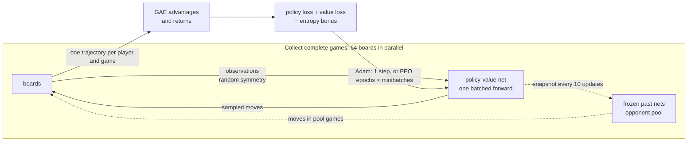

# Stage 3. Policy Gradients — REINFORCE → A2C → PPO

> **Status: in progress (2026-10-02).** Implementation and tests are done; the experiment sweep is half finished.
> Preliminary result: PPO beats random 100% on `omok9` but only reaches a score of **0.35 ± 0.02** against the heuristic after 6M moves
> (Stage 2 DQN: 0.57 after 2M). Without its clipped ratio, the same 16 gradient steps per batch destroy the policy (entropy → 0, score 0.00).
> Removing the entropy bonus lowers the score to 0.21. See [Progress so far](#progress-so-far) for what is done and what remains.

## Goal

- Learn a **policy** $\pi_\theta(a \mid s)$ directly, instead of deriving moves from Q-values as in Stage 2.
- Implement the three classic policy-gradient methods in one self-play loop: **REINFORCE** (with and without a baseline),
  **A2C** (advantage actor-critic with parallel games), and **PPO** (clipped updates, GAE advantages, masked logits).
- Add **self-play against a pool of past checkpoints** (a simple league) and compare it with pure self-play.
- **Success criteria**:
  1. Correctness: on tic-tac-toe, the policy approaches the exact metrics of Stage 1–2 (≥ 99% optimal moves, unbeatable).
  2. On `omok9`, beat the Stage 0 heuristic (score > 0.5), and compare with Stage 2's best DQN (0.57 after 2M moves)
     in sample efficiency (moves played), wall-clock time and stability.

## Background

### Why learn a policy directly?

DQN learns $Q(s, a)$ and plays $\arg\max_a Q(s, a)$. That has two consequences:

- The policy is **deterministic**, and exploration has to be bolted on (ε-greedy).
- A tiny change in Q-values can flip the argmax, so the policy can change abruptly. Stage 2 saw this as tic-tac-toe
  networks drifting in and out of "unbeatable".

A **policy-gradient** method instead parameterizes the policy itself: a network outputs one logit per cell, and
$\pi_\theta(a \mid s)$ is the softmax over the **legal** cells. Illegal moves get logit $-\infty$ (**masked logits**),
so they have probability exactly 0. The policy changes smoothly with $\theta$, and exploration is built in:
moves are *sampled*.

### The policy gradient theorem

We want to maximize the expected return $J(\theta) = \mathbb{E}_{\pi_\theta}[G_0]$, where the return $G_t$ is the
(discounted) sum of rewards from move $t$ to the end of the game. The **policy gradient theorem** says

$$
\nabla_\theta J(\theta) = \mathbb{E}_{\pi_\theta}\left[ \sum_t \nabla_\theta \log \pi_\theta(a_t \mid s_t) \, G_t \right]
$$

In words: make moves that were followed by a high return more likely, in proportion to that return.
It needs no model of the game and no differentiable reward, only samples of games played by the current policy.

**REINFORCE** (Williams, 1992) estimates this expectation from complete games: play, compute $G_t$ for every move,
take a gradient step on $-\sum_t \log \pi_\theta(a_t \mid s_t) \, G_t$.
It is **on-policy**: the samples must come from the current $\pi_\theta$, so every batch of games is used once and thrown away
(unlike DQN's replay buffer).

### Baselines and the advantage

$G_t$ is very noisy: in Omok it is just the final result ($+1$, $0$ or $-1$), decided by many later moves of both players.
Subtracting any **baseline** $b(s_t)$ that doesn't depend on the action leaves the gradient unbiased, since
$\mathbb{E}_{a \sim \pi}[\nabla_\theta \log \pi_\theta(a \mid s)] = 0$, but can reduce its variance a lot.
The natural choice is a learned **state value** $V_\phi(s) \approx \mathbb{E}[G_t \mid s_t = s]$, which gives the **advantage**

$$
A_t = G_t - V_\phi(s_t)
$$

"How much better did this move turn out than expected from this position?" A move in a won game played from an already
winning position gets little credit, a move that turned a lost position around gets a lot.

**Actor-critic** methods also use $V_\phi$ to *bootstrap*, as TD learning did in Stage 1: the one-step **TD error**
$\delta_t = r_t + \gamma V_\phi(s_{t+1}) - V_\phi(s_t)$ is an advantage estimate with low variance but some bias (it trusts $V_\phi$).
**Generalized Advantage Estimation** (GAE, Schulman et al., 2016) interpolates between the two:

$$
\hat A_t = \sum_{k \ge 0} (\gamma \lambda)^k \, \delta_{t+k}
$$

where $\gamma$ is the discount factor and $\lambda \in [0, 1]$ trades bias for variance: $\lambda = 0$ is the TD error,
$\lambda = 1$ telescopes to $G_t - V_\phi(s_t)$, REINFORCE with a baseline. The critic is trained by regression of
$V_\phi(s_t)$ on $\hat A_t + V_\phi(s_t)$.

**A2C** (the synchronous variant of A3C, Mnih et al., 2016) runs many games in parallel, computes advantages with the critic,
and takes one gradient step on the combined batch.

### PPO: several steps on one batch, safely

On-policy methods use each batch for one gradient step, which wastes data. Taking several steps on the same batch is tempting,
but after the first step the data no longer comes from the current policy, and a large step can make the policy much worse.
**PPO** (Schulman et al., 2017) reweights each sample by the probability ratio
$\rho_t = \pi_\theta(a_t \mid s_t) / \pi_{\theta_\text{old}}(a_t \mid s_t)$, where $\pi_{\theta_\text{old}}$ is the policy that played the games,
and **clips** it, so that a single batch can't push the policy far:

$$
L^\text{CLIP}(\theta) = -\mathbb{E}_t\left[ \min\left( \rho_t \hat A_t, \; \text{clip}(\rho_t, 1 - \epsilon, 1 + \epsilon) \hat A_t \right) \right]
$$

with $\epsilon = 0.2$. Once a move's probability has moved by more than ±20% in the direction the advantage asks for,
its gradient is zero. That makes several epochs of minibatch updates on one batch safe in practice.

### Entropy bonus

All three methods add $-c_\text{ent} \, \mathcal{H}[\pi_\theta(\cdot \mid s)]$ to the loss, where the **entropy**
$\mathcal{H} = -\sum_a \pi(a \mid s) \log \pi(a \mid s)$ (in nats) measures how spread out the policy is
($\log 81 \approx 4.4$ for a uniform move on an empty 9x9 board, 0 for a deterministic one). Without it, the policy tends to become
deterministic early, and then it stops exploring: positions it never reaches are never learned. $c_\text{ent}$ is the
**entropy coefficient** (`ent_coef`).

### Self-play, a league, and two-player perspective

In pure self-play both players are the current network. The opponent is then a moving target (**non-stationarity**,
already a problem in Stage 2), and the policy can learn to beat only *itself*, forget how to beat older strategies, and go
around in circles. A common remedy (e.g. AlphaStar's league, OpenAI Five) is to also play against a **pool of frozen past versions**.

## Implementation



| File | What it does |
|---|---|
| [`src/omok_rl/nets.py`](../../src/omok_rl/nets.py) | `PolicyValueNet`: the Stage 2 residual CNN body with a policy head and a value head |
| [`src/omok_rl/pg.py`](../../src/omok_rl/pg.py) | `PGConfig`, `Collector` (parallel games, opponent pool), `advantages` (GAE), `learn`, `train`; CLI `python -m omok_rl.pg` |
| [`src/omok_rl/agents/policy.py`](../../src/omok_rl/agents/policy.py) | `PolicyAgent`: plays the most likely legal move (or samples) from a saved network; usable in the arena |
| [`scripts/stage3_pg.py`](../../scripts/stage3_pg.py) | All Stage 3 runs (5 at a time on one GPU) |
| [`scripts/plot_stage3.py`](../../scripts/plot_stage3.py) | Tables and figures in this document, head-to-head matches |
| [`tests/test_stage3.py`](../../tests/test_stage3.py) | GAE, perspective of rewards, masking, network shapes, short end-to-end runs |

**Network.** `PolicyValueNet`: a 3x3 convolution to 64 channels and 3 residual blocks, as `ConvQNet` in Stage 2. The **policy head** is a 1x1 convolution
giving one logit per cell; the **value head** averages the features over the board, then a 64-unit layer and `tanh` give $V(s) \in [-1, 1]$.
Both heads share the body (~0.23M parameters), so the value loss also shapes the features the policy uses.

**One trajectory per player.** Every move is stored from the point of view of the player who made it, and each player's moves in a game form one trajectory.
For Black, White's replies are part of the environment, and vice versa. The only reward is the final result for that player,
on their last move: $+1$ win, $-1$ loss, $0$ draw. So $s_{t+1}$ in the TD error is the position at the player's *next* turn, two plies later.
Stage 2 instead used negamax ($-V$ of the opponent's position one ply later). Both are valid. This one has the advantage that self-play and pool games use
the same code: against a pool opponent, only the learner's trajectory is kept.

**The three algorithms in one loss** (`ppo_loss` in [`pg.py`](../../src/omok_rl/pg.py)):

```python
log_probs = masked_log_probs(logits, mask)              # illegal cells: -inf
log_prob = log_probs.gather(1, action[:, None])[:, 0]
ratio = (log_prob - old_log_prob).exp()
if config.algo == 'ppo':
    policy_loss = -torch.min(ratio * adv, ratio.clamp(1 - config.clip, 1 + config.clip) * adv).mean()
else:   # reinforce and a2c: the plain policy gradient
    policy_loss = -(log_prob * adv).mean()
value_loss = 0.5 * ((value - ret) ** 2).mean()
loss = policy_loss + config.vf_coef * value_loss - config.ent_coef * entropy(log_probs).mean()
```

| Algorithm | Advantage `adv` | Gradient steps per batch |
|---|---|---|
| REINFORCE | $G_t$ (no baseline) | 1 |
| REINFORCE + baseline | $G_t - V(s_t)$, i.e. GAE with $\lambda = 1$ | 1 |
| A2C | GAE, $\lambda = 0.95$ | 1 |
| PPO | GAE, $\lambda = 0.95$, clipped ratio | 4 epochs × 4 minibatches = 16 |

The critic $V$ is trained in all four, also for REINFORCE without a baseline, where it is just not used in the policy loss. That way the variants differ
only in the advantage and in the update rule.

**Design decisions**

- **Batches of complete games.** Each update collects complete games until at least 4,096 learner moves are recorded, so no game is cut off and every
  advantage is computed to the real end of the game (no bootstrapping at a rollout boundary). Boards that finish once the batch is full sit idle until the
  last game ends. The usual A2C/PPO recipe instead uses fixed-length rollouts. Omok games are short (20–50 moves), so whole games are simpler and REINFORCE
  can use the same collector.
- **Symmetry at collection time.** Stage 2 augmented replayed samples. Here the data must come from the current policy, so instead every move is chosen on
  a randomly rotated or reflected copy of the board (the move is mapped back before it is played), and the transformed board is what gets stored.
  The stored log-probabilities match the stored boards exactly, so PPO's ratio stays correct.
- **Advantage normalization** (zero mean, unit standard deviation per batch) for all variants except REINFORCE without a baseline, where it would act as a
  baseline (the batch mean).
- **Opponent pool.** With `pool_prob = 0.5`, half of the games (once the pool is non-empty) are against a frozen snapshot, taken every 10 updates, last 20 kept.
  The learner's color is random. One snapshot is drawn per batch for all of that batch's pool games, so they share one forward pass per move.
  Drawing a snapshot per game made collection about 3x slower (up to 20 small forward passes per move).
- **Evaluation** is greedy (most likely legal move), with the same `Evaluator` as Stage 2: 100 games against random and 100 against the heuristic,
  each pair of games from the same random 4-move opening, once per color.

| Hyperparameter | Value |
|---|---|
| Optimizer | Adam, learning rate 3e-4, gradient norm clipped at 1.0 |
| Batch | ≥ 4,096 learner moves of complete games (2,048 on tic-tac-toe), 64 parallel boards |
| PPO | 4 epochs × 4 minibatches, clip $\epsilon$ = 0.2 |
| GAE | $\gamma$ = 1 (no discount; games are short and the result is all that counts), $\lambda$ = 0.95 |
| Loss weights | value 0.5, entropy 0.01 (default) |

## Progress so far

This section is temporary: it records the state of the work so it can be resumed, and will be replaced by the usual
**Experiments**, **Summary** and **Next Steps** sections once the sweep is complete.

### Done

- `PolicyValueNet`, `PolicyAgent` (also loadable by `make_agent` / `omok-arena` from a `.pt` file), `omok_rl.pg` with REINFORCE / A2C / PPO,
  GAE, masked logits, entropy bonus, symmetry at collection time, and the opponent pool.
- Tests: [`tests/test_stage3.py`](../../tests/test_stage3.py) (all 44 project tests pass).
- Experiment and plotting scripts: [`scripts/stage3_pg.py`](../../scripts/stage3_pg.py), [`scripts/plot_stage3.py`](../../scripts/plot_stage3.py).

### Pilot runs (one seed each, used to choose the settings above)

`omok9`, PPO unless noted, score against the heuristic (100 games, 4-move random openings):

| Pilot | Score at 2M moves | Score at 6M moves | Note |
|---|---:|---:|---|
| Defaults (lr 3e-4, batch 4,096, 4 × 4 updates, ent_coef 0.01) | 0.05 | 0.33 | chosen |
| ent_coef 0.03 | 0.02 | 0.32 | |
| lr 1e-3 | 0.11 | 0.25 | |
| $\gamma$ = 0.99, $\lambda$ = 1 | 0.03 | 0.37 | |
| batch 16,384, 4 × 16 updates | 0.08 | 0.37 (5.5M) | |
| 8 epochs × 8 minibatches | 0.02 | 0.07 (4M) | more reuse per batch hurts |
| A2C, lr 1e-3 | 0.00 | 0.00 | collapses: entropy 0.15, self-play games shrink to ~10 moves |

- **Throughput**: one PPO run alone plays ~5,000 moves/s, about 10x DQN's rate in Stage 2: there is no replay and only 16 gradient steps per ~4,000 moves.
  With 5 runs sharing the GPU, a 6M-move run takes ~48 minutes (DQN: 2M moves in ~100 minutes with 6 runs sharing).
- **Tic-tac-toe** (300k moves): PPO with ent_coef 0.01 ends at **87%** optimal moves and is not unbeatable (DQN: 99.7%). Its entropy falls to ~0.3 nats by 100k moves:
  the policy becomes almost deterministic, and self-play stops visiting most positions. With ent_coef 0.1 it reaches **97%**, which supports this explanation.
  Turning off symmetry augmentation made no clear difference (85%).

### Preliminary results of the sweep (3 seeds, 6M moves, final checkpoint)

| Run | Score vs heuristic | Win as Black | Win as White | Best score | Final entropy (nats) |
|---|---:|---:|---:|---:|---:|
| PPO (ent_coef 0.01) | 0.35 ± 0.02 | 0.31 ± 0.05 | 0.07 ± 0.01 | 0.40 | 0.95 ± 0.10 |
| PPO, ent_coef 0 | 0.21 ± 0.02 | 0.21 ± 0.06 | 0.04 ± 0.02 | 0.29 | 0.52 ± 0.05 |
| PPO without clipping (4 epochs × 4 minibatches of the plain policy gradient) | 0.00 ± 0.00 | 0.00 | 0.00 | 0.00 | 0.00 |

All score 0.97–1.00 against random. PPO is still improving at 6M moves (seed 0: 0.04 at 1.5M, 0.15 at 3.5M, 0.38 at 5.5M).
Code version: working tree on top of `293d42a`. Hardware: NVIDIA RTX 5060 Ti + Intel Core i5-14400F.

### Remaining

1. Finish the sweep: `uv run python scripts/stage3_pg.py` (it skips finished runs). Missing: `algorithms/` REINFORCE, REINFORCE + baseline, A2C;
   `updates/a2c-16mb`; `entropy/` ent_coef 0.03 and 0.1; `league/` (opponent pool); all of `tictactoe/`.
2. `uv run python scripts/plot_stage3.py` for the tables and figures (also plays PPO vs the Stage 2 DQN and the final networks against their own past checkpoints).
3. Replace this section with **Experiments**, **Summary**, **Next Steps**, **References**; update the TL;DR, the index in `docs/README.md` and the root checklist.

## Pitfalls & Lessons

- **`dataclasses.replace` copies values that `__post_init__` derived.** `PGConfig` first resolved `epochs = 0` ("algorithm default") to 4 or 1 in `__post_init__`.
  The experiment script builds every run as `replace(OMOK9, algo=...)` from a PPO config, so the A2C and REINFORCE runs silently inherited PPO's
  4 epochs × 4 minibatches. Without PPO's clipping, those 16 steps per batch blew up: policy loss around −4,000, approximate KL in the thousands, and entropy exactly 0
  within 500k moves. The defaults are now resolved where they are used (`PGConfig.n_epochs`, `n_minibatches`), and a test checks `replace`.
  The broken A2C runs are exactly "PPO without clipping", so they are kept as that ablation (`updates/noclip`). The REINFORCE runs were discarded.
- **`Path.with_suffix` on names with a dot.** `Path('ent0.03-seed0').with_suffix('.json')` is `ent0.json`, so all runs with ent_coef 0.03 and 0.1 wrote their
  curve and final network to the same file. Their per-checkpoint networks survived (directories don't use `with_suffix`), but the training statistics
  (entropy, KL) were lost, so these runs are being repeated. Output paths are now built as `f'{out}.json'`.
- **Redirected `print` is block-buffered.** The first pilots wrote nothing to their logs for 30 minutes. Logs now flush on every line.
- **`pkill -f <pattern>` can kill the shell that runs it** if the pattern appears in its own command line (Stage 2 hit the same problem with `pgrep`).
  Use a pattern like `"pool-pro[b]"`, which matches the target but not itself.
- **One forward pass per opponent.** Drawing a pool snapshot per game made collection about 3x slower, since a batch of 64 boards could need up to 20 separate
  forward passes. Now one snapshot is drawn per batch.
