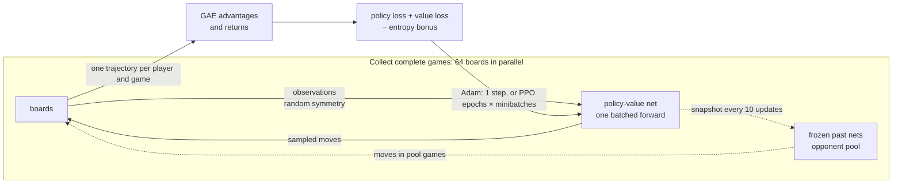
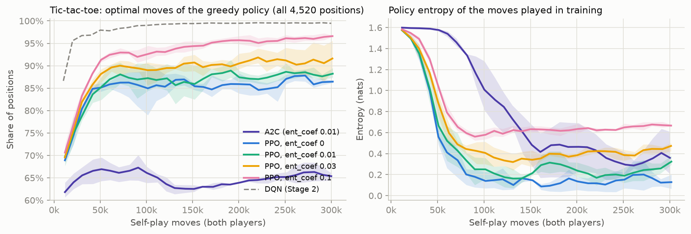
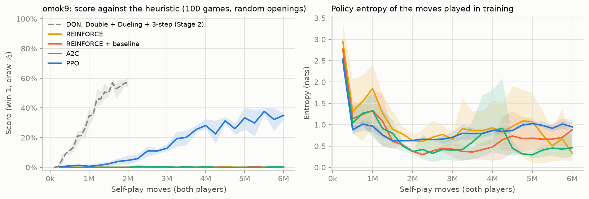
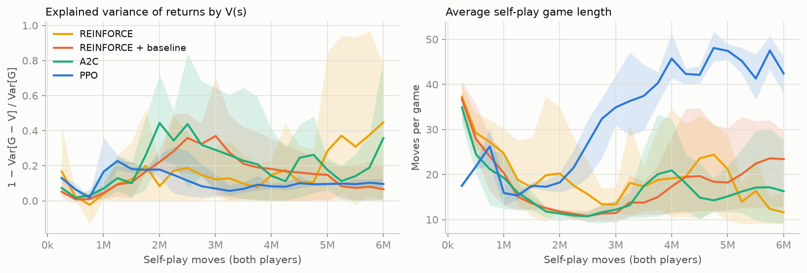
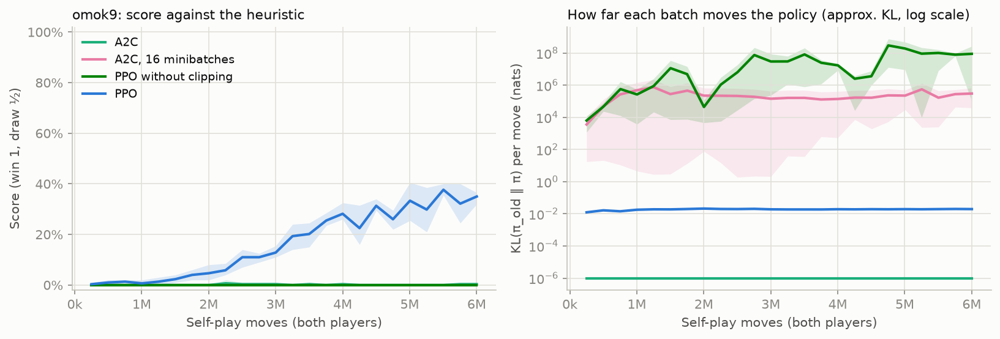
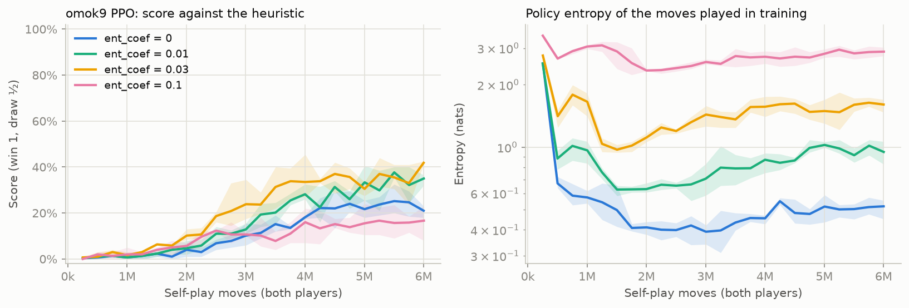
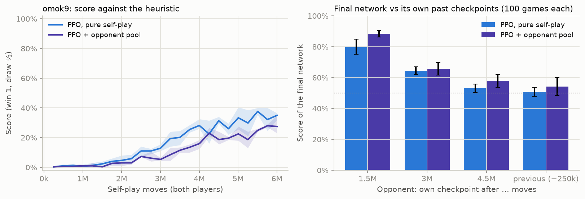
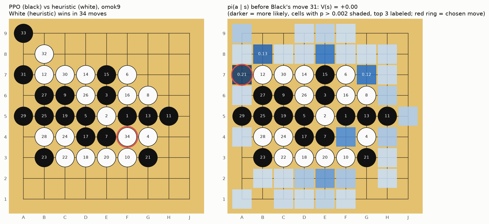

# Stage 3. Policy Gradients — REINFORCE → A2C → PPO

> **TL;DR** — Of the four policy-gradient methods, only **PPO** learns to play `omok9` beyond beating random: after 6M self-play moves it scores
> **0.35 ± 0.02** against the heuristic (**0.42** with entropy coefficient 0.03). That is below Stage 2's DQN (0.57 after 2M moves), and PPO loses to that DQN
> head-to-head (score 0.29). REINFORCE (with or without a baseline) and A2C beat random 99–100% of the time but score **0.00** against the heuristic:
> their self-play collapses into ~10-move games where neither side defends. PPO's clipped ratio is what makes its 16 gradient steps per batch work:
> without it, the same updates drive the entropy to 0 within 250k moves. Neither success criterion was met (tic-tac-toe: 97% optimal moves at best, not 99%).

## Goal

- Learn a **policy** $\pi_\theta(a \mid s)$ directly, instead of deriving moves from Q-values as in Stage 2.
- Implement the three classic policy-gradient methods in one self-play loop: **REINFORCE** (with and without a baseline),
  **A2C** (advantage actor-critic with parallel games), and **PPO** (clipped updates, GAE advantages, masked logits).
- Add **self-play against a pool of past checkpoints** (a simple league) and compare it with pure self-play.
- **Success criteria**:
  1. Correctness: on tic-tac-toe, the policy approaches the exact metrics of Stage 1–2 (≥ 99% optimal moves, unbeatable).
  2. On `omok9`, beat the Stage 0 heuristic (score > 0.5), and compare with Stage 2's best DQN (0.57 after 2M moves)
     in sample efficiency (moves played), wall-clock time and stability.

## Background

### Why learn a policy directly?

DQN learns $Q(s, a)$ and plays $\arg\max_a Q(s, a)$. That has two consequences:

- The policy is **deterministic**, and exploration has to be bolted on (ε-greedy).
- A tiny change in Q-values can flip the argmax, so the policy can change abruptly. Stage 2 saw this as tic-tac-toe
  networks drifting in and out of "unbeatable".

A **policy-gradient** method instead parameterizes the policy itself: a network outputs one logit per cell, and
$\pi_\theta(a \mid s)$ is the softmax over the **legal** cells. Illegal moves get logit $-\infty$ (**masked logits**),
so they have probability exactly 0. The policy changes smoothly with $\theta$, and exploration is built in:
moves are *sampled*.

### The policy gradient theorem

We want to maximize the expected return $J(\theta) = \mathbb{E}_{\pi_\theta}[G_0]$, where the return $G_t$ is the
(discounted) sum of rewards from move $t$ to the end of the game. The **policy gradient theorem** says

$$
\nabla_\theta J(\theta) = \mathbb{E}_{\pi_\theta}\left[ \sum_t \nabla_\theta \log \pi_\theta(a_t \mid s_t) \, G_t \right]
$$

In words: make moves that were followed by a high return more likely, in proportion to that return.
It needs no model of the game and no differentiable reward, only samples of games played by the current policy.

**REINFORCE** (Williams, 1992) estimates this expectation from complete games: play, compute $G_t$ for every move,
take a gradient step on $-\sum_t \log \pi_\theta(a_t \mid s_t) \, G_t$.
It is **on-policy**: the samples must come from the current $\pi_\theta$, so every batch of games is used once and thrown away
(unlike DQN's replay buffer).

### Baselines and the advantage

$G_t$ is very noisy: in Omok it is just the final result ($+1$, $0$ or $-1$), decided by many later moves of both players.
Subtracting any **baseline** $b(s_t)$ that doesn't depend on the action leaves the gradient unbiased, since
$\mathbb{E}_{a \sim \pi}[\nabla_\theta \log \pi_\theta(a \mid s)] = 0$, but can reduce its variance a lot.
The natural choice is a learned **state value** $V_\phi(s) \approx \mathbb{E}[G_t \mid s_t = s]$, which gives the **advantage**

$$
A_t = G_t - V_\phi(s_t)
$$

"How much better did this move turn out than expected from this position?" A move in a won game played from an already
winning position gets little credit, a move that turned a lost position around gets a lot.

**Actor-critic** methods also use $V_\phi$ to *bootstrap*, as TD learning did in Stage 1: the one-step **TD error**
$\delta_t = r_t + \gamma V_\phi(s_{t+1}) - V_\phi(s_t)$ is an advantage estimate with low variance but some bias (it trusts $V_\phi$).
**Generalized Advantage Estimation** (GAE, Schulman et al., 2016) interpolates between the two:

$$
\hat A_t = \sum_{k \ge 0} (\gamma \lambda)^k \, \delta_{t+k}
$$

where $\gamma$ is the discount factor and $\lambda \in [0, 1]$ trades bias for variance: $\lambda = 0$ is the TD error,
$\lambda = 1$ telescopes to $G_t - V_\phi(s_t)$, REINFORCE with a baseline. The critic is trained by regression of
$V_\phi(s_t)$ on $\hat A_t + V_\phi(s_t)$.

**A2C** (the synchronous variant of A3C, Mnih et al., 2016) runs many games in parallel, computes advantages with the critic,
and takes one gradient step on the combined batch.

### PPO: several steps on one batch, safely

On-policy methods use each batch for one gradient step, which wastes data. Taking several steps on the same batch is tempting,
but after the first step the data no longer comes from the current policy, and a large step can make the policy much worse.
**PPO** (Schulman et al., 2017) reweights each sample by the probability ratio
$\rho_t = \pi_\theta(a_t \mid s_t) / \pi_{\theta_\text{old}}(a_t \mid s_t)$, where $\pi_{\theta_\text{old}}$ is the policy that played the games,
and **clips** it, so that a single batch can't push the policy far:

$$
L^\text{CLIP}(\theta) = -\mathbb{E}_t\left[ \min\left( \rho_t \hat A_t, \; \text{clip}(\rho_t, 1 - \epsilon, 1 + \epsilon) \hat A_t \right) \right]
$$

with $\epsilon = 0.2$. Once a move's probability has moved by more than ±20% in the direction the advantage asks for,
its gradient is zero. That makes several epochs of minibatch updates on one batch safe in practice.

### Entropy bonus

All three methods add $-c_\text{ent} \, \mathcal{H}[\pi_\theta(\cdot \mid s)]$ to the loss, where the **entropy**
$\mathcal{H} = -\sum_a \pi(a \mid s) \log \pi(a \mid s)$ (in nats) measures how spread out the policy is
($\log 81 \approx 4.4$ for a uniform move on an empty 9x9 board, 0 for a deterministic one). Without it, the policy tends to become
deterministic early, and then it stops exploring: positions it never reaches are never learned. $c_\text{ent}$ is the
**entropy coefficient** (`ent_coef`).

### Self-play, a league, and two-player perspective

In pure self-play both players are the current network. The opponent is then a moving target (**non-stationarity**,
already a problem in Stage 2), and the policy can learn to beat only *itself*, forget how to beat older strategies, and go
around in circles. A common remedy (e.g. AlphaStar's league, OpenAI Five) is to also play against a **pool of frozen past versions**.

## Implementation



| File | What it does |
|---|---|
| [`src/omok_rl/nets.py`](../../src/omok_rl/nets.py) | `PolicyValueNet`: the Stage 2 residual CNN body with a policy head and a value head |
| [`src/omok_rl/pg.py`](../../src/omok_rl/pg.py) | `PGConfig`, `Collector` (parallel games, opponent pool), `advantages` (GAE), `learn`, `train`; CLI `python -m omok_rl.pg` |
| [`src/omok_rl/agents/policy.py`](../../src/omok_rl/agents/policy.py) | `PolicyAgent`: plays the most likely legal move (or samples) from a saved network; usable in the arena |
| [`scripts/stage3_pg.py`](../../scripts/stage3_pg.py) | All Stage 3 runs, several at a time on one GPU (`--workers`, default 3) |
| [`scripts/plot_stage3.py`](../../scripts/plot_stage3.py) | Tables and figures in this document, head-to-head matches |
| [`tests/test_stage3.py`](../../tests/test_stage3.py) | GAE, perspective of rewards, masking, network shapes, short end-to-end runs |

**Network.** `PolicyValueNet`: a 3x3 convolution to 64 channels and 3 residual blocks, as `ConvQNet` in Stage 2. The **policy head** is a 1x1 convolution
giving one logit per cell; the **value head** averages the features over the board, then a 64-unit layer and `tanh` give $V(s) \in [-1, 1]$.
Both heads share the body (~0.23M parameters), so the value loss also shapes the features the policy uses.

**One trajectory per player.** Every move is stored from the point of view of the player who made it, and each player's moves in a game form one trajectory.
For Black, White's replies are part of the environment, and vice versa. The only reward is the final result for that player,
on their last move: $+1$ win, $-1$ loss, $0$ draw. So $s_{t+1}$ in the TD error is the position at the player's *next* turn, two plies later.
Stage 2 instead used negamax ($-V$ of the opponent's position one ply later). Both are valid. This one has the advantage that self-play and pool games use
the same code: against a pool opponent, only the learner's trajectory is kept.

**The three algorithms in one loss** (`ppo_loss` in [`pg.py`](../../src/omok_rl/pg.py)):

```python
log_probs = masked_log_probs(logits, mask)              # illegal cells: -inf
log_prob = log_probs.gather(1, action[:, None])[:, 0]
ratio = (log_prob - old_log_prob).exp()
if config.algo == 'ppo':
    policy_loss = -torch.min(ratio * adv, ratio.clamp(1 - config.clip, 1 + config.clip) * adv).mean()
else:   # reinforce and a2c: the plain policy gradient
    policy_loss = -(log_prob * adv).mean()
value_loss = 0.5 * ((value - ret) ** 2).mean()
loss = policy_loss + config.vf_coef * value_loss - config.ent_coef * entropy(log_probs).mean()
```

| Algorithm | Advantage `adv` | Gradient steps per batch |
|---|---|---|
| REINFORCE | $G_t$ (no baseline) | 1 |
| REINFORCE + baseline | $G_t - V(s_t)$, i.e. GAE with $\lambda = 1$ | 1 |
| A2C | GAE, $\lambda = 0.95$ | 1 |
| PPO | GAE, $\lambda = 0.95$, clipped ratio | 4 epochs × 4 minibatches = 16 |

The critic $V$ is trained in all four, also for REINFORCE without a baseline, where it is just not used in the policy loss. That way the variants differ
only in the advantage and in the update rule.

**Design decisions**

- **Batches of complete games.** Each update collects complete games until at least 4,096 learner moves are recorded, so no game is cut off and every
  advantage is computed to the real end of the game (no bootstrapping at a rollout boundary). Boards that finish once the batch is full sit idle until the
  last game ends. The usual A2C/PPO recipe instead uses fixed-length rollouts. Omok games are short (20–50 moves), so whole games are simpler and REINFORCE
  can use the same collector.
- **Symmetry at collection time.** Stage 2 augmented replayed samples. Here the data must come from the current policy, so instead every move is chosen on
  a randomly rotated or reflected copy of the board (the move is mapped back before it is played), and the transformed board is what gets stored.
  The stored log-probabilities match the stored boards exactly, so PPO's ratio stays correct.
- **Advantage normalization** (zero mean, unit standard deviation per batch) for all variants except REINFORCE without a baseline, where it would act as a
  baseline (the batch mean).
- **Opponent pool.** With `pool_prob = 0.5`, half of the games (once the pool is non-empty) are against a frozen snapshot, taken every 10 updates, last 20 kept.
  The learner's color is random. One snapshot is drawn per batch for all of that batch's pool games, so they share one forward pass per move.
  Drawing a snapshot per game made collection about 3x slower (up to 20 small forward passes per move).
- **Evaluation** is greedy (most likely legal move), with the same `Evaluator` as Stage 2: 100 games against random and 100 against the heuristic,
  each pair of games from the same random 4-move opening, once per color.

| Hyperparameter | Value |
|---|---|
| Optimizer | Adam, learning rate 3e-4, gradient norm clipped at 1.0 |
| Batch | ≥ 4,096 learner moves of complete games (2,048 on tic-tac-toe), 64 parallel boards |
| PPO | 4 epochs × 4 minibatches, clip $\epsilon$ = 0.2 |
| GAE | $\gamma$ = 1 (no discount; games are short and the result is all that counts), $\lambda$ = 0.95 |
| Loss weights | value 0.5, entropy 0.01 (default) |

## Experiments

**Common setup** (unless stated otherwise)

- Board `omok9` (9x9 freestyle), 6M self-play moves per run (both players counted), 3 seeds (0, 1, 2).
- Every 250k moves the greedy policy plays 100 games against random and 100 against the heuristic, each pair of games from the same random 4-move
  opening, once per color. **Score** = (wins + ½ draws) / games.
- Tables report the final checkpoint as mean ± std over the 3 seeds. Shaded bands in the figures are the min–max over the seeds.
- **Commands**: `uv run python scripts/stage3_pg.py` runs everything (`--only <experiment>` for one experiment; finished runs are skipped),
  then `uv run python scripts/plot_stage3.py` prints the tables and draws the figures.
- **Code version**: `77c9f5d`. The runs `algorithms/ppo`, `entropy/ent0` and `updates/noclip` come from the uncommitted working tree on top of `293d42a`
  that became `77c9f5d`. The two bugs fixed in that commit did not affect them (see [Pitfalls](#pitfalls--lessons)).
- **Hardware**: NVIDIA RTX 5060 Ti (16 GB) + Intel Core i5-14400F, several runs sharing the GPU. Those three experiments ran 5 at a time,
  the rest 3 at a time, so wall-clock minutes are only comparable within a pass. A PPO run takes ~31 minutes with 3 runs sharing the GPU,
  ~49 minutes with 5. REINFORCE and A2C take ~16 minutes with 3 sharing.

### Pilot runs (one seed each, used to choose the settings)

`omok9`, PPO unless noted, score against the heuristic:

| Pilot | Score at 2M moves | Score at 6M moves | Note |
|---|---:|---:|---|
| Defaults (lr 3e-4, batch 4,096, 4 × 4 updates, ent_coef 0.01) | 0.05 | 0.33 | chosen |
| ent_coef 0.03 | 0.02 | 0.32 | |
| lr 1e-3 | 0.11 | 0.25 | |
| $\gamma$ = 0.99, $\lambda$ = 1 | 0.03 | 0.37 | |
| batch 16,384, 4 × 16 updates | 0.08 | 0.37 (5.5M) | |
| 8 epochs × 8 minibatches | 0.02 | 0.07 (4M) | more reuse per batch hurts |
| A2C, lr 1e-3 | 0.00 | 0.00 | collapses: entropy 0.15, self-play games shrink to ~10 moves |

- One PPO run alone plays ~5,000 moves/s, about 10x DQN's rate in Stage 2, since there is no replay and only 16 gradient steps per ~4,000 moves.
- Turning off symmetry augmentation on tic-tac-toe made no clear difference (85% optimal moves vs 88%).

### 1. Correctness check on tic-tac-toe

- **Question**: does the implementation learn a near-perfect tic-tac-toe policy, as Stages 1–2 did?
- **Setup**: 300k moves, batches of ≥ 2,048 learner moves, evaluation every 10k moves against the exact game-theoretic values of all 4,520 positions
  (the metrics of Stage 1): the **optimal-move rate** (share of positions where the greedy move is optimal) and **unbeatable** (no losing line for either color).
  PPO with four entropy coefficients, and A2C.

| Run | Final optimal-move rate | Best optimal-move rate | Unbeatable at the end | Share of checkpoints unbeatable | Final entropy (nats) |
|---|---:|---:|---:|---:|---:|
| A2C (ent_coef 0.01) | 0.654 ± 0.007 | 0.679 ± 0.020 | 0/3 | 0.00 ± 0.00 | 0.36 ± 0.18 |
| PPO, ent_coef 0 | 0.865 ± 0.002 | 0.890 ± 0.004 | 1/3 | 0.01 ± 0.02 | 0.13 ± 0.05 |
| PPO, ent_coef 0.01 | 0.882 ± 0.009 | 0.895 ± 0.014 | 0/3 | 0.04 ± 0.04 | 0.32 ± 0.04 |
| PPO, ent_coef 0.03 | 0.916 ± 0.029 | 0.927 ± 0.020 | 0/3 | 0.08 ± 0.06 | 0.47 ± 0.04 |
| PPO, ent_coef 0.1 | **0.966 ± 0.002** | 0.967 ± 0.003 | 0/3 | 0.22 ± 0.15 | 0.67 ± 0.01 |
| DQN (Stage 2) | 0.997 | | | | |



*Figure 1. Tic-tac-toe: share of positions where the greedy policy plays an optimal move (left) and entropy of the moves played in training (right),
3 seeds, min–max band. The dashed line is Stage 2's DQN. Generated by `scripts/plot_stage3.py`.*

- **Observation**: the implementation learns (from ~69% optimal moves at 10k moves to 85–91% at 50k), but no setting reaches DQN's 99.7%.
  The more entropy bonus, the better: ent_coef 0.1 keeps the entropy at ~0.65 nats and reaches 97%, ent_coef 0 drops to 0.13 nats and stalls at 87%.
  Self-play with a nearly deterministic policy keeps replaying the same few games, so most of the 4,520 positions are never visited and never learned.
  DQN's ε-greedy exploration plus replay covers them; on-policy self-play only learns where its own policy goes.
- A2C is stuck at 65%: in 300k moves it takes only ~146 gradient steps (one per batch), PPO ~2,300.

### 2. REINFORCE vs A2C vs PPO on omok9

- **Question**: how do the four algorithms compare with each other and with Stage 2's best DQN, in moves played and in stability?
- **Setup**: common setup, ent_coef 0.01. Each algorithm's update rule is in the [table above](#implementation). DQN numbers are Stage 2's
  Double + Dueling + 3-step runs (2M moves, same evaluation).

| Algorithm | Score vs random | Score vs heuristic | Win as Black | Win as White | Best score vs heuristic | Moves to first 0.5 vs heuristic | Gradient steps |
|---|---:|---:|---:|---:|---:|---:|---:|
| DQN, Double + Dueling + 3-step (Stage 2, 2M moves) | 1.00 ± 0.00 | **0.57 ± 0.03** | 0.49 ± 0.08 | 0.28 ± 0.07 | 0.59 ± 0.01 | 1.5M (3/3) | 31,093 |
| REINFORCE | 1.00 ± 0.00 | 0.00 ± 0.00 | 0.00 ± 0.00 | 0.01 ± 0.01 | 0.01 ± 0.00 | never | 1,245 |
| REINFORCE + baseline | 0.99 ± 0.01 | 0.00 ± 0.00 | 0.01 ± 0.01 | 0.00 ± 0.00 | 0.01 ± 0.00 | never | 1,264 |
| A2C | 1.00 ± 0.00 | 0.00 ± 0.00 | 0.01 ± 0.01 | 0.00 ± 0.00 | 0.01 ± 0.01 | never | 1,277 |
| PPO | 1.00 ± 0.00 | **0.35 ± 0.02** | 0.31 ± 0.05 | 0.07 ± 0.01 | 0.40 ± 0.01 | never | 18,021 |



*Figure 2. `omok9`: score against the heuristic (left, 100 games per point) and policy entropy (right), 3 seeds, min–max band.
The dashed line is Stage 2's DQN, which was trained for 2M moves. Generated by `scripts/plot_stage3.py`.*



*Figure 3. Learning-signal diagnostics: how much of the variance of the returns $V(s)$ explains (left) and the average self-play game length (right).
Generated by `scripts/plot_stage3.py`.*

- **Observation**: all four beat random almost always, but only PPO learns anything against the heuristic, and slowly: 0.05 at 2M moves, 0.35 at 6M,
  still rising. DQN reached 0.57 in 2M moves, so PPO needs more than 3x the moves to get to two thirds of DQN's score.
- **The collapse of REINFORCE and A2C** is visible in the game length (Figure 3, right): self-play games shrink from ~37 to ~10–11 moves by 2.5M moves.
  The shared policy learns to build five in a row fast, and, playing against itself, never meets an opponent that blocks, so it never learns to block either.
  That is enough to beat random (who doesn't block) and useless against the heuristic (who does). PPO goes through the same dip (16 moves at 1.25M),
  then its games grow to 40–50 moves, and its score against the heuristic rises with them: it has learned to defend.
- **The baseline makes no difference here.** REINFORCE with and without a baseline end in the same place. The value head explains only 10–40% of the
  variance of the returns (Figure 3, left), so the baseline removes little noise, and the problem is not only variance.
- **We can't separate two explanations** for the failure of the one-step methods: too few gradient steps (1,250 vs PPO's 18,000, at the same learning rate),
  or an unstable update. Raising A2C's learning rate to 1e-3 (pilot) collapsed in the same way, and taking more steps without clipping fails worse (next experiment).
- **Head-to-head against DQN**: the final PPO networks play the final DQN networks of the same seed, 200 games each from random 4-move openings, both colors:

| Pair | PPO score | PPO win as Black | PPO win as White | Draws |
|---|---:|---:|---:|---:|
| PPO seed 0 vs DQN seed 0 | 0.28 | 0.30 | 0.07 | 0.18 |
| PPO seed 1 vs DQN seed 1 | 0.29 | 0.26 | 0.04 | 0.27 |
| PPO seed 2 vs DQN seed 2 | 0.31 | 0.23 | 0.08 | 0.30 |

  DQN is clearly stronger. As against the heuristic, PPO wins mostly as Black and almost never as White.

### 3. What makes PPO work: clipping, not data reuse

- **Question**: PPO changes two things relative to A2C: it takes 16 gradient steps per batch instead of 1, and it clips the probability ratio.
  Which one matters?
- **Setup**: two controls with the plain policy gradient of A2C. `a2c-16mb`: 16 minibatches, one epoch, so 16 steps but each sample used once.
  `noclip`: PPO's 4 epochs × 4 minibatches without the clip. Common setup otherwise.

| Update | Gradient steps per batch | Uses of each sample | Score vs heuristic | Best score vs heuristic | Final entropy (nats) | Mean approx. KL per batch (nats) |
|---|---:|---:|---:|---:|---:|---:|
| A2C | 1 | 1 | 0.00 ± 0.00 | 0.01 ± 0.01 | 0.46 ± 0.25 | 0 (by construction) |
| A2C, 16 minibatches | 16 | 1 | 0.00 ± 0.00 | 0.00 ± 0.00 | 0.00 ± 0.00 | 2.5e5 |
| PPO without clipping | 16 | 4 | 0.00 ± 0.00 | 0.00 ± 0.00 | 0.00 ± 0.00 | 4.7e7 |
| PPO | 16 | 4 | **0.35 ± 0.02** | 0.40 ± 0.01 | 0.95 ± 0.10 | 0.019 |



*Figure 4. Score against the heuristic (left) and how far one batch of updates moves the policy (right): the approximate KL divergence between the policy
that played the games and the one being updated, $\mathbb{E}[(\rho - 1) - \log \rho]$, averaged over the gradient steps of a batch, log scale.
For A2C it is exactly 0 (one step, taken at the collecting policy) and is drawn at $10^{-6}$. Generated by `scripts/plot_stage3.py`.*

- **Observation**: with clipping, each batch moves the policy by a steady KL of ~0.02 nats per move for the whole run. Without it, the same 16 steps
  move it by $10^4$–$10^8$ nats: the policy becomes deterministic (entropy 0) within the first 250k moves and never recovers.
  Using each sample only once (`a2c-16mb`) does not help, so the problem is not overfitting a reused batch.
- **Likely mechanism.** The plain gradient $\nabla \log \pi(a \mid s) \, \hat A$ keeps pushing a move with negative advantage down with the same strength
  however unlikely it has already become, and 16 steps in a row can push a lot. PPO's objective has two brakes: it is weighted by the ratio $\rho$,
  which shrinks as the move becomes less likely, and once $\rho$ is outside $[0.8, 1.2]$ in the direction the advantage asks for, its gradient is zero.
  We did not run a control that separates the two brakes (a ratio-weighted loss without the clip).

### 4. Entropy coefficient

- **Question**: how much entropy bonus does PPO need on `omok9`?
- **Setup**: PPO with `ent_coef` 0, 0.01 (the `algorithms/ppo` runs), 0.03, 0.1. Common setup otherwise. **Last-10 jitter** = mean absolute change of
  the score between consecutive checkpoints over the last 10 (a measure of how unstable the policy is).

| ent_coef | Score vs heuristic | Best score vs heuristic | Final entropy (nats) | Last-10 jitter |
|---:|---:|---:|---:|---:|
| 0 | 0.21 ± 0.02 | 0.29 ± 0.03 | 0.52 ± 0.05 | 0.05 ± 0.01 |
| 0.01 | 0.35 ± 0.02 | 0.40 ± 0.01 | 0.95 ± 0.10 | 0.07 ± 0.02 |
| 0.03 | **0.42 ± 0.01** | 0.44 ± 0.02 | 1.61 ± 0.10 | 0.07 ± 0.00 |
| 0.1 | 0.17 ± 0.06 | 0.21 ± 0.03 | 2.88 ± 0.11 | 0.04 ± 0.01 |



*Figure 5. PPO on `omok9` with four entropy coefficients: score against the heuristic (left) and policy entropy (right, log scale), 3 seeds, min–max band.
Generated by `scripts/plot_stage3.py`.*

- **Observation**: there is a sweet spot. ent_coef 0.03 is best (0.42, ahead of the default 0.01 at most checkpoints from 2.5M moves on) and keeps the entropy around 1.6 nats.
  Without a bonus the entropy falls to ~0.4 nats by 2M moves and the score stalls at ~0.2, the same "stops exploring" effect as on tic-tac-toe.
  With 0.1 the entropy stays near 2.9 nats (about 18 equally likely moves): the policy stays too random to play sharply, and the score stalls at ~0.17.
  The single-seed pilot with 0.03 (0.32) did not show the gain; three seeds did.

### 5. Opponent pool (a simple league)

- **Question**: does playing half of the games against frozen past versions make training more stable or the policy stronger?
- **Setup**: PPO, `pool_prob = 0.5`: once the pool is non-empty, half of the games are against a snapshot drawn uniformly from the last 20
  (one taken every 10 updates). Only the learner's moves are trained on. To measure forgetting, each final network also plays its own checkpoints
  from 1.5M, 3M and 4.5M moves and the previous one (5.75M), 100 games each.

| Training opponents | Score vs heuristic | Last-10 jitter | Final vs own past checkpoints (mean of 4) | Updates in 6M moves |
|---|---:|---:|---:|---:|
| Pure self-play | **0.35 ± 0.02** | 0.07 ± 0.02 | 0.62 ± 0.02 | ~1,120 |
| Self-play + opponent pool | 0.27 ± 0.05 | 0.05 ± 0.01 | **0.67 ± 0.01** | ~940 |



*Figure 6. Left: score against the heuristic. Right: score of each final network against its own earlier checkpoints (100 games each, mean ± std over 3 seeds).
Above the dotted 50% line, the final network beats that checkpoint. Generated by `scripts/plot_stage3.py`.*

- **Observation**: the pool made the policy **weaker** against the heuristic (0.27 vs 0.35), and only slightly more consistent (jitter 0.05 vs 0.07,
  0.67 vs 0.62 against its own past). Neither run shows much forgetting: both final networks beat all their earlier checkpoints.
- Part of the gap is data: in a pool game only the learner's moves are kept, so the pool run gets ~17% fewer updates from the same 6M moves.
  At equal updates (~940, i.e. ~5M moves) pure self-play scored ~0.33, still ahead. At this level of play the policy isn't cycling between strategies,
  which is what a pool protects against, so it mostly costs data.

### 6. Looking inside: a lost game



*Figure 7. Left: PPO (seed 0, greedy, Black) loses to the heuristic in 34 moves. White's last move (red ring) completes B8–C7–D6–E5–F4.
Right: the policy before Black's move 31. Shading = $\pi(a \mid s)$, the 3 most likely moves are labeled, the red ring is the move played.
Generated by `scripts/plot_stage3.py`.*

- White's move 30 (C7) made an **open three** C7–D6–E5: it must be blocked at B8 or F4 now, or White gets an open four and wins.
  The policy does put weight on both blocks (B8 0.13, F4 0.08, together 0.22), but its single most likely move is A7 (0.21), which does nothing,
  and the greedy agent plays it. Black blocks the open four at A9 on move 33, too late.
- The value head rates this lost position $V(s) = +0.00$: it hasn't learned to see the threat either, consistent with its low explained variance.
- This is the typical failure: the policy knows *roughly* where to play (near the action), but the difference between a forced block and a quiet move
  is a single cell, and the policy spreads probability over many plausible cells. A one-ply search would find the block immediately.

## Pitfalls & Lessons

- **`dataclasses.replace` copies values that `__post_init__` derived.** `PGConfig` first resolved `epochs = 0` ("algorithm default") to 4 or 1 in `__post_init__`.
  The experiment script builds every run as `replace(OMOK9, algo=...)` from a PPO config, so the A2C and REINFORCE runs silently inherited PPO's
  4 epochs × 4 minibatches. Without PPO's clipping, those 16 steps per batch blew up: policy loss around −4,000, approximate KL in the thousands, and entropy exactly 0
  within 500k moves. The defaults are now resolved where they are used (`PGConfig.n_epochs`, `n_minibatches`), and a test checks `replace`.
  The broken A2C runs are exactly "PPO without clipping", so they are kept as that ablation (`updates/noclip`). The REINFORCE runs were discarded.
- **`Path.with_suffix` on names with a dot.** `Path('ent0.03-seed0').with_suffix('.json')` is `ent0.json`, so all runs with ent_coef 0.03 and 0.1 wrote their
  curve and final network to the same file. Their per-checkpoint networks survived (directories don't use `with_suffix`), but the training statistics
  (entropy, KL) were lost, so these runs were repeated. Output paths are now built as `f'{out}.json'`.
- **Redirected `print` is block-buffered.** The first pilots wrote nothing to their logs for 30 minutes. Logs now flush on every line.
- **`pkill -f <pattern>` can kill the shell that runs it** if the pattern appears in its own command line (Stage 2 hit the same problem with `pgrep`).
  Use a pattern like `"pool-pro[b]"`, which matches the target but not itself.
- **One forward pass per opponent.** Drawing a pool snapshot per game made collection about 3x slower, since a batch of 64 boards could need up to 20 separate
  forward passes. Now one snapshot is drawn per batch.
- **Approximate KL is zero with one gradient step.** It is measured between the collecting policy and the policy being updated, before each step,
  so with a single step per batch (REINFORCE, A2C) it is 0 by construction and says nothing about how far the update moved the policy.
- **Several runs on the GPU that drives the display make the whole PC lag.** Five runs at once used 99% of the GPU and 15.8 of its 16 GB.
  Most of the memory was PyTorch's caching allocator: the batch size changes with every update (complete games), so cached blocks of the old sizes pile up.
  `PYTORCH_CUDA_ALLOC_CONF=expandable_segments:True` halved the memory use (from 14.8 to 7.2 GB for 3 runs) without changing the results; `scripts/stage3_pg.py` now sets it. Lowering the CPU
  priority with `nice` doesn't help, since the bottleneck is the GPU.
- **Long runs have no resume.** A reboot killed the opponent-pool runs at 4M of 6M moves, and they had to start over. The experiment script skips
  finished runs, so only the interrupted runs are lost, but checkpointing the optimizer state would make long runs resumable.

## Summary

- REINFORCE, REINFORCE + baseline, A2C and PPO are implemented in one self-play loop with GAE, masked logits, an entropy bonus,
  symmetry at collection time and an opponent pool.
- **Neither success criterion was met.** On tic-tac-toe the best setting reaches 97% optimal moves, not 99%. On `omok9` the best setting
  (PPO, ent_coef 0.03) scores 0.42 against the heuristic, not > 0.5.
- **Only PPO learns to defend.** REINFORCE and A2C beat random but collapse into short attack-only self-play games and score 0 against the heuristic.
- **The clipped ratio is what makes PPO work.** It lets PPO take 16 gradient steps per batch, so it gets more learning out of each game.
  Without it, the same steps make the policy deterministic within 250k moves.
- **The entropy bonus decides how much the policy keeps exploring**, and on-policy self-play only learns positions its own policy visits.
  Too little (0) or too much (0.1) both cost about half of the score.
- **The opponent pool didn't help** at this level of play: it cost ~17% of the training data and lowered the score.
- **Against Stage 2, policy gradients lost on every count we measured**: lower final score (0.35–0.42 vs 0.57) after 3x the moves, and 0.29 head-to-head.
  Their one advantage is speed: PPO plays ~10x more moves per second, since it has no replay buffer and few gradient steps per move.

| Agent | `omok9` score vs heuristic | Moves played |
|---|---:|---:|
| DQN, CNN, Double + Dueling + 3-step (Stage 2) | **0.57 ± 0.03** | 2M |
| REINFORCE / REINFORCE + baseline / A2C | 0.00 | 6M |
| PPO, ent_coef 0.01 | 0.35 ± 0.02 | 6M |
| PPO, ent_coef 0.03 | 0.42 ± 0.01 | 6M |
| PPO + opponent pool | 0.27 ± 0.05 | 6M |

## Next Steps

- **Stage 4 — Search (Minimax, MCTS).** Figure 7 shows the gap that search fills: the policy puts 22% of its probability on the two moves that block an
  open three, but plays a quiet move instead. A shallow search finds the forced block, however the probability is spread. Stage 4 builds search on its own
  (Minimax with Alpha-Beta, MCTS with random rollouts) and then with the networks from Stages 2–3 as rollout policies or move priors.
- **The value head is weak.** It explains only ~10% of the variance of the game results in PPO's self-play, and rates a lost position at 0.00.
  Learning a value from final results alone, with no lookahead, is hard. AlphaZero (Stage 5) trains it on positions improved by search.
- **Left open in this stage**: PPO was still improving at 6M moves, so longer runs might pass 0.5; ent_coef between 0.01 and 0.1 (e.g. 0.05) or an annealed
  schedule; a ratio-weighted loss without the clip, to separate PPO's two brakes; and resumable checkpoints.

## References

- Williams, *Simple Statistical Gradient-Following Algorithms for Connectionist Reinforcement Learning*, Machine Learning 1992 (REINFORCE)
- Sutton, McAllester, Singh & Mansour, *Policy Gradient Methods for Reinforcement Learning with Function Approximation*, NeurIPS 2000 (policy gradient theorem)
- Mnih et al., *Asynchronous Methods for Deep Reinforcement Learning*, ICML 2016 (A3C / A2C)
- Schulman et al., *High-Dimensional Continuous Control Using Generalized Advantage Estimation*, ICLR 2016 (GAE)
- Schulman et al., *Proximal Policy Optimization Algorithms*, arXiv 2017 (PPO)
- Vinyals et al., *Grandmaster level in StarCraft II using multi-agent reinforcement learning*, Nature 2019 (league training)
- Sutton & Barto, *Reinforcement Learning: An Introduction* (2nd ed.), Chapter 13 (policy gradient methods)
- OpenAI, *Spinning Up in Deep RL* (REINFORCE, VPG and PPO)
