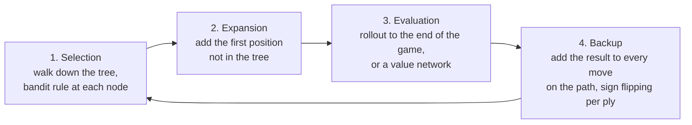
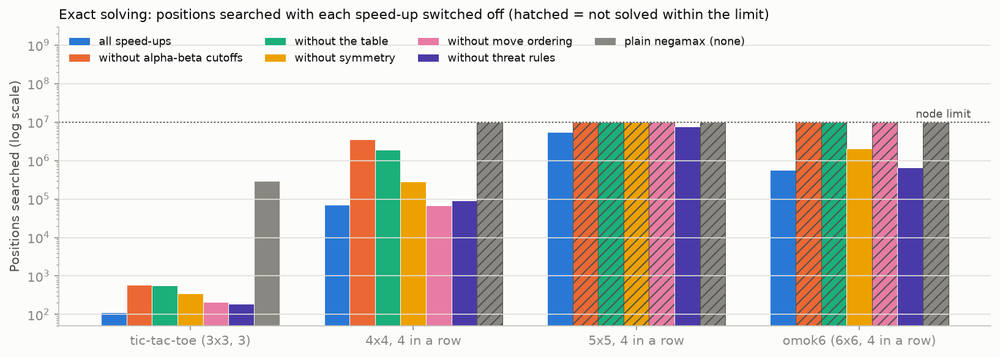
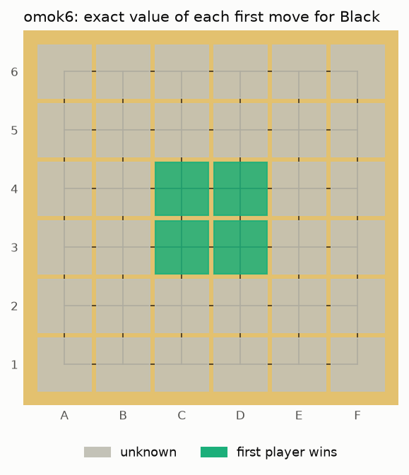
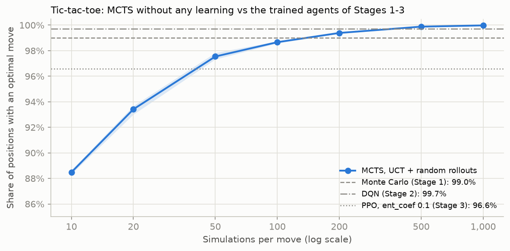
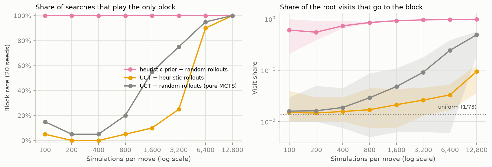
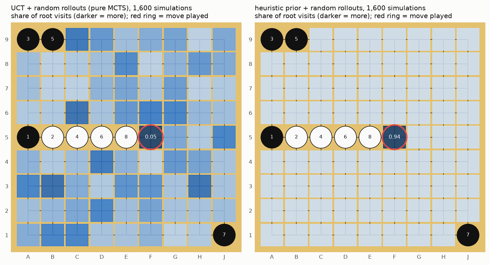
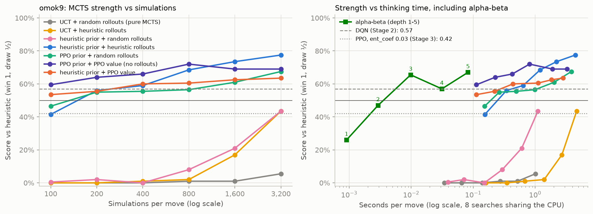

# Stage 4. Search — Alpha-Beta and Monte Carlo Tree Search

> **TL;DR** — With no training at all, search plays better than everything learned so far. An exact alpha-beta solver proves that **`omok6` is a first-player win**
> (562k positions). On tic-tac-toe, MCTS plays 99.98% optimal moves at 1,000 simulations, better than every agent trained in Stages 1–3.
> On `omok9`, *pure* MCTS loses every game to the heuristic, because it must try all ~75 moves at every node (it needs ~6,400 simulations to block a single four).
> Given a prior that focuses the search, it beats the heuristic with a score up to **0.77** and beats Stage 2's DQN (0.57) and Stage 3's PPO (0.42) head-to-head.
> Depth-5 alpha-beta reaches 0.67 at only 0.08 s per move. Used as MCTS's prior and value, the Stage 3 PPO network beats itself 0.89.

## Goal

- Play by **looking ahead** instead of learning: search the tree of future moves at decision time, with no training at all.
- Implement the two classic families: **alpha-beta** (exhaustive, with an evaluation function at a depth limit) and
  **Monte Carlo Tree Search** (MCTS, sampled, guided by a bandit rule), with rollout policies and the networks of Stages 2–3 as guides.
- **Success criteria**:
  1. Ground truth: the exact solver reproduces known results for small boards and solves `omok6` (6x6, four in a row), which Stages 0–2 played but never solved.
  2. On tic-tac-toe, MCTS with no knowledge of the game beyond its rules reaches ≥ 99% optimal moves, like the trained agents of Stages 1–2.
  3. On `omok9`, find out how strong search alone gets: beat the heuristic (score > 0.5) and compare with Stage 2's DQN (0.57) and Stage 3's PPO (0.42).

## Background

### Game trees and minimax

A two-player game with perfect information is a **tree**: the root is the current position, each edge a move, each leaf a finished game.
If both players play perfectly, the value of a position is the result of the best move for the player to move, assuming the opponent then also plays
their best move, and so on down to the leaves. This is **minimax**. Written from the point of view of the player to move (**negamax**),
it is one line:

$$
V(s) = \max_{a} \; -V(s'_a)
$$

where $s'_a$ is the position after move $a$ and a finished game is worth $+1$ (the player who just moved won, so $-1$ for the player to move), or $0$ for a draw.
The minus sign switches the point of view at every ply, as in Stages 1–3. Stage 1 used plain negamax as ground truth for tic-tac-toe, which has only
5,478 positions. A 9x9 board has up to $3^{81} \approx 10^{38}$ positions, so exact minimax is only possible on small boards.

### Alpha-beta pruning

Most of the tree can't affect the result. Suppose we already have a move worth $+0$ (a draw). If, while checking a second move, we find
that the opponent has a reply that wins against it, we can stop looking at the second move's other replies: it is worth at most $-1$ to us,
we will never play it, whatever the remaining replies are worth. **Alpha-beta** keeps two bounds while searching:

- $\alpha$: the value the player to move is already guaranteed elsewhere in the tree;
- $\beta$: the value above which the opponent would never let us get here.

A move whose value reaches $\beta$ causes a **cutoff**: its siblings are not searched. Alpha-beta returns the same value as minimax.
How much it saves depends on the **move ordering**: if the best move is searched first, a cutoff comes as early as possible.
With perfect ordering, it searches about $b^{d/2}$ positions instead of $b^d$ (branching factor $b$, depth $d$), i.e. twice as deep for the same work.

Three more tools make exact solving practical:

- A **transposition table**: the same position is reached by different move orders, so its value (or a bound on it) is stored and reused.
  The 8 rotations and reflections of a board have the same value, so they can share one entry.
- **Move ordering**: search the moves the Stage 0 heuristic likes first.
- **Threat rules** (exact, specific to k-in-a-row games): if the player to move can complete a line, they win now; if the opponent can complete a line
  in two places, the player to move loses (they can block only one); if in exactly one place, the block is the only move worth searching.

### Depth-limited search and evaluation functions

On a board too big to solve, classical game programs (chess engines, for example) search a fixed number of plies ahead and score the positions at the
depth limit with an **evaluation function**, a hand-written guess of who is winning. Their strength comes from the depth of the search and the quality of the
evaluation. To keep the tree small, we also search only the `width` moves the heuristic rates highest at each node.

### Multi-armed bandits and UCB1

MCTS instead *samples* the tree. Its building block is the **multi-armed bandit**: $K$ slot machines with unknown average payouts,
and a budget of pulls. Pulling the best-looking machine every time can lock onto a lucky bad one; pulling at random wastes pulls.
**UCB1** (Auer et al., 2002) pulls the machine with the highest optimistic estimate

$$
\bar X_i + c \sqrt{\frac{\ln N}{n_i}}
$$

where $\bar X_i$ is machine $i$'s average payout so far, $n_i$ the number of times it was pulled, $N = \sum_i n_i$, and $c$ the **exploration constant**.
The second term is large for machines tried rarely, so every machine keeps being tried, but less and less often if it looks bad.

### Monte Carlo Tree Search

MCTS (Coulom, 2006; Kocsis & Szepesvári, 2006) treats every position in its tree as a bandit whose arms are the legal moves. One **simulation** has four steps:



After the simulation budget is spent, the agent plays the root move that was **visited most**. With UCB1 as the bandit rule this is **UCT**
(Upper Confidence bounds applied to Trees). Its values converge to minimax as the number of simulations grows, but it needs no evaluation function:
a **rollout** (playing random moves to the end of the game) gives a noisy estimate of a new position's value, using nothing but the rules.

Two things decide how good MCTS is with a fixed budget:

- **Which moves get simulations** (selection). UCT tries every legal move once before it trusts any statistics, so at a node with 70 legal moves,
  70 simulations are spent before it can prefer one. **PUCT** (Rosin, 2011; used by AlphaGo and AlphaZero) adds a **prior** $P(s, a)$ that says
  which moves look promising before any simulation:

  $$
  Q(s, a) + c \, P(s, a) \, \frac{\sqrt{N(s)}}{1 + N(s, a)}
  $$

  where $Q(s, a)$ is the move's mean value so far, $N(s, a)$ its visits and $N(s)$ the visits of the position. Moves with a low prior are rarely tried.
- **How good the evaluation of new positions is**: a rollout with random moves, a rollout with a better **rollout policy** (here, the heuristic),
  or a learned **value function** $V(s)$ with no rollout at all.

AlphaZero (Stage 5) is exactly PUCT with a network that provides both the prior and the value, trained on the results of its own searches.
This stage uses the Stage 3 PPO network for both, without any further training, to see how far an existing network gets.

## Implementation

| File | What it does |
|---|---|
| [`src/omok_rl/agents/alphabeta.py`](../../src/omok_rl/agents/alphabeta.py) | `Solver` (exact negamax with switchable speed-ups and a node limit), `AlphaBetaAgent` (depth-limited), `threat_moves`, `winning_cells` |
| [`src/omok_rl/agents/mcts.py`](../../src/omok_rl/agents/mcts.py) | `MCTSAgent`: UCT or PUCT, priors from the heuristic or a network, random / heuristic rollouts or a network value |
| [`src/omok_rl/agents/__init__.py`](../../src/omok_rl/agents/__init__.py) | `make_agent('alphabeta:3')`, `'mcts:800'`, `'mcts-heuristic:400'`, also usable in `omok-arena` |
| [`scripts/stage4_search.py`](../../scripts/stage4_search.py) | All Stage 4 experiments (CPU, several processes) |
| [`scripts/plot_stage4.py`](../../scripts/plot_stage4.py) | Tables and figures of this document |
| [`tests/test_stage4.py`](../../tests/test_stage4.py) | Solver vs Stage 1 minimax on tic-tac-toe, known m,n,k values, threat rules, MCTS statistics and variants |

### The exact solver

`Solver.negamax` is alpha-beta over the values $\{-1, 0, +1\}$, with a transposition table that stores each value with a flag: exact, a lower bound
(the search was cut off because the value reached $\beta$) or an upper bound (no move reached $\alpha$). Each speed-up is a switch in `SolverOptions`,
so that the experiments can turn them off one at a time. The table key is the canonical form of the board under the 8 symmetries
(the player to move follows from the number of stones).

```python
decided, moves = threat_moves(env)          # win now / lost to a double threat / one forced block
if decided is not None:
    return decided
for a in moves or self.ordered_moves(env):  # the heuristic's favorites first
    env.move(a)
    value = 1.0 if win else 0.0 if draw else -self.negamax(env, -beta, -alpha)
    env.move_back()
    best, alpha = max(best, value), max(alpha, value)
    if alpha >= beta or best == 1.0:
        break                               # cutoff
```

`env.move` / `env.move_back` change one board in place, so the search never copies positions.

### The depth-limited player

`AlphaBetaAgent(depth, width)` uses the same threat rules, searches the `width = 8` moves with the highest heuristic score at each node, and scores
positions at the depth limit with the line counts of the heuristic: for each line of 5 cells that only one player can still complete,
$10^k$ for $k$ stones, ours minus the opponent's. A win scores $10^9$ minus the number of plies to reach it, so faster wins are preferred.

### MCTS

`MCTSAgent` stores, for each position in the tree, its legal moves and per-move arrays of visits $N$, total value $W$ (from the point of view of the
player who makes the move) and prior $P$, so that the bandit rule is one vectorized numpy expression per node.

| Option | Values |
|---|---|
| `prior` | `None`: UCT, $c = 1$; untried moves are tried first, in random order. `'heuristic'`: PUCT with $P \propto (\text{score} + 1)^{1/2}$ from the heuristic's move scores. `'net'`: PUCT with the policy of a Stage 3 network. PUCT uses $c = 1.5$ and $Q = 0$ for unvisited moves. |
| `evaluation` | `'random'`: rollout with uniformly random moves (the empty cells are shuffled once and played in that order). `'heuristic'`: rollout where each move is the heuristic's choice, or a random move with probability `epsilon = 0.1`. `'value'`: the network's $V(s)$, no rollout. |

The tree is rebuilt from scratch for every move (no tree reuse), and the network runs on the CPU, one position at a time.
The network is Stage 3's best PPO run (`ent_coef` 0.03, seed 0: score 0.42 against the heuristic).

## Experiments

**Common setup**

- **Command**: `uv run python scripts/stage4_search.py` runs every job (`--only <experiment>` for one; finished jobs are skipped), then
  `uv run python scripts/plot_stage4.py` prints the tables and draws the figures.
- **Code version**: `355dfc1`. Most jobs ran while the plotting script and this document were still uncommitted (recorded as `355dfc1-dirty`),
  which doesn't affect the results. The four matches against DQN were rerun after fixing the path of the DQN network (see [Pitfalls](#pitfalls--lessons)).
  **Hardware**: Intel Core i5-14400F (16 threads), CPU only. The jobs ran up to 17 at a time at the lowest priority,
  so times are slower than a search running alone (the `omok6` solve takes 15 s alone and 36 s in the sweep). Compare times within a table, not across documents.
- `omok9` matches use the protocol of Stages 2–3: 100 games against the heuristic, 50 random 4-move openings, each played once per color,
  openings drawn with seed 0 (the same openings Stages 2–3 evaluated seed 0 on).

### 1. Exact solving with alpha-beta

- **Question**: which small boards can we solve exactly, and what does each speed-up contribute?
- **Setup**: `Solver` from the empty board, all speed-ups on, then with each one switched off. A search is stopped after 10M positions (~5 minutes).
  Then the value of every first move on `omok6`, one search per symmetry class, each with its own table and limit.

| Board | Value | Positions searched | Table entries | Seconds |
|---|---|---:|---:|---:|
| tic-tac-toe (3x3, 3 in a row) | draw | 112 | 72 | 0.0 |
| 4x4, 3 in a row | first player wins | 26 | 11 | 0.0 |
| 4x4, 4 in a row | draw | 69,650 | 40,104 | 3.8 |
| 5x5, 4 in a row | draw | 5,421,792 | 2,827,130 | 230 |
| **`omok6` (6x6, 4 in a row)** | **first player wins** | 562,226 | 237,981 | 36 |

| Solver | tic-tac-toe | 4x4, 4 in a row | 5x5, 4 in a row | `omok6` |
|---|---:|---:|---:|---:|
| all speed-ups | 112 | 69,650 | 5,421,792 | 562,226 |
| without alpha-beta cutoffs | 596 | 3,585,204 | > 10M | > 10M |
| without the table | 562 | 1,936,123 | > 10M | > 10M |
| without symmetry | 357 | 286,773 | > 10M | 2,083,407 |
| without move ordering | 211 | 67,009 | > 10M | > 10M |
| without threat rules | 186 | 90,534 | 7,510,328 | 666,152 |
| plain negamax (none of them) | 294,778 | > 10M | > 10M | > 10M |



*Figure 1. Positions searched to solve each board from the empty position, log scale. Hatched bars hit the limit of 10M positions without
finishing. Generated by `scripts/plot_stage4.py`.*

- **Observation**: the solver reproduces the known values of the small boards (tic-tac-toe, 4x4 and 5x5 four in a row are draws, 4x4 three in a row
  is a first-player win), and **solves `omok6`: Black wins with perfect play**. Stage 0 hinted at this: the heuristic playing itself won every `omok6` game as Black.
- **Proving a win is much cheaper than proving a draw.** The bigger `omok6` (a win) took 10x fewer positions than 5x5 (a draw). To prove a win,
  it is enough to find *one* winning move at each of the winner's turns; to prove a draw or a loss, *every* move must be refuted.
- **Every speed-up is needed on the larger boards.** Without alpha-beta cutoffs, the table or move ordering, neither 5x5 nor `omok6` is solved within 10M positions.
  The symmetry in the table saves ~4x on `omok6`. The threat rules save little (~20–40%), because move ordering by the heuristic already searches wins and blocks first.
  Plain negamax, which solved tic-tac-toe in Stage 1, can't even solve 4x4.
- Move ordering is the one speed-up that doesn't pay on 4x4 (69,650 positions with it, 67,009 without): on a small board where every line is a draw,
  the order hardly matters and computing it costs a heuristic evaluation per position.

| First moves on `omok6` (one symmetry class per row) | Value for Black | Positions searched |
|---|---|---:|
| C4, D4, C3, D3 (center) | **first player wins** | 562,225 |
| B5, E5, B2, E2 | unknown | > 10M (limit) |
| C5, D5, B4, E4, B3, E3, C2, D2 | unknown | > 10M (limit) |
| A6, F6, A1, F1 (corners) | unknown | > 10M (limit) |
| B6, E6, A5, F5, A2, F2, B1, E1 | unknown | > 10M (limit) |
| C6, D6, A4, F4, A3, F3, C1, D1 | unknown | > 10M (limit) |



*Figure 2. `omok6`: value of each first move for Black. Only the four center cells were proven within 10M positions. Generated by `scripts/plot_stage4.py`.*

- Only the center opening was proven. The other first moves may be wins that need a longer proof, or draws, which would need the exhaustive refutation that
  5x5 needed and more. 10M positions per move was not enough to tell.

### 2. MCTS on tic-tac-toe

- **Question**: can MCTS, knowing nothing but the rules, play tic-tac-toe as well as the agents that Stages 1–3 trained?
- **Setup**: UCT ($c = 1$) with random rollouts, a fresh search from each of the 4,520 non-terminal positions, 3 seeds.
  **Optimal-move rate** = share of positions where the move played is optimal (Stage 1's metric checks all of an agent's tied greedy moves instead; MCTS plays one).

| Simulations per move | Optimal-move rate | ms per move |
|---:|---:|---:|
| 10 | 0.885 ± 0.001 | 0.5 |
| 20 | 0.934 ± 0.003 | 0.8 |
| 50 | 0.975 ± 0.002 | 1.9 |
| 100 | 0.987 ± 0.001 | 4.1 |
| 200 | 0.994 ± 0.000 | 8.7 |
| 500 | 0.999 ± 0.000 | 19 |
| 1,000 | **0.9998** (4,519 / 4,520) | 31 |



*Figure 3. Tic-tac-toe: share of all 4,520 positions where MCTS plays an optimal move, 3 seeds (min–max band, almost invisible). Horizontal lines: the best final
agents of Stages 1–3. Generated by `scripts/plot_stage4.py`.*

- **Observation**: with no training, MCTS passes Stage 3's PPO (96.6%) at 50 simulations, Stage 1's Monte Carlo agent (99.0%) at ~150 and
  Stage 2's DQN (99.7%) at 500, all at a few milliseconds per move. The price is paid at every move instead of once in training.
- **The one position it misses at 1,000 simulations** (on all 3 seeds): Black has played the top middle, White the bottom-left corner. Only the top-left corner wins,
  through a forced sequence a few plies deep. After 1,000 simulations, MCTS's mean value for the winning move is +0.67, the highest of all moves,
  but the move has only 26% of the visits, against 34% for a drawing move valued at +0.13. Random rollouts undervalued the win at first, and its visit count
  hadn't caught up yet. Playing the most-visited move is robust in general, but it lags behind a move whose value is discovered late.

### 3. Pure MCTS on omok9: the breadth problem

- **Question**: in the pilot, pure MCTS lost every `omok9` game to the heuristic. Why?
- **Setup**: a position where White has four in a row with one open end and Black has exactly one move that doesn't lose. 73 legal moves.
  20 searches (seeds) per point; we count how often the search plays the block, and what share of the root visits it gets.

| Variant | 100 | 200 | 400 | 800 | 1,600 | 3,200 | 6,400 | 12,800 |
|---|---:|---:|---:|---:|---:|---:|---:|---:|
| UCT + random rollouts (pure MCTS) | 0.15 | 0.05 | 0.05 | 0.20 | 0.55 | 0.75 | 0.95 | 1.00 |
| UCT + heuristic rollouts | 0.05 | 0.00 | 0.00 | 0.05 | 0.10 | 0.25 | 0.90 | 1.00 |
| heuristic prior + random rollouts | **1.00** | 1.00 | 1.00 | 1.00 | 1.00 | 1.00 | 1.00 | 1.00 |



*Figure 4. Left: share of 20 searches that play the only move that doesn't lose immediately. Right: share of the root visits going to that move
(mean and min–max over the 20 searches; the dotted line is a uniform share). Generated by `scripts/plot_stage4.py`.*



*Figure 5. The same position after 1,600 simulations. Left: pure MCTS spreads its visits almost evenly; the block F5 happens to get the most visits in this
search (5%), but only 11 of 20 searches play it. Right: with the heuristic prior, 94% of the visits go to the block. Generated by `scripts/plot_stage4.py`.*

- **Observation**: pure MCTS needs ~6,400 simulations to block a single, obvious threat reliably. UCT tries all 73 moves once before it trusts any statistic,
  and below each of them the opponent again has ~72 replies to try once. A root move is only recognized as losing once the search below it has found the
  opponent's winning reply, which takes on the order of 73 × 72 ≈ 5,000 simulations. Until then, all moves look the same (Figure 5, left).
- **Better rollouts don't help here, they hurt**: with heuristic rollouts, the block is found even later. They do make the other moves look bad
  (after 1,600 simulations their mean value is −0.81, since White completes the five in the rollout), but they make the block look almost as bad (−0.53):
  when the heuristic plays both sides from the position after the block, White, who moves next, wins most games (mean result +0.79 for White over 200 rollouts).
  With random rollouts the gap is larger (block −0.15, others −0.55). A rollout policy's value estimates carry its own biases, and here they hide the one move that matters.
- **A prior fixes it at once**: with the heuristic's move scores as a PUCT prior, the block gets most of the visits from the first 100 simulations.
  The prior doesn't have to be learned. It only has to rule out the obviously irrelevant moves.

### 4. How strong is search on omok9?

- **Question**: how does playing strength grow with the simulation budget, and what matters more: the prior (which moves are searched) or the
  evaluation (how new positions are scored)? How does MCTS compare with depth-limited alpha-beta at the same thinking time?
- **Setup**: 7 MCTS variants × 6 budgets (100 to 3,200 simulations per move), and alpha-beta at depths 1–5 (`width` 8), each playing 100 games against the heuristic
  (protocol above). With 100 games, a score has a standard error of about ±0.04. Times are with 8 searches sharing the CPU.

| Prior (which moves) | Evaluation (new positions) | 100 | 200 | 400 | 800 | 1,600 | 3,200 | Seconds per move at 1,600 |
|---|---|---:|---:|---:|---:|---:|---:|---:|
| none (UCT) | random rollout (pure MCTS) | 0.00 | 0.00 | 0.00 | 0.01 | 0.01 | 0.06 | 0.52 |
| none (UCT) | heuristic rollout | 0.00 | 0.00 | 0.01 | 0.02 | 0.17 | 0.43 | 2.70 |
| heuristic | random rollout | 0.01 | 0.02 | 0.00 | 0.08 | 0.21 | 0.43 | 0.61 |
| heuristic | heuristic rollout | 0.42 | 0.56 | 0.59 | 0.69 | 0.74 | **0.77** | 2.22 |
| PPO network | random rollout | 0.46 | 0.55 | 0.55 | 0.56 | 0.61 | 0.68 | 2.03 |
| PPO network | PPO value | **0.59** | **0.64** | **0.66** | **0.72** | 0.69 | 0.69 | 1.91 |
| heuristic | PPO value | 0.54 | 0.55 | 0.60 | 0.60 | 0.62 | 0.64 | 1.84 |

| Alpha-beta (`width` 8) | depth 1 | depth 2 | depth 3 | depth 4 | depth 5 |
|---|---:|---:|---:|---:|---:|
| Score vs heuristic | 0.26 | 0.47 | 0.66 | 0.57 | **0.67** |
| Draws | 0.08 | 0.62 | 0.43 | 0.64 | 0.34 |
| Seconds per move | 0.001 | 0.003 | 0.010 | 0.031 | 0.083 |

For reference, the learned agents of Stages 2–3 play in about a millisecond per move: DQN scores 0.57 and the PPO network used here 0.42.



*Figure 6. `omok9`, score against the heuristic (100 games per point). Left: MCTS variants vs simulations per move. Right: the same against seconds per move,
with alpha-beta at depths 1–5 (numbers next to the squares). Dashed and dotted lines: the final networks of Stages 2 and 3. Generated by `scripts/plot_stage4.py`.*

- **Search beats learning on `omok9`.** Four MCTS variants and alpha-beta at depth 3 or 5 score above Stage 2's DQN (0.57), which took 2M self-play moves and
  100 minutes of training. The best, MCTS with the heuristic as both prior and rollout policy, reaches **0.77** at 3,200 simulations, with no training at all.
- **Both the prior and the evaluation are needed.** Without a prior, or with random rollouts, MCTS is at 0.00–0.08 up to 800 simulations, and only
  starts to win at 3,200. With a good prior *and* a good evaluation (heuristic + heuristic rollouts, PPO prior + PPO value) it beats the heuristic from 100–200 simulations.
  A random rollout on 9x9 is mostly noise: two random players rarely make five in a row deliberately, so its result says little about the position.
- **Search makes a weak network strong.** The PPO network plays at 0.42 on its own. As the prior and value of a 100-simulation search it reaches 0.59, and 0.72
  at 800, beating the heuristic-guided searches at small budgets. Its value head, which Stage 3 found explains only ~10% of the variance of game results,
  is still a better evaluation than a random rollout (0.66 vs 0.55 at 400 simulations), at about the same cost (the network call dominates either way).
- **The network search stops improving after ~800 simulations** (0.72 → 0.69 → 0.69), while the heuristic search keeps improving (0.69 → 0.74 → 0.77).
  More simulations only refine the estimates of the network's value head, and its errors are systematic, not noise that averaging removes.
  A rollout is an unbiased (if noisy) sample of a real game continuation, so more of them keep helping.
- **Alpha-beta is far cheaper for the same strength.** Depth 5 scores 0.67 at 0.08 s per move; MCTS needs 0.4–1.2 s per move for the same score (PPO prior + value at 400 simulations, heuristic prior + rollouts at 800), 5–15x more.
  Omok is a tactical game: wins come from forcing sequences of threats, which the threat rules and a full-width look at the 8 best moves find exactly,
  while MCTS has to sample them. The heuristic evaluation was also written for this game.
- **Odd and even depths behave differently.** Depths 2 and 4 score lower than depth 3 and draw much more (62–64% draws vs 34–43%).
  At an even depth, the search ends on the opponent's reply, so it sees every one of its plans answered and prefers safe moves. At an odd depth it ends on its own move
  and is more optimistic. This **odd-even effect** is well known in game-tree search.
- **Black and White**: every player wins far more as Black than as White, as in Stages 2–3. Against a defender that blocks, White's main way to score is a draw.

### 5. Head-to-head

- **Question**: how do the best searches compare with each other and with the networks of Stages 2–3 directly?
- **Setup**: 100 games per pair, protocol above. DQN is Stage 2's final Double + Dueling + 3-step network (seed 0, score 0.575 against the heuristic);
  PPO is Stage 3's `ent_coef` 0.03 network (seed 0, 0.42). Both play greedily.

| Player A | Player B | Score of A | A wins as Black | A wins as White | Draws |
|---|---|---:|---:|---:|---:|
| MCTS, heuristic prior + rollouts, 1,600 sims | alpha-beta, depth 4 | 0.61 | 0.54 | 0.28 | 0.40 |
| MCTS, heuristic prior + rollouts, 1,600 sims | DQN (Stage 2) | 0.74 | 0.86 | 0.40 | 0.23 |
| MCTS, heuristic prior + rollouts, 1,600 sims | PPO (Stage 3) | 0.76 | 0.62 | 0.64 | 0.25 |
| MCTS, PPO prior + PPO value, 1,600 sims | DQN (Stage 2) | 0.69 | 0.72 | 0.34 | 0.32 |
| MCTS, PPO prior + PPO value, 1,600 sims | PPO (Stage 3), the same network without search | **0.89** | 0.92 | 0.66 | 0.20 |
| alpha-beta, depth 4 | DQN (Stage 2) | 0.65 | 0.52 | 0.52 | 0.25 |
| alpha-beta, depth 4 | PPO (Stage 3) | 0.81 | 0.60 | 0.76 | 0.26 |
| DQN (Stage 2) | PPO (Stage 3) | 0.59 | 0.54 | 0.36 | 0.28 |

- **Every search player beats both learned networks** head-to-head (0.65–0.89), consistent with their scores against the heuristic.
  The ranking among the networks is the same as in Stage 3: DQN beats PPO (0.59).
- **Search improves the network it is built on**: MCTS using the PPO network as prior and value beats the same network playing greedily 0.89 (92% wins as Black).
  The search's choice of move is a better policy than the network's own. This is the observation AlphaZero is built on: train the network to predict the search's choices,
  and the next search starts from a better prior.
- The heuristic-guided MCTS beats alpha-beta at depth 4 (0.61) but takes ~70x longer per move (2.2 s vs 0.03 s).

## Pitfalls & Lessons

- **A network that runs on any board size will happily play on the wrong one.** The first head-to-head runs loaded Stage 2's `omok6` network
  (`runs/stage2/ablation/`) instead of the `omok9` one (`runs/stage2/omok9/`). The convolutional network accepts any board, so nothing failed:
  it just lost every game, and "search beats DQN 100–0" looked like a result. It was caught because DQN also lost 0.15 to PPO, the opposite of Stage 3.
  Checking each loaded agent against its known score (DQN: 0.575 against the heuristic) before using it would have caught it at once.
- **Breadth, not depth, is what kills plain MCTS on a bigger board.** UCT spends a simulation on every legal move before preferring any,
  at every node. On tic-tac-toe that is 9 moves; on `omok9`, ~75, and the cost multiplies at each level of the tree.
- **A rollout policy's bias becomes the search's bias.** Heuristic rollouts were expected to help pure MCTS, and they did on average,
  but in the blocking test they made the one good move look nearly as bad as the others, because the heuristic playing itself favors the player to move.
- **Proving a draw costs far more than proving a win**: one good move per turn proves a win, while a draw needs every alternative refuted.
  The node limit meant that most `omok6` first moves stayed unknown.
- **`pkill -f <pattern>` killed its own shell again** when the pattern appeared elsewhere in the same command (Stage 3 noted the same pitfall).
  Run `pkill` in a command of its own.
- **Wall-clock times depend on how many jobs share the CPU.** The `omok6` solve takes 15 s alone and 36 s in the sweep. Times are only compared within one table.

## Summary

- **Exact search**: alpha-beta with a transposition table (shared across symmetries), move ordering and threat rules solves boards up to 6x6 and proves that
  **`omok6` is a first-player win** (562k positions, 15 s), with the four center cells as winning first moves. Each speed-up is needed: without any one of
  alpha-beta, the table or move ordering, the same solve doesn't finish within 10M positions.
- **MCTS without knowledge**: on tic-tac-toe it plays 99.98% optimal moves at 1,000 simulations, better than every trained agent of Stages 1–3.
  On `omok9` it loses to the heuristic: UCT has to try ~75 moves at every node and needs ~6,400 simulations just to block a single four.
- **Guided search beats learning on `omok9`**: with a prior (the heuristic or the PPO network) and a reasonable evaluation, MCTS scores up to **0.77** against the
  heuristic, and alpha-beta at depth 5 scores 0.67 at 0.08 s per move. Stage 2's DQN scores 0.57, Stage 3's PPO 0.42, after hours of training.
- **The success criteria are met**: known values reproduced and `omok6` solved; 99.98% optimal moves on tic-tac-toe; on `omok9`, search beats the heuristic
  (0.77) and both learned agents, including head-to-head.

| Agent | `omok9` score vs heuristic | Seconds per move | Training |
|---|---:|---:|---|
| PPO, ent_coef 0.03 (Stage 3) | 0.42 | ~0.001 | 6M self-play moves |
| DQN, Double + Dueling + 3-step (Stage 2) | 0.57 | ~0.001 | 2M self-play moves |
| MCTS, UCT + random rollouts, 3,200 simulations | 0.06 | 1.0 | none |
| Alpha-beta, depth 5, width 8 | 0.67 | 0.08 | none |
| MCTS, PPO prior + PPO value, 800 simulations | 0.72 | 0.8 | the Stage 3 network |
| MCTS, heuristic prior + heuristic rollouts, 3,200 simulations | **0.77** | 4.4 | none |

## Next Steps

- **Stage 5 — AlphaZero.** This stage shows what each half contributes. Search turns a weak network (PPO, 0.42) into a strong player (0.72),
  but it stops improving at ~800 simulations because the network's prior and value are fixed and their errors are systematic. AlphaZero closes that loop:
  the network is trained to predict the search's visit distribution (a better policy than its own prior) and the game results, then the better network guides the next search.
  The PUCT search of this stage is its core; Stage 5 adds batched network evaluation on the GPU, Dirichlet noise at the root for exploration, and the training loop.
- **Speed**: one search runs in pure Python on one core, at about 3,000 random rollouts or 1,000 network evaluations per second. AlphaZero needs many
  searches per training game, so evaluating many positions in one network call (batched leaves, virtual loss) and reusing the tree between moves matter.
- **Left open in this stage**: the value of the other `omok6` first moves (draws or longer wins), alpha-beta with a learned evaluation, and MCTS
  with tactical knowledge (the threat rules, or solving terminal positions inside the tree, as in MCTS-Solver).

## References

- Knuth & Moore, *An Analysis of Alpha-Beta Pruning*, Artificial Intelligence 1975
- Auer, Cesa-Bianchi & Fischer, *Finite-time Analysis of the Multiarmed Bandit Problem*, Machine Learning 2002 (UCB1)
- Coulom, *Efficient Selectivity and Backup Operators in Monte-Carlo Tree Search*, Computers and Games 2006
- Kocsis & Szepesvári, *Bandit based Monte-Carlo Planning*, ECML 2006 (UCT)
- Rosin, *Multi-armed bandits with episode context*, Annals of Mathematics and Artificial Intelligence 2011 (PUCT)
- Browne et al., *A Survey of Monte Carlo Tree Search Methods*, IEEE Transactions on Computational Intelligence and AI in Games 2012
- Silver et al., *Mastering the game of Go with deep neural networks and tree search*, Nature 2016 (AlphaGo: policy prior, value network and rollouts)
- Silver et al., *A general reinforcement learning algorithm that masters chess, shogi, and Go through self-play*, Science 2018 (AlphaZero)
- Russell & Norvig, *Artificial Intelligence: A Modern Approach* (4th ed.), Chapter 5 (adversarial search, alpha-beta, MCTS)
