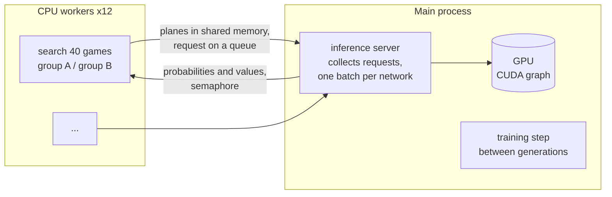
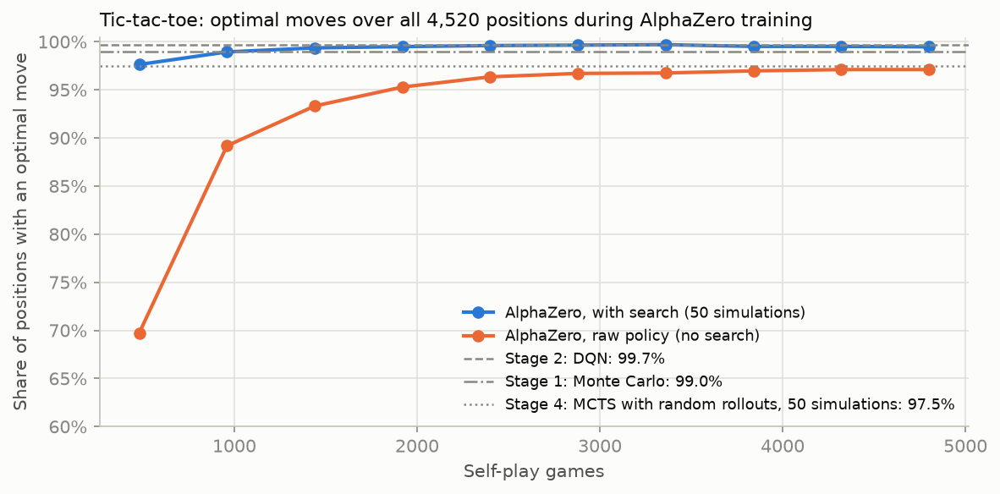
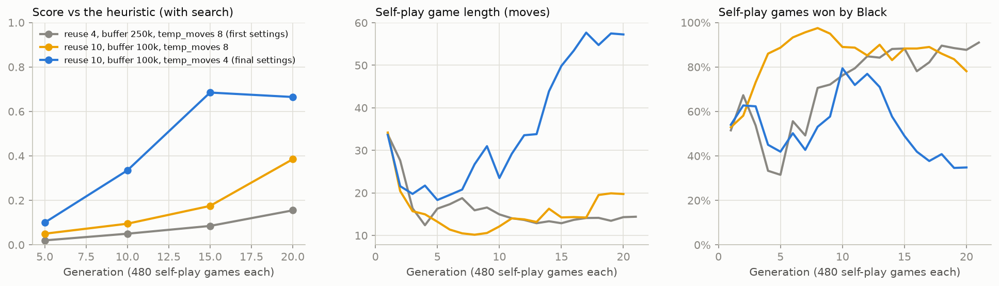
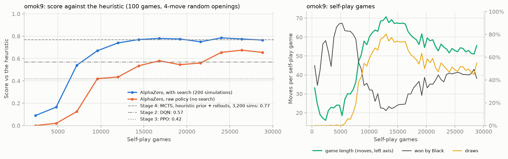
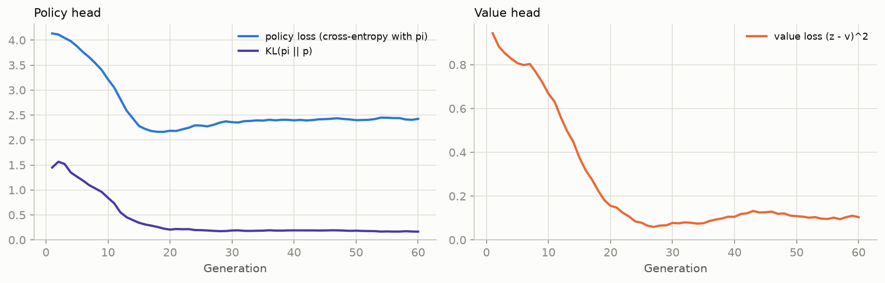
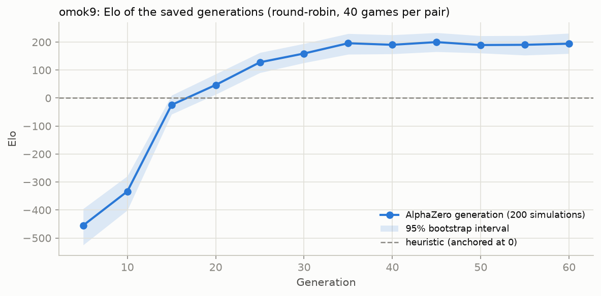
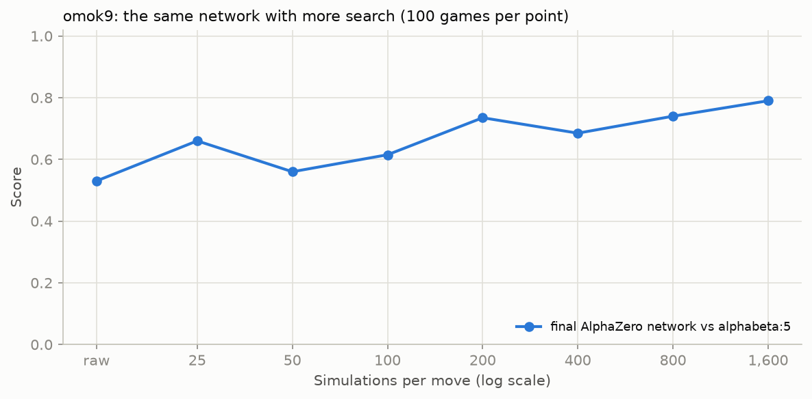
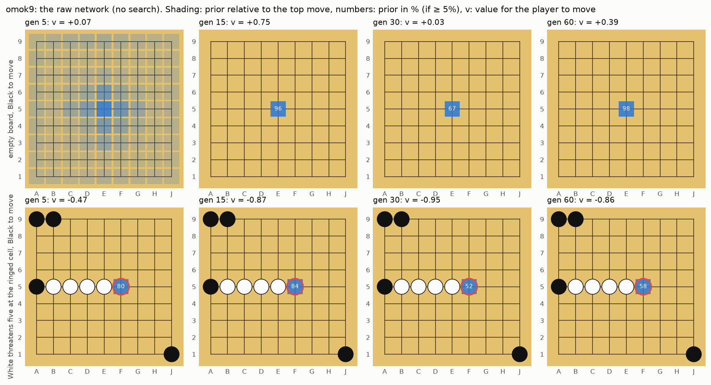
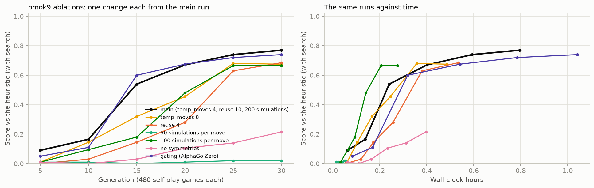
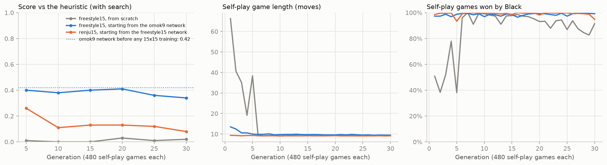

# Stage 5. AlphaZero — Combining Search and Learning

> **TL;DR** — AlphaZero from random weights, trained in under two hours on one desktop (12 CPU search workers feeding one GPU, 61k simulations per second).
> On tic-tac-toe it never loses and plays 99.5% optimal moves. On `omok9` it scores 0.77 against the heuristic with 200 simulations and beats the best
> player of every earlier stage head to head; the network alone, without search, beats Stage 2's DQN and Stage 3's PPO. The 8 board symmetries and
> enough search during self-play matter most: without them, self-play collapses into short games where nobody defends. That collapse is also why
> the same settings fail on 15x15: 200 simulations are too few for ~220 legal moves. Strength on `omok9` plateaus after 35 generations (+195 Elo over the heuristic).

## Goal

- Close the loop that Stage 4 left open: a network guides the search (prior and value), and the search's results train the network,
  so that each makes the other better. Start from random weights and use nothing but the rules and self-play.
- Make it fast enough to train in hours on one desktop: batched network evaluation on the GPU, search on all CPU cores.
- Scale it from 9x9 to the full 15x15 board, freestyle and Renju.
- **Success criteria**:
  1. Tic-tac-toe: never loses and plays ≥ 99% optimal moves (the exact metrics of Stages 1–4).
  2. `omok9`: beats the heuristic and the best player of every earlier stage, including Stage 4's strongest search (0.77 against the heuristic).
     The network alone, without search, beats Stage 2's DQN and Stage 3's PPO.
  3. Strength rises across generations (Elo).
  4. 15x15 freestyle and Renju: beat the heuristic, and measure the result against the pretrained models shipped with the `omok` package (`omok.OmokAgent`).

## Background

### What Stage 4 left open

Stage 4 ran PUCT search with the Stage 3 PPO network as the prior $P(s, a)$ and the value $V(s)$. The search turned a weak network (0.42 against the heuristic)
into a much stronger player (0.72), but stopped improving at about 800 simulations: the network's errors are systematic, and more search can't fix
a prior that always ignores the right move or a value that is always wrong in the same kind of position. The network never learned from the search.

### Search as policy improvement

The visit counts at the root of a search are a better policy than the prior the search started from: the search looked ahead, found the moves
that hold up, and spent its simulations on them. AlphaGo Zero (Silver et al., 2017) turned this into a learning rule.
Play a game against yourself, choosing each move with a search, and record every position $s$ with

- $\pi(a \mid s) = N(s, a) / \sum_b N(s, b)$, the visit distribution at the root (an **improved policy**), and
- $z \in \{+1, 0, -1\}$, the result of the game for the player to move in $s$ (a **sample of the value**).

Then train one network $f_\theta(s) = (p, v)$ with two heads to predict both:

$$
\ell(\theta) = (z - v)^2 - \sum_a \pi(a \mid s) \log p(a \mid s) + c \lVert \theta \rVert^2
$$

where $p$ is the policy head (a distribution over the legal moves), $v \in [-1, 1]$ the value head, and $c$ the weight decay.
The next searches use the new network, so they start from a better prior and evaluate leaves better, and produce better targets in turn.
This is **policy iteration** (Sutton & Barto, Chapter 4) with the search as the policy-improvement step and the network as the policy-evaluation step.

Compared with Stages 2–3:

- The policy target is a full distribution from a search, not one sampled action weighted by a noisy return (REINFORCE, PPO) or a bootstrapped
  value (DQN). The cross-entropy loss is a plain supervised loss, so there are no importance ratios, no clipping, and no target network.
- The value target is the final result $z$ (a Monte Carlo return), learned by regression. Self-play is still non-stationary, but each position's
  target comes from a much stronger player (network + search) than the network alone.

### PUCT with a network

The search is Stage 4's PUCT. At each position the simulation picks the move that maximizes

$$
Q(s, a) + c_\text{puct} \, P(s, a) \, \frac{\sqrt{N(s) + 1}}{1 + N(s, a)}
$$

with $Q = 0$ for unvisited moves and $c_\text{puct} = 1.5$. When it reaches a position that isn't in the tree, the network gives the prior of its moves
and its value $v$, which is backed up the path with the sign flipping at every ply. There are no rollouts. A position where the game has ended
is scored exactly (+1 for the player who just won, 0 for a draw).

### Exploration in self-play

A search that always plays its most visited move would play the same game over and over. Two sources of randomness:

- **Dirichlet noise at the root**: $P(s, a) \leftarrow (1 - \epsilon) P(s, a) + \epsilon \, \eta_a$ with $\eta \sim \mathrm{Dir}(\alpha)$, $\epsilon = 0.25$.
  Every move gets some prior, so the search sometimes checks moves the network dismisses. The noise concentration is split over the legal moves,
  $\alpha = 10 / \text{(legal moves)}$ (KataGo's scaling; AlphaZero used 0.3 for chess and 0.03 for Go), so the noise is equally "spiky" on any board size.
- **Temperature**: for the first `temp_moves` moves of a game, the move is drawn with probability proportional to its visit count
  (temperature 1). Afterwards the most visited move is played (temperature → 0). The training target is $\pi$ either way.

### Generations, the replay buffer and gating

The loop runs in **generations**: play a batch of self-play games with the current network, add their positions to a **replay buffer**
holding the most recent positions, take gradient steps on minibatches drawn from the buffer, repeat. Each position is shown through a random one of
the 8 rotations and reflections of the board (**augmentation**): the game's rules don't change under them, so neither should the policy (mapped
accordingly) or the value. During the search, each leaf is also evaluated through a random symmetry (as in AlphaGo Zero).

AlphaGo Zero added **gating**: a new network only becomes the self-play network if it beats the current best one in a match (55% of the games).
AlphaZero dropped gating and always plays with the newest network. Both are implemented here.

## Implementation

| File | What it does |
|---|---|
| [`src/omok_rl/nets.py`](../../src/omok_rl/nets.py) | `AlphaZeroNet` (the ResNet), `NetEvaluator` (batched evaluation through random symmetries, CUDA graphs) |
| [`src/omok_rl/puct.py`](../../src/omok_rl/puct.py) | `PUCT`: search over many trees at once, virtual loss, Dirichlet noise; written as a generator of network requests |
| [`src/omok_rl/inference.py`](../../src/omok_rl/inference.py) | `Server` (GPU, main process) and `RemoteEvaluator` (CPU worker processes), connected by shared memory |
| [`src/omok_rl/selfplay.py`](../../src/omok_rl/selfplay.py) | Self-play games and batched matches between any players (runs in the workers, without torch) |
| [`src/omok_rl/alphazero.py`](../../src/omok_rl/alphazero.py) | `AZConfig`, `ReplayBuffer`, the training step and the generation loop (`python -m omok_rl.alphazero`), resume after interruption |
| [`src/omok_rl/agents/alphazero.py`](../../src/omok_rl/agents/alphazero.py) | `AlphaZeroAgent`: plays from a saved network with or without search; `omok-arena` loads AlphaZero checkpoints |
| [`scripts/stage5_alphazero.py`](../../scripts/stage5_alphazero.py) | All training runs of this document, one after another |
| [`scripts/stage5_eval.py`](../../scripts/stage5_eval.py) | Exact tic-tac-toe metrics, Elo round-robin, head-to-head matches |
| [`scripts/plot_stage5.py`](../../scripts/plot_stage5.py) | Tables and figures of this document |
| [`tests/test_stage5.py`](../../tests/test_stage5.py) | Search tactics with an uninformed network, virtual loss, symmetry round trips, targets, buffer, transfer, batched matches vs `arena.evaluate` |

### The network

`AlphaZeroNet` is a residual network like AlphaGo Zero's, scaled down: a 3x3 convolution stem, 6 residual blocks of 64 channels
(conv–BN–ReLU–conv–BN, plus the input), and two heads. It has 0.45M parameters.

- **Policy head**: 1x1 convolutions to one logit per cell. Illegal moves (occupied, or forbidden for Black under Renju) are masked before the softmax.
- **Value head**: a 1x1 convolution, global average pooling, two linear layers, tanh.

There are no fully connected layers over the board, so **the same weights play on any board size**: a network trained on 9x9 can be loaded for 15x15.
AlphaGo Zero's policy head was a fully connected layer over the board; a convolutional head is what makes the transfer experiment possible.
The input is the planes of `env.get_observation()` (own stones, opponent stones, a constant "Black to play" plane, the last move, and, on 15x15,
Renju forbidden points) **plus a plane of ones** added inside the network. With zero padding at the border, an empty cell and a point off the board
otherwise look the same when White is to move (every plane is 0), and a five-in-a-row game is all about where lines end.

### Batched search

A network call costs about the same for 1 position as for 100: on this GPU the time goes into launching the ~60 small kernels of a forward pass.
So the search never evaluates one position at a time.

- **Many games at once**: every self-play game has its own tree. One round of the search walks down every tree to a new leaf,
  collects the leaves' planes, and evaluates all of them in one batch. Each worker process plays ~40 games at once.
- **Virtual loss** (`leaves > 1`): one tree can contribute several leaves to a batch. Each walk adds a temporary loss to the moves on its path
  ($N \mathrel{+}= 1$, $W \mathrel{-}= 1$), so the next walk prefers a different path. Useful when one game is searched alone:
  200 simulations take 0.15 s per move one leaf at a time and 0.03 s with 8 leaves per batch. Self-play has enough games to fill the batches without it.

`PUCT.search_steps` is a Python generator: it yields `(obs, masks)` whenever it needs a batch evaluated and receives `(probs, values)`.
The same search code runs with a network on the local device (`PUCT.search`) or in a worker process that interleaves two groups of games:

```python
def search_steps(self, envs, simulations, noise=False, leaves=1):
    probs, values = yield root_planes, root_masks          # expand the roots (+ Dirichlet noise)
    ...
    while active:
        for each tree: walk down with PUCT to a new leaf    # or score a finished game exactly
        probs, values = yield leaf_planes, leaf_masks       # one batch for all trees
        for each leaf: expand it, back the value up the path
    return roots
```

### One GPU, many CPU processes

The tree search is Python and numpy (about 50 µs per simulation), so it needs every CPU core; the network needs the GPU.
The first version gave each of 6 worker processes its own copy of the network on the GPU. It reached only 21k simulations per second:
the processes took turns on the GPU (a context switch each time), each CUDA context cost 1.7 GB of RAM, and the many small batches kept
the GPU 79% busy. The final design:



- Workers import no torch at all (`selfplay.py`, `puct.py`, `inference.py` are numpy only): ~190 MB of RAM each instead of 660 MB.
  A spawned process normally re-imports the parent's main module first, which would import torch, so the server starts its workers without it.
- The server waits up to 2 ms for a request from every busy worker before it evaluates, so batches are large.
- Each worker splits its games into two groups. While group A's leaves are on the GPU, it searches group B (`inference.drive_interleaved`).
- The evaluation is recorded once per batch size (padded to a power of two) as a **CUDA graph** and replayed with one launch, in `channels_last`
  memory format and bfloat16. The graphs read the weights in place, so they stay valid while the same network trains.

| Version | Simulations per second (omok9, 200 per move) | Notes |
|---|---:|---|
| 1 process, 128 games at once | 18,500 | Python + kernel-launch bound |
| 6 processes, each with the network on the GPU | 21,000 | GPU context switching; 10 GB of RAM |
| 12 CPU workers + 1 GPU server | 37,000 | server-bound: ~2.5 ms of overhead per batch |
| + CUDA graphs | 54,000 | |
| + wait for the other workers, `channels_last`, two groups per worker | 61,000 | GPU ~50% busy, ~5 GB of RAM in total |

The remaining headroom (pipelining the server itself) was left unused on purpose: the same GPU drives the desktop, which lags when the GPU is saturated.

### The training loop

`omok_rl.alphazero.train` runs the generations:

1. **Self-play**: 480 games split among 12 workers, 200 simulations per move, Dirichlet noise at every root, the first `temp_moves = 4` moves
   drawn in proportion to the visits.
2. **Buffer**: the most recent 100,000 positions, stored as `uint8` planes, `float16` $\pi$ and `int8` $z$.
3. **Training**: Adam (learning rate $10^{-3}$, weight decay $10^{-4}$), minibatches of 512 with a random symmetry each, bfloat16.
   The number of steps per generation is set so that each new position is trained on `reuse = 10` times on average:
   steps $= \lceil 10 \times \text{new positions} / 512 \rceil$.
4. **Gating** (optional): 100 games between the new and the best network; the new one is kept for self-play if it scores ≥ 0.55.
5. Every 5 generations: 100 games against the heuristic with search (200 simulations) and with the raw policy, and a checkpoint.

The legal-move mask for the training loss is recomputed from the planes (empty and not forbidden), so the buffer doesn't store it.
Every 5 generations the network, optimizer, buffer and random state are saved to `resume.pt`; a run that is killed (WSL restarts) continues from there.

## Experiments

**Common setup**

- **Commands**: `uv run python scripts/stage5_alphazero.py` trains every run, one after another (`--only <experiment>`, finished runs are skipped,
  interrupted runs resume). `uv run python scripts/stage5_eval.py` plays the evaluation matches, and `uv run python scripts/plot_stage5.py`
  prints the tables and draws the figures. A single run: `uv run python -m omok_rl.alphazero --env omok9 --out runs/x`.
- **Code version**: tic-tac-toe `817494b-dirty` (the Stage 5 code before its first commit); the `omok9` runs `149a4c4`, except `sims100`;
  `sims100`, the 15x15 runs and all evaluations `149a4c4-dirty`. The uncommitted changes were to the scripts (new runs and evaluation jobs)
  and a docstring, not to self-play or training. The pilot runs are kept in `runs/stage5-pilot/`. Seed 0 everywhere: one seed per configuration, because a run takes up to two hours.
- **Hardware**: Intel Core i5-14400F (16 threads), NVIDIA RTX 5060 Ti 16 GB, WSL2. One run at a time uses all of it: 12 search workers and the GPU.
- **Default configuration** (`AZConfig`): 6 residual blocks of 64 channels, 200 simulations per move, $c_\text{puct} = 1.5$, Dirichlet
  $\alpha = 10 / \text{legal moves}$, $\epsilon = 0.25$, `temp_moves = 4`, 480 games per generation, buffer of 100k positions, `reuse = 10`,
  batch 512, Adam $10^{-3}$, weight decay $10^{-4}$, no gating.
- **Evaluation** uses the protocol of Stages 2–4: 100 games against the heuristic from 50 random 4-move openings, each played once per color,
  openings drawn with seed 0. "With search" is the network with 200 simulations and no noise, playing its most visited move;
  "raw policy" is the network's most likely move, no search. Results of 100 games have a standard error of about ±0.04.

### 1. Tic-tac-toe: a correctness check

- **Question**: does the loop learn perfect play where we can check it exactly?
- **Setup**: a small network (2 blocks of 32 channels), 50 simulations, 240 games per generation, 20 generations, buffer 20k, `reuse = 4`.
  Every second generation is scored on all 4,520 positions against the minimax solver of Stage 1, with the network alone and with 50 simulations.
- **Results**: 34 seconds of training.



*Figure 1. Share of all 4,520 tic-tac-toe positions where the move is optimal, for the raw network (orange) and with 50 simulations (blue).
Gray lines: the best agents of Stages 1, 2 and 4 (Stage 4's MCTS uses the same 50 simulations but random rollouts and no learning).
Generated by `scripts/plot_stage5.py`.*

| Generation | Self-play games | Optimal moves (raw) | Optimal moves (search) | Result vs a perfect opponent, B / W (raw) | (search) |
|---:|---:|---:|---:|---|---|
| 2 | 480 | 69.7% | 97.6% | loss / loss | draw / loss |
| 6 | 1,440 | 93.3% | 99.4% | draw / loss | draw / draw |
| 14 | 3,360 | 96.7% | 99.7% | draw / draw | draw / draw |
| 20 | 4,800 | 97.1% | 99.5% | draw / draw | draw / draw |

- **Observation**: with search, the agent never loses with either color from generation 4 (960 games), and plays 99.5% optimal moves with
  50 simulations, against 97.5% for Stage 4's untrained MCTS with the same budget. The raw network also never loses from generation 14.
  Its 97.1% optimal moves are below Stage 1's tabular Monte Carlo (99.0%). 106 of its 131 mistakes are in positions where the player to move
  has a forced win and the network misses it. Such positions only arise after a mistake by the opponent, so self-play between good players
  rarely produces them as training data, while Stage 1's table was trained on every position its ε-greedy games visited.

### 2. Finding a training schedule (pilots)

- **Question**: the first `omok9` run learned very slowly. Why?
- **Setup**: three 20-generation runs on `omok9` that differ in the training schedule.
- **Results**:



*Figure 2. Score against the heuristic (left), self-play game length (middle) and share of self-play games won by Black (right) for the three pilots.
Generated by `scripts/plot_stage5.py` from the pilot logs.*

| Settings | Gen 5 | Gen 10 | Gen 15 | Gen 20 | Self-play length at gen 10 | Black wins at gen 10 |
|---|---:|---:|---:|---:|---:|---:|
| reuse 4, buffer 250k, temp_moves 8 (first settings) | 0.02 | 0.05 | 0.09 | 0.15 | 14.9 | 76% |
| reuse 10, buffer 100k, temp_moves 8 | 0.05 | 0.10 | 0.17 | 0.39 | 12.1 | 89% |
| reuse 10, buffer 100k, temp_moves 4 (final settings) | 0.10 | 0.34 | 0.69 | 0.67 | 23.5 | 79% |

- **Observation**: two problems, and both fixes matter.
  - **Too little training**. Early games are short (~15 moves), so a generation adds only ~7k positions; with `reuse = 4` that is ~50 gradient steps
    (about one second) per minute of self-play, and a 250k buffer still holds the random games of generation 1 at generation 20.
    Training each position 10 times on average, from a 100k buffer, more than doubles the score at generation 20.
  - **Sampling the tactical phase**. On 9x9 the decisive fight happens within the first ~10 moves. With `temp_moves = 8`, White's blocking moves are
    *drawn* from the visit counts, so White often doesn't block, while almost any attacking move works for Black. Black wins ~90% of the games in
    ~10 moves, the value head learns "Black wins", and White's search can no longer tell its moves apart (they all look lost). Sampling only the
    first 4 moves keeps the games balanced: the self-play games get longer as White learns to defend, and the score rises much faster.

### 3. The main run on omok9

- **Question**: how strong does AlphaZero get on `omok9`, starting from random weights?
- **Setup**: the default configuration, 60 generations (28,800 self-play games, 1.5M positions). **Time**: 1 h 49 min.
- **Results**:



*Figure 3. Left: score against the heuristic with search (blue) and with the raw network (orange), 100 games per point, every 5 generations,
with the best scores of Stages 2–4 for reference (same protocol). Right: self-play game length, and the share of games won by Black or drawn.
Generated by `scripts/plot_stage5.py`.*

| Generation | Self-play games | Score vs heuristic (search) | Score vs heuristic (raw) | Self-play game length | Self-play draws | Hours |
|---:|---:|---:|---:|---:|---:|---:|
| 5 | 2,400 | 0.09 | 0.00 | 16.0 | 0% | 0.06 |
| 10 | 4,800 | 0.16 | 0.02 | 24.0 | 0% | 0.14 |
| 15 | 7,200 | 0.54 | 0.12 | 32.2 | 11% | 0.24 |
| 20 | 9,600 | 0.67 | 0.42 | 56.0 | 52% | 0.40 |
| 30 | 14,400 | 0.77 | 0.54 | 67.2 | 73% | 0.80 |
| 40 | 19,200 | 0.78 | 0.54 | 61.7 | 63% | 1.17 |
| 50 | 24,000 | 0.78 | 0.66 | 51.6 | 47% | 1.51 |
| 60 | 28,800 | 0.76 | 0.66 | 55.5 | 55% | 1.82 |

- **Observation**:
  - Three phases show up in the self-play games. Up to generation ~10 both sides attack and Black wins short games (as in the pilots).
    Then White learns to defend: games get longer and draws appear, up to 80% of the games at generation 27. After generation ~35
    Black's attacks improve again and Black wins ~40% of the games.
  - With search, the network passes the heuristic at generation ~15 and reaches 0.77, Stage 4's best score, at generation 30, then stays there.
    The raw network keeps improving until generation 50 (0.66), above Stage 2's DQN (0.57) and Stage 3's PPO (0.42), which needed 2–6M training moves;
    this run played 1.5M.
  - The value loss falls from 0.97 to 0.06 when most games are draws, and rises again (0.12) when decisive games come back.



*Figure 4. Training losses per generation (mean over the generation's gradient steps). The policy KL is the cross-entropy minus the entropy of the
targets, i.e. how far the network's prior is from the search's visit distribution. Generated by `scripts/plot_stage5.py`.*

### 4. Elo across generations

- **Question**: is the plateau at ~0.77 real, or a ceiling of the heuristic as a yardstick?
- **Setup**: a round-robin between every 5th generation of the main run and the heuristic: 13 players, 40 games per pair (20 openings × 2 colors),
  200 simulations. Ratings are fitted with the Bradley–Terry model, $P(i \text{ beats } j) = 1 / (1 + 10^{(R_j - R_i)/400})$, counting a draw as half
  a win, with one virtual draw added to every pair and the heuristic fixed at 0; intervals from 200 bootstrap resamples of the games.
  **Time**: 26 min.
- **Results**:



*Figure 5. Elo of every 5th generation of the main run, relative to the heuristic, with 95% bootstrap intervals. Generated by `scripts/plot_stage5.py`.*

| Generation | 5 | 10 | 15 | 20 | 25 | 30 | 35 | 40 | 45 | 50 | 55 | 60 |
|---|---:|---:|---:|---:|---:|---:|---:|---:|---:|---:|---:|---:|
| Elo | −455 | −333 | −25 | 47 | 128 | 159 | 196 | 190 | 200 | 189 | 190 | 194 |

- **Observation**: the plateau is real. Strength rises by ~650 Elo in 35 generations and then stops: generations 35 to 60 are within each other's
  intervals. The losses keep falling and the self-play games keep changing, but the players don't get stronger against each other.
  Likely reasons: the network is small (0.45M parameters), the 100k buffer holds only ~4 generations, and 200 simulations limit how much better
  than its prior each search target can be. The next steps below list remedies.

### 5. Search on top of the trained network

- **Question**: how much does search add to the final network, and does it keep helping with more simulations (Stage 4's PPO network stopped at ~800)?
- **Setup**: the generation-60 network with 0 to 1,600 simulations against depth-5 alpha-beta (Stage 4's strongest cheap player), 100 games each.
  **Time**: 7 min.



*Figure 6. Score of the final network against depth-5 alpha-beta as a function of the number of simulations per move (100 games per point).
Generated by `scripts/plot_stage5.py`.*

| Simulations | raw | 25 | 50 | 100 | 200 | 400 | 800 | 1,600 |
|---|---:|---:|---:|---:|---:|---:|---:|---:|
| Score vs alpha-beta depth 5 | 0.53 | 0.66 | 0.56 | 0.61 | 0.73 | 0.69 | 0.74 | 0.79 |

- **Observation**: the raw network already matches depth-5 alpha-beta (0.53), and search adds up to +0.26. The trend is upward up to 1,600
  simulations, but with ±0.04–0.05 of noise per point neighbouring points (25 vs 50, 200 vs 400) are not really different.

### 6. Against the best players of Stages 2–4

- **Question**: does AlphaZero beat everything learned or searched so far, head to head?
- **Setup**: the final network, with search (200 simulations) and without, 100 games against each opponent. **Time**: 52 min (the Stage 4 MCTS
  takes 4.4 s per move on one core).

| AlphaZero | Opponent | Score | Wins as Black | Wins as White | Draws |
|---|---|---:|---:|---:|---:|
| 200 simulations | Stage 4: MCTS, heuristic prior + heuristic rollouts, 3,200 simulations | 0.53 | 58% | 6% | 41% |
| 200 simulations | Stage 4: alpha-beta, depth 5 | 0.70 | 66% | 44% | 30% |
| 200 simulations | Stage 2: DQN | 0.76 | 82% | 40% | 29% |
| 200 simulations | Stage 3: PPO | 0.81 | 84% | 50% | 28% |
| raw network | heuristic | 0.68 | 62% | 24% | 49% |
| raw network | Stage 2: DQN | 0.57 | 56% | 20% | 38% |
| raw network | Stage 3: PPO | 0.71 | 76% | 32% | 33% |

- **Observation**: AlphaZero beats every earlier player. Against Stage 4's strongest search it is only just ahead (0.53, within the noise),
  but it uses 200 network evaluations per move against 3,200 heuristic-guided rollouts: 0.15 s per move against 4.4 s, about 30x less
  (one game searched alone on the GPU; 0.03 s with 8 leaves per batch).
  The raw network, a single forward pass per move, beats both learned agents of Stages 2–3.



*Figure 7. What the raw network has learned. Top: its prior on the empty board (from uniform to the center point). Bottom: Stage 4's blocking test,
where White threatens five and Black must block at the ringed cell. The block gets 52–84% of the prior from generation 5 on. The value $v$ of that
position stays strongly negative for Black even though the block saves the game: in self-play, positions where the opponent has a four were mostly lost.
Generated by `scripts/plot_stage5.py`.*

### 7. Ablations

- **Question**: which parts of the recipe matter?
- **Setup**: six runs of 30 generations, each with one change from the main run, compared with the main run's first 30 generations.
  Then each final network plays the main run's generation-30 network (100 games, 200 simulations).
- **Results**:



*Figure 8. Score against the heuristic (with search) for the main run and six ablations, by generation (left) and by wall-clock time (right).
Generated by `scripts/plot_stage5.py`.*

| Run (30 generations) | Gen 10 | Gen 20 | Gen 30 | Raw policy, gen 30 | Hours | Score vs main at gen 30 |
|---|---:|---:|---:|---:|---:|---:|
| main (temp_moves 4, reuse 10, 200 simulations) | 0.16 | 0.67 | **0.77** | **0.54** | 0.80 | – |
| `temp_moves` 8 | 0.15 | 0.46 | 0.68 | 0.53 | 0.48 | 0.41 |
| `reuse` 4 | 0.03 | 0.28 | 0.68 | 0.46 | 0.53 | 0.38 |
| 100 simulations per move | 0.10 | 0.48 | 0.67 | 0.41 | 0.28 | 0.42 |
| 50 simulations per move | 0.01 | 0.01 | 0.02 | 0.00 | 0.05 | 0.00 |
| no symmetries | 0.00 | 0.10 | 0.22 | 0.10 | 0.40 | 0.10 |
| gating (AlphaGo Zero) | 0.11 | 0.68 | 0.74 | 0.52 | 1.04 | 0.46 |

The first four columns are scores against the heuristic; the last is 100 games of the ablation's final network against the main run's
generation-30 network, both with 200 simulations.

- **Observation**:
  - **Symmetries matter most**: without the 8x augmentation (in training and in the search), the score at generation 30 is 0.22 instead of 0.77.
    Each position teaches the network about 8 positions, which is worth more than any other change here.
  - **Search during self-play is the engine of learning**. With 50 simulations per move, self-play collapses into the "both attack, Black wins in
    9 moves" equilibrium and never leaves it (Black wins 98% of the games at generation 30). With ~70 legal moves, 50 simulations can't find the
    one blocking move reliably, so the targets never teach White to defend: the same breadth problem as Stage 4's pure MCTS. 100 simulations learn,
    at 0.67, and are the fastest per hour, but end below 200.
  - **`temp_moves` and `reuse`**: both alternatives reach ~0.68 at generation 30, behind the main run, confirming the pilots with one change at a time.
  - **Gating** (AlphaGo Zero) rejects 13 of the 30 new networks, so it learns about as fast per generation but needs 30% more time for the gating matches,
    and its final network is about as strong as the main run's at the same generation (0.46, within the noise). On this budget, gating buys nothing.

### 8. Scaling up to 15x15: freestyle and Renju

- **Question**: does the same recipe work on the full board, and does starting from the `omok9` network help?
- **Setup**: three 30-generation runs with the default configuration (200 simulations): `freestyle15` from scratch; `freestyle15` starting from
  the final `omok9` network (the convolutional network loads unchanged; the 5th input plane, forbidden points, starts with zero weights);
  and `renju15` starting from that `freestyle15` network. The final networks then play the heuristic and the two pretrained models shipped with
  the `omok` package (`omok.OmokAgent`, 100 games each, same random 4-move openings). **Time**: 18, 14 and 12 minutes.
- **Results**:



*Figure 9. The three 15x15 runs: score against the heuristic with search (left; dotted: the `omok9` network before any 15x15 training),
self-play game length (middle) and share of self-play games won by Black (right). Generated by `scripts/plot_stage5.py`.*

| Run | Gen 5 | Gen 10 | Gen 20 | Gen 30 | Self-play length at gen 30 | Black wins at gen 30 |
|---|---:|---:|---:|---:|---:|---:|
| `freestyle15`, from scratch | 0.01 | 0.00 | 0.03 | 0.02 | 9.2 | 91% |
| `freestyle15`, from the `omok9` network | 0.40 | 0.38 | 0.41 | 0.34 | 9.5 | 99% |
| `renju15`, from the `freestyle15` network | 0.26 | 0.11 | 0.13 | 0.08 | 9.1 | 95% |

The generation columns are scores against the heuristic with search (200 simulations). The final networks against the heuristic and the
pretrained models, 100 games each (scores of the network in the first column):

| Network | Opponent | Raw policy | 200 simulations | 800 simulations |
|---|---|---:|---:|---:|
| `omok9` network, no 15x15 training | heuristic (freestyle) | 0.34 | 0.42 | |
| `freestyle15`, from scratch | heuristic / pretrained0 / pretrained1 | 0.02 / 0.23 / 0.13 | 0.05 / 0.18 / 0.18 | |
| `freestyle15`, from `omok9` | heuristic / pretrained0 / pretrained1 | 0.17 / 0.57 / 0.51 | 0.33 / 0.46 / 0.38 | |
| `renju15`, from `freestyle15` | heuristic / pretrained0 / pretrained1 | 0.05 / 0.45 / 0.35 | 0.06 / 0.30 / 0.29 | 0.11 / 0.36 / 0.44 |
| heuristic (reference) | pretrained0 / pretrained1, freestyle | 0.37 / 0.38 | | |
| heuristic (reference) | pretrained0 / pretrained1, Renju | 0.45 / 0.26 | | |

- **Observation**: **the 15x15 runs fail**, in the same way as the 50-simulation run on `omok9`.
  - All three runs fall into the "both sides attack, Black wins in 9 moves" equilibrium within a few generations and never leave it.
    From scratch, the scores stay at ~0. With ~220 legal moves, 200 simulations are spread as thin as ~60 simulations on `omok9`,
    where the ablations already failed: the search rarely finds White's one blocking move, so the targets never teach White to defend.
  - **Transfer works, but only as far as the old network goes**. The `omok9` network, without any 15x15 training, already scores 0.42 against the
    heuristic on the big board: its 3x3 filters recognize lines of stones wherever they are. Training from there doesn't add to it, because
    self-play collapses from the first generation; Renju, trained in the same collapsed games, does worse.
  - Against the pretrained models, the transferred network wins about half of the games (raw policy: 0.57 and 0.51; 64% / 50% and 58% / 44%
    wins as Black / White), in short games of ~25 moves. The results are not transitive: the pretrained models beat the heuristic (0.63 and 0.62),
    and the heuristic beats our network (0.17 raw, 0.33 with search). Our network plays fast attacking races, which the pretrained models
    don't stop well but the heuristic, which blocks every line greedily, does. Search makes it *worse* against the pretrained models
    (0.46 and 0.38), probably because its value head was trained on collapsed games, where whoever attacks first wins.
  - What it would take: far more search per move on 15x15 (in breadth terms, ~600+ simulations to match `omok9`'s 200), fewer sampled opening
    moves, and more time per generation, since games that don't collapse are much longer. See [Next Steps](#next-steps).

## Pitfalls & Lessons

- **Self-play can settle into a degenerate equilibrium and stay there.** If White's search can't find the blocking move (too few simulations
  for the board's breadth, or blocks *sampled* away by the temperature), Black wins short games, the value head learns "the attacker wins",
  and White's moves all look equally lost, so its targets never improve. This one mechanism explains the slow first run, `temp_moves = 8`,
  50 simulations on `omok9` and all three 15x15 runs. Watching the self-play game length and the share of Black wins catches it within a few
  generations, long before the evaluation scores do.
- **The schedule matters as much as the algorithm.** The first run trained each position only 4 times and on a buffer full of random games;
  changing three numbers (`reuse`, `buffer_size`, `temp_moves`) took the score at generation 20 from 0.15 to 0.67.
- **Several processes sharing one GPU is slow.** Six processes with their own copy of the network reached 21k simulations per second;
  one GPU process serving CPU workers reached 61k with less GPU load. And GPU latency, not GPU compute, was the bottleneck: CUDA graphs and
  larger batches helped more than anything else.
- **`spawn` re-imports the main module in every child.** The CPU workers imported torch only because the main module did, which cost
  460 MB of RAM per worker. The workers also need a way to notice that the main process died: the first version left 12 orphans
  blocked on a semaphore forever.
- **One batch per network.** The Elo round-robin has 13 networks in play at once; the server evaluates each network's requests separately,
  so batches were small and the workers idled at ~11% CPU (26 minutes instead of ~10). The same happened when a slow opponent (Stage 4's
  4.4 s-per-move MCTS) was split into only two tasks of 50 games: 52 minutes for one evaluation job.
- **Compare like with like.** The first ablation head-to-heads played the 30-generation ablations against the main run's 60-generation network;
  they are now played against generation 30.
- **A test can pass for the wrong reason.** The first symmetry test used a "network" whose logits only depended on occupied cells, which are
  masked: every policy was uniform and the test passed even with the un-transform removed. It now uses a blur that commutes with the symmetries,
  and was checked to fail when the un-transform is deleted.
- **`pkill -f` / `pgrep -f` matched their own shell** a third time (as in Stages 3 and 4). Kill by PID.

## Summary

- **The loop works**: from random weights, with the rules only. On tic-tac-toe it never loses after 960 games and plays 99.5% optimal moves
  with 50 simulations. On `omok9`, after 1 h 49 min (28,800 games), the network with 200 simulations scores 0.77 against the heuristic and beats
  the best player of every earlier stage head to head: Stage 2's DQN (0.76), Stage 3's PPO (0.81), Stage 4's depth-5 alpha-beta (0.70) and,
  narrowly, Stage 4's 3,200-simulation MCTS (0.53) at ~30x less time per move. The network alone (one forward pass per move) beats the heuristic
  (0.68), DQN (0.57) and PPO (0.71).
- **What mattered**: the 8 symmetries (0.22 without them), enough search during self-play (50 simulations collapse), and a schedule that trains
  enough and doesn't sample the tactical phase. Gating made no difference.
- **What didn't work**: strength plateaued after generation 35 (+195 Elo over the heuristic); and on 15x15, with the same 200 simulations,
  self-play collapsed into 9-move attacking games, from scratch and after transfer. The `omok9` network transfers to 15x15 without training
  (0.42 against the heuristic), and wins about half of its games against the `omok` package's pretrained models, but loses to the heuristic.
- **Against the success criteria**: (1) met; (2) met; (3) met up to generation 35, then flat; (4) not met: no 15x15 network beats the heuristic.

| Agent | `omok9` score vs heuristic | Training | Time per move |
|---|---:|---|---:|
| PPO (Stage 3) | 0.42 | 6M self-play moves | ~1 ms |
| DQN (Stage 2) | 0.57 | 2M self-play moves | ~1 ms |
| **AlphaZero, raw network** | **0.66** | 1.5M self-play moves (60 generations) | ~1 ms |
| Alpha-beta, depth 5 (Stage 4) | 0.67 | none | 80 ms |
| MCTS, heuristic prior + rollouts, 3,200 simulations (Stage 4) | 0.77 | none | 4.4 s |
| **AlphaZero, 200 simulations** | **0.77** | 1.5M self-play moves (60 generations) | 0.15 s (0.03 s with 8 leaves per batch) |

## Next Steps

- **Make 15x15 work** (Stage 6 or a rerun of this one). More simulations per move where the board is wide (~600–800), only 1–2 sampled opening moves,
  and a check on self-play game length that stops a collapsing run early. Cheaper alternatives from the literature: **playout cap randomization**
  (KataGo: a full search on a few moves, a cheap one on the rest, training only on the full ones) and **Gumbel AlphaZero** (policy improvement
  that works with as few as 2–16 simulations, by sampling root moves without replacement).
- **Get past the `omok9` plateau**: a bigger network, a larger buffer, more simulations late in training, and KataGo-style auxiliary targets
  (e.g. predicting the final board) that give the value head more signal than one result per game.
- **Speed**: pipeline the inference server (run batch $k+1$ on the GPU while answering batch $k$), group requests by network so round-robins stay
  batched, reuse the search tree between moves, and export the network to ONNX/TensorRT.
- **Hook the network up to the web UI** (`python -m omok`) to play against it.

## References

- Silver et al., *Mastering the game of Go without human knowledge*, Nature 2017 (AlphaGo Zero: self-play with search targets, gating, symmetries)
- Silver et al., *A general reinforcement learning algorithm that masters chess, shogi, and Go through self-play*, Science 2018 (AlphaZero)
- Wu, *Accelerating Self-Play Learning in Go*, 2019 (KataGo: Dirichlet noise scaled by the number of legal moves, and many other improvements)
- Rosin, *Multi-armed bandits with episode context*, Annals of Mathematics and Artificial Intelligence 2011 (PUCT)
- Chaslot, Winands & van den Herik, *Parallel Monte-Carlo Tree Search*, Computers and Games 2008 (virtual loss)
- Hunter, *MM algorithms for generalized Bradley-Terry models*, Annals of Statistics 2004 (Elo ratings from a round-robin)
- Sutton & Barto, *Reinforcement Learning: An Introduction* (2nd ed.), Chapter 4 (policy iteration)
