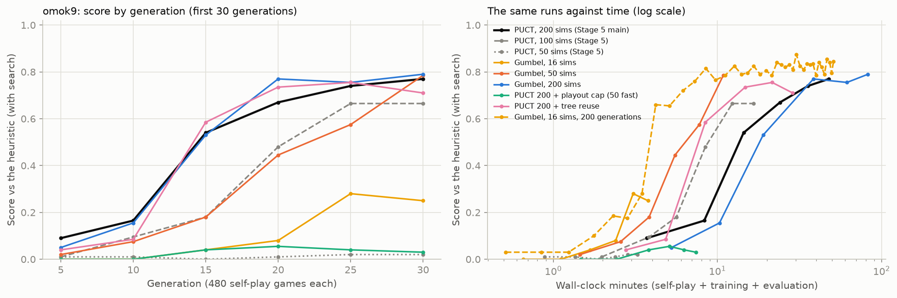
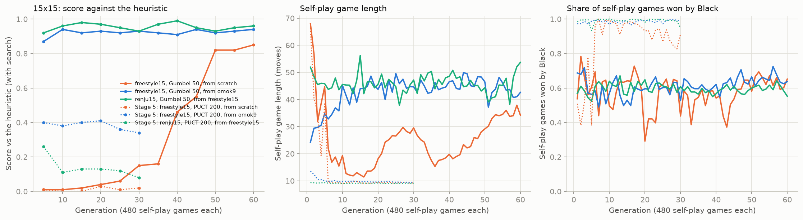

# Stage 6. Advanced — Gumbel AlphaZero, 15x15, and Playing in the Browser

> **TL;DR** — **Gumbel AlphaZero fixes the 15x15 collapse that ended Stage 5.** With only 50 simulations per move, Gumbel search learns 15x15
> freestyle from scratch in 22 minutes (0.85 against the heuristic, where Stage 5 scored 0.02), and starting from the `omok9` network it scores
> 0.85–0.88 against the `omok` package's pretrained models; trained on, it reaches 0.95 against both under Renju. On `omok9`, 50 Gumbel simulations match
> 200 PUCT simulations at 4.4x less time, and 16 simulations for 200 generations score higher against the heuristic than Stage 5's best network (0.84 vs 0.76) in 51 minutes instead of 109.
> Tree reuse makes PUCT self-play 1.7x faster at similar strength. Playout cap randomization *failed* on `omok9`: the moves that are actually played
> come from the cheap search, which can't defend. Black wins 60–65% of the strong self-play games under both rules. The networks are exported to ONNX and
> play in the `omok` web UI (`python -m omok_rl.play`).

## Goal

Stage 5 left one success criterion unmet: on the 15x15 board, self-play collapsed into 9-move games where Black attacks
and White never learns to defend, so no 15x15 network beat the heuristic. The cause was the search's **breadth**: 200 PUCT
simulations spread over ~220 legal moves rarely find White's single blocking move, so the training targets never teach it.
This stage tries the fixes that Stage 5's [Next Steps](../stage5-alphazero/README.md#next-steps) listed, measures each on
`omok9` first (where we have a reference run), and then applies the best to 15x15.

1. **Gumbel AlphaZero** (Danihelka et al., 2022): a policy-improvement step that is still an improvement with very few
   simulations (2–50), because it plans which root moves to try instead of letting visit counts decide.
2. **Playout cap randomization** (Wu, 2019, KataGo): a full search on a random quarter of the moves (the training samples),
   a cheap one on the rest (which only serve to finish the game).
3. **Tree reuse**: keep the subtree of the move played as the next search's root.
4. **Scale to 15x15** freestyle and Renju with whichever works, and compare with the `omok` package's pretrained models.
5. **Black/White asymmetry** under Renju vs freestyle, measured in self-play and evaluation games.
6. **Export** the network to ONNX and hook it up to the `omok` web UI (`python -m omok`) to play against it.

**Success criteria**

- On `omok9`, Gumbel search with ≤ 50 simulations per move learns where PUCT with 50 collapsed (Stage 5: 0.02 against the
  heuristic), and reaches the score of the 200-simulation main run (0.77) at a lower cost.
- On 15x15 freestyle and Renju, a network that beats the heuristic (score > 0.5, 100 games) and the pretrained models.
- A playable browser game against the trained network.

## Background

### Why visit counts need many simulations

PUCT's policy target is the visit distribution $\pi(a) = N(a) / \sum_b N(b)$. It is a good target only when there are many
more simulations than plausible moves: with $n$ simulations, at most $n$ moves get any visit, and a move's share of visits
is a noisy, integer-valued estimate of how good it is. Dirichlet noise makes it worse at small $n$: it spends simulations on
random moves. In Stage 5, 50 simulations on `omok9` (~70 legal moves) and 200 on 15x15 (~220 legal moves) both collapsed.
AlphaZero also has no guarantee that the visit distribution is better than the prior it started from when $n$ is small.

### Gumbel AlphaZero

Danihelka et al. (2022) replace both the root search and the target, keeping everything below the root close to MCTS.

**Sampling root moves without replacement.** Draw independent Gumbel noise $g(a) \sim \text{Gumbel}(0, 1)$ for every legal
move. The move $\arg\max_a [g(a) + \text{logits}(a)]$ is an exact sample from the prior $p = \text{softmax}(\text{logits})$
(the *Gumbel-max trick*), and the top-$m$ moves by $g + \text{logits}$ are a sample of $m$ distinct moves
without replacement. Only these $m$ moves ($m = 16$ here) are searched at the root.

**Sequential Halving.** The simulations are split into $\lceil \log_2 m \rceil$ phases. In each phase every remaining move
gets the same number of visits; at the end of the phase the worse half is dropped, ranked by

$$
g(a) + \text{logits}(a) + \sigma(\hat q(a)),
$$

where $\hat q(a)$ is the move's mean value so far and $\sigma$ a monotone transformation (below). The move left at the end
is played. With the Gumbel noise this is a *sample* from the improved policy, so no temperature or Dirichlet noise is
needed. In evaluation games $g = 0$ and the choice is deterministic.

**Improved policy target.** Every move, visited or not, gets a target:

$$
\pi'(a) = \text{softmax}\left(\text{logits}(a) + \sigma(\text{completed}\ q(a))\right), \qquad
\sigma(q) = (c_\text{visit} + \max_b N(b)) \, c_\text{scale} \, q,
$$

where *completed q* is $\hat q(a)$ for visited moves and $v_\text{mix}$ for the others,

$$
v_\text{mix} = \frac{1}{1 + \sum_b N(b)} \left( \hat v + \sum_b N(b) \cdot
\frac{\sum_{b:\,N(b) > 0} p(b)\, \hat q(b)}{\sum_{b:\,N(b) > 0} p(b)} \right),
$$

a mix of the network's value $\hat v$ of the position and the prior-weighted mean value of the visited moves. The
completed q values are rescaled to $[0, 1]$ over the legal moves before $\sigma$; $c_\text{visit} = 50$, $c_\text{scale} = 0.1$
(the defaults of DeepMind's `mctx` library). The paper proves that, in expectation, $\pi'$ is not worse than the prior
for any number of simulations. With zero simulations, $\pi' = p$: the target says "keep what you have".

**Below the root** the move is chosen deterministically: the one whose share of the node's visits is furthest below
$\pi'$, $\arg\max_a \left[\pi'(a) - N(a) / (1 + \sum_b N(b))\right]$.

### Playout cap randomization

KataGo (Wu, 2019) noticed that the *value* target $z$ needs many games, while the *policy* target needs deep searches,
and that most positions of a game only matter for $z$. So each move independently gets either a full search
(probability $p_\text{full} = 0.25$, $n_\text{full}$ simulations, with noise) or a fast one ($n_\text{fast}$ simulations, no noise).
Only full-search positions are recorded for training. The average cost per move drops from $n_\text{full}$ to
$p_\text{full} n_\text{full} + (1 - p_\text{full}) n_\text{fast}$, while every training target still comes from a full search.

### Tree reuse

After a move is played, the subtree under it already has statistics from the previous search (often a third or more of its
simulations). Keeping it as the next root and only adding the missing simulations saves that work. The kept root gets
fresh Dirichlet noise. Tree reuse doesn't combine with Gumbel search, whose Sequential Halving schedule starts from an
empty root.

## Implementation

| File | What it does |
|---|---|
| [`src/omok_rl/puct.py`](../../src/omok_rl/puct.py) | `PUCT` now takes per-position simulation counts and noise flags and optional kept roots; `Gumbel` (subclass), `halving_schedule`, `make_search` |
| [`src/omok_rl/selfplay.py`](../../src/omok_rl/selfplay.py) | `self_play` with `fast_simulations` / `full_prob` (playout cap randomization) and `reuse_tree` |
| [`src/omok_rl/alphazero.py`](../../src/omok_rl/alphazero.py) | New `AZConfig` fields: `search`, `considered`, `c_visit`, `c_scale`, `fast_simulations`, `full_prob`, `reuse_tree` |
| [`src/omok_rl/agents/alphazero.py`](../../src/omok_rl/agents/alphazero.py) | `AlphaZeroAgent(search='gumbel')` |
| [`scripts/stage6_alphazero.py`](../../scripts/stage6_alphazero.py) | All training runs of this document |
| [`src/omok_rl/play.py`](../../src/omok_rl/play.py) | `export_onnx`, `OnnxEvaluator` (onnxruntime + numpy), `WebAgent` for the `omok` web UI, `python -m omok_rl.play` |
| [`scripts/stage6_eval.py`](../../scripts/stage6_eval.py) | Head-to-head matches, search at play time, 15x15 against the pretrained models |
| [`scripts/plot_stage6.py`](../../scripts/plot_stage6.py) | Tables and figures of this document |
| [`tests/test_stage6.py`](../../tests/test_stage6.py) | Halving schedule, Gumbel tactics with an uninformed network, targets, tree reuse, playout cap randomization, ONNX export matches torch, a move through the web UI |

### Gumbel search in the batched PUCT code

`Gumbel` is a subclass of Stage 5's `PUCT` and changes four methods, so the batched search loop, the worker processes and
the GPU server are unchanged:

- `make_root` draws the Gumbel noise and precomputes the Sequential Halving **schedule**: entry $k$ is the visit count a root
  move must have to receive simulation $k$ (the trick from `mctx`). For $m = 16$ and 32 simulations it is
  `0 x16, 1 x8, 2 x4, 3 x4`: every considered move gets one visit, then the best 8 get a second, the best 4 a third, and so on.
  The root then needs no other state: at simulation $k$ it picks the best-scoring move among those with exactly
  `schedule[k]` visits.
- `select` uses the schedule at the root and $\arg\max [\pi' - N / (1 + \sum N)]$ below it.
- `target` returns $\pi'$ instead of the visit distribution, and `choose` the move left by Sequential Halving.

```python
def sigma_q(self, node):
    q = w / n for visited moves, v_mix for the others   # "completed" q, for the player to move
    q = (q - q.min()) / max(q.max() - q.min(), 1e-8)    # rescaled to [0, 1] over the legal moves
    return (self.c_visit + node.n.max()) * self.c_scale * q

def improved_policy(self, node):
    return softmax(log(node.prior) + self.sigma_q(node))
```

### Playout cap randomization and tree reuse

`PUCT.search_steps` now accepts one simulation count and one noise flag *per position*, so a batch of games can mix full
and fast searches. `self_play_steps` draws "full or fast" for every move of every game, and only records the full ones.
For tree reuse it keeps `root.children[move]` per game and passes the kept roots back into the next search, which skips their
network evaluation and only adds the missing simulations.

### Playing in the browser

`python -m omok_rl.play <checkpoint.pt> --rule renju` exports the network to ONNX (once, next to the checkpoint) and starts the `omok` package's web UI
(`omok.OmokGame`) with a `WebAgent` as the computer player:

- The UI asks its agent for `agent(state, player)` (a move) and `agent.get_probs(state, player)` (the overlay of move probabilities). `WebAgent` is bound to
  the game's own environment, so the search sees the full move history (the "last move" plane), and answers both calls from **one** search per position,
  cached by move history. The overlay shows the search's policy target: the visit distribution (PUCT) or $\pi'$ (Gumbel).
- `OnnxEvaluator` has the same call signature as `NetEvaluator` (planes and legal masks in, probabilities and values out), including one random symmetry
  per position. It needs no torch, so playing needs neither PyTorch nor a GPU; 400 simulations take ~2 s per move on the CPU.
- The batch and board dimensions of the ONNX graph are dynamic, and `--rule renju` loads a freestyle or `omok9` network with the extra (forbidden points)
  input plane at zero weights, as in Stage 5's transfer.
- `export_onnx` uses PyTorch's TorchScript-based exporter (`dynamo=False`), which only needs the `onnx` package (a dev dependency); the newer exporter
  needs `onnxscript` as well. The test checks that the ONNX network gives the same outputs as PyTorch, symmetries included, to 1e-5.

## Experiments

**Common setup**

- **Commands**: `uv run python scripts/stage6_alphazero.py` trains every run (`--only <experiment>`, finished runs are skipped, interrupted ones resume);
  `uv run python scripts/stage6_eval.py` plays the evaluation matches; `uv run python scripts/plot_stage6.py` prints the tables and draws the figures.
- **Code version**: the first five `omok9` runs (`gumbel16`, `gumbel50`, `gumbel200`, `pcr200-50`, `reuse-tree`) `3dc9eac`; the rest `3ea61c5-dirty`, where the
  uncommitted changes were to the scripts (the Renju run's entry, the evaluation and plot scripts), not to the search or training code. Between the two
  commits only the speed of `Gumbel.select` changed (cached log-prior, fewer temporary arrays; checked to give identical choices and targets on 2,000 random nodes).
- **Hardware**: Intel Core i5-14400F (16 threads), NVIDIA RTX 5060 Ti 16 GB, WSL2; one run at a time with 12 CPU search workers and the GPU, as in Stage 5.
  Seed 0 everywhere (one seed per configuration).
- **Configuration**: Stage 5's defaults (`AZConfig`: 6 residual blocks of 64 channels, 480 games per generation, buffer 100k positions, `reuse = 10`,
  batch 512, Adam $10^{-3}$) with one change per run. Gumbel runs use $m = 16$ considered moves, $c_\text{visit} = 50$, $c_\text{scale} = 0.1$, no Dirichlet noise
  and no temperature (the Gumbel noise is the only exploration).
- **Evaluation** as in Stages 2–5: 100 games from 50 random 4-move openings, each played once per color. During training a network is evaluated with
  **its own search** (PUCT or Gumbel, no noise) and 200 simulations, and with the raw policy. Results of 100 games have a standard error of about ±0.04–0.05.

### 1. omok9: Gumbel search, playout cap randomization and tree reuse

- **Question**: which of the three changes learns as well as Stage 5's main run (PUCT, 200 simulations) at a lower cost, and does Gumbel search learn
  where PUCT with 50 simulations collapsed?
- **Setup**: five 30-generation runs on `omok9`, each one change from Stage 5's main run, compared with the main run's first 30 generations and
  Stage 5's 50- and 100-simulation ablations. Then a 200-generation run of the cheapest variant (Gumbel, 16 simulations).



*Figure 1. Score against the heuristic with search (100 games per point, every 5 generations) by generation (left) and by wall-clock time (right, log scale),
including the evaluations. Stage 5's runs in black and gray. Generated by `scripts/plot_stage6.py`.*

| Run (30 generations) | Gen 10 | Gen 20 | Gen 30 | Raw policy, gen 30 | Simulations per move (mean) | Minutes | Self-play length, gen 30 | Black wins, gen 30 |
|---|---:|---:|---:|---:|---:|---:|---:|---:|
| PUCT, 200 sims (Stage 5 main) | 0.16 | 0.67 | 0.77 | 0.54 | 200 | 47.7 | 67.2 | 16% |
| PUCT, 100 sims (Stage 5) | 0.10 | 0.48 | 0.67 | 0.41 | 100 | 16.5 | 46.4 | 55% |
| PUCT, 50 sims (Stage 5) | 0.01 | 0.01 | 0.02 | 0.00 | 50 | 3.3 | 9.2 | 99% |
| **Gumbel, 16 sims** | 0.00 | 0.08 | 0.25 | 0.04 | 16 | 3.8 | 17.7 | 59% |
| **Gumbel, 50 sims** | 0.08 | 0.45 | **0.79** | 0.47 | 50 | **10.9** | 54.0 | 39% |
| **Gumbel, 200 sims** | 0.15 | 0.77 | **0.79** | **0.61** | 200 | 82.6 | 65.7 | 20% |
| PUCT 200 + playout cap (200 on 25% of moves, 50 on the rest) | 0.00 | 0.06 | 0.03 | 0.03 | 88 | 7.4 | 14.0 | 88% |
| PUCT 200 + tree reuse | 0.09 | 0.74 | 0.71 | 0.60 | 200 | 28.7 | 61.3 | 34% |

Head to head, every 30-generation network against the main run's generation-30 network (100 games each, both with PUCT and 200 simulations
unless noted; scores of the first network):

| Network | With PUCT, 200 sims | With its own Gumbel search, 200 sims |
|---|---:|---:|
| Gumbel, 16 sims, generation 30 | 0.09 | 0.08 |
| Gumbel, 50 sims, generation 30 | 0.46 | 0.55 |
| Gumbel, 200 sims, generation 30 | **0.64** | 0.61 |
| PUCT 200 + playout cap, generation 30 | 0.01 | |
| PUCT 200 + tree reuse, generation 30 | 0.47 | |
| Gumbel, 16 sims, generation 100 (20 min) | 0.65 | 0.53 |
| Gumbel, 16 sims, generation 200 (51 min) | **0.72** | 0.68 |

| Self-play cost (mean of generations 11–30) | Self-play seconds per generation | Moves played per second | Training samples per generation |
|---|---:|---:|---:|
| PUCT, 200 sims (Stage 5 main) | 107.6 | 234 | 15,105 |
| PUCT 200 + tree reuse | 63.1 | 381 | 24,063 |
| PUCT 200 + playout cap | 12.8 | 514 | 1,657 |
| Gumbel, 200 sims | 207.0 | 115 | 23,714 |
| Gumbel, 50 sims | 17.8 | 755 | 13,414 |
| Gumbel, 16 sims | 2.9 | 2,973 | 8,726 |

- **Observation**:
  - **Gumbel search learns with few simulations.** With 50 simulations PUCT collapsed (0.02; Black wins 99% of 9-move games) and Gumbel search reaches
    0.79, as high as the 200-simulation main run, in 11 minutes instead of 48. Head to head it is even with the main run (0.46 / 0.55).
    With 16 simulations it learns more slowly per generation (0.25 at generation 30) but each generation takes ~7 s, so given time it goes further:
    0.82 at generation 75 (13 min), 0.84 at generation 200 (51 min). Its generation-200 network beats the main run's generation-30 network 0.72 and scores
    higher against the heuristic than Stage 5's final network (0.84 vs 0.76, which took 109 minutes).
  - **Why Gumbel search doesn't collapse**: its target $\pi'$ is defined for every move and is an improvement over the prior even with a handful of
    visits, and its root noise is a sample *from the prior* (Gumbel-top-k) rather than Dirichlet noise that spends a large share of a small budget on random moves.
    In the 16-simulation runs, Black wins up to 81–87% of the short early games but never 99%, and the games grow longer once White learns to block.
  - **With the same 200 simulations, Gumbel is as strong or slightly stronger** (0.79 / 0.61 raw vs 0.77 / 0.54; 0.64 head to head), but **1.7x slower**
    in our implementation: choosing a move below the root needs a softmax over the completed q values (~14 µs per node instead of ~8 µs for PUCT's
    formula), and its games are longer. The advantage of Gumbel search is at small budgets.
  - **Tree reuse** cuts self-play time per generation by 41% (63 s instead of 108 s) with a similar result (0.71 vs 0.77 at generation 30, 0.47 head to head,
    both within about 1.5 standard errors), so the whole run took 29 minutes instead of 48. Its training samples per generation are higher because its games
    were longer, not because of the reuse.
  - **Playout cap randomization collapsed**, like 50-simulation PUCT, for two reasons: (1) the moves that are *played* come from the cheap 50-simulation
    search on 75% of the moves, so White's blocks are missed and Black wins 88% of 14-move games; the full searches can't teach defence if the games never
    reach positions that need it; (2) only 1,657 positions per generation were recorded, so with `reuse = 10` the network got ~32 gradient steps per
    generation. KataGo uses it with a cheap search that is still strong enough to play (and in Go, a single bad move rarely ends the game). Here the cheap search
    would need to be well above the ~100 simulations where PUCT starts to work on `omok9`, and the number of games per generation would have to grow
    to keep the training samples up.

### 2. Gumbel search at play time

- **Question**: Gumbel search is a better *training target* with few simulations. Is it also a better *player* with few simulations?
- **Setup**: Stage 5's final `omok9` network (trained with PUCT) against depth-5 alpha-beta, searched with PUCT or with Gumbel (no noise), 4 to 200 simulations,
  100 games each. Stage 5 measured the raw network at 0.53 against the same opponent.

| Simulations | 4 | 16 | 50 | 200 |
|---|---:|---:|---:|---:|
| PUCT | 0.54 | 0.56 | 0.60 | 0.71 |
| Gumbel | 0.34 | 0.51 | 0.66 | 0.73 |

- **Observation**: no. With 4 simulations, Gumbel search plays *worse* than the raw network (0.34 vs 0.53): without noise it considers the 4 most likely moves,
  gives each one visit, and picks by prior plus the rescaled value of that single visit, so one noisy value estimate can overrule the prior.
  PUCT with 4 simulations stays close to the raw policy (0.54). From 50 simulations on the two are the same within the noise.
  What Gumbel search does better is producing a training signal from a small search; for playing, PUCT is as good.

### 3. 15x15 freestyle and Renju with Gumbel search

- **Question**: does Gumbel search with 50 simulations learn on the full board, where Stage 5's PUCT with 200 collapsed?
- **Setup**: three 60-generation runs with Gumbel search, 50 simulations per move and otherwise Stage 5's defaults: `freestyle15` from scratch;
  `freestyle15` starting from Stage 5's final `omok9` network (checked first: 0.765 against the heuristic on `omok9`, as documented); and `renju15`
  starting from that `freestyle15` network. Then the final networks play the heuristic and the two pretrained models of the `omok` package (`omok.OmokAgent`),
  100 games each. **Time**: 22, 42 and 50 minutes.



*Figure 2. The three 15x15 runs with Gumbel search (solid) and Stage 5's three runs with PUCT (dotted): score against the heuristic with search (left),
self-play game length (middle) and share of self-play games won by Black (right). Generated by `scripts/plot_stage6.py`.*

| Run | Gen 5 | Gen 10 | Gen 20 | Gen 30 | Gen 60 | Raw policy, last | Minutes | Self-play length, last 10 gens | Black wins, last 10 gens |
|---|---:|---:|---:|---:|---:|---:|---:|---:|---:|
| `freestyle15`, Gumbel 50, from scratch | 0.01 | 0.01 | 0.04 | 0.15 | **0.85** | 0.65 | 22 | 34.2 | 64% |
| `freestyle15`, Gumbel 50, from `omok9` | 0.87 | 0.94 | 0.93 | 0.93 | **0.94** | 0.83 | 42 | 42.9 | 65% |
| `renju15`, Gumbel 50, from `freestyle15` | 0.92 | 0.96 | 0.97 | 0.93 | **0.96** | 0.85 | 50 | 45.1 | 60% |
| Stage 5: `freestyle15`, PUCT 200, from scratch | 0.01 | 0.00 | 0.03 | 0.02 | – | 0.01 | 18 | 9.3 | 90% |
| Stage 5: `freestyle15`, PUCT 200, from `omok9` | 0.40 | 0.38 | 0.41 | 0.34 | – | 0.26 | 14 | 9.6 | 99% |
| Stage 5: `renju15`, PUCT 200, from `freestyle15` | 0.26 | 0.11 | 0.13 | 0.08 | – | 0.04 | 12 | 9.1 | 99% |

The final networks against the heuristic and the pretrained models, 100 games each (scores of the network; "search" is its Gumbel search, 200 simulations):

| Network | Opponent | Raw policy | Search | PUCT, 200 sims |
|---|---|---:|---:|---:|
| `freestyle15`, from scratch | heuristic | 0.63 | 0.83 | 0.81 |
| | pretrained0 | 0.65 | 0.92 | |
| | pretrained1 | 0.59 | 0.82 | 0.89 |
| `freestyle15`, from `omok9` | heuristic | 0.79 | 0.89 | 0.90 |
| | pretrained0 | 0.85 | 0.85 | |
| | pretrained1 | 0.82 | 0.88 | 0.88 |
| `renju15`, from `freestyle15` | heuristic (Renju) | 0.92 | **0.96** | 0.93 |
| | pretrained0 (Renju) | 0.77 | **0.95** | |
| | pretrained1 (Renju) | 0.76 | **0.95** | |
| *Stage 5's best:* `freestyle15` from `omok9` | heuristic / pretrained0 / pretrained1 | 0.17 / 0.57 / 0.51 | 0.33 / 0.46 / 0.38 (PUCT) | |
| *Reference*: heuristic | pretrained0 / pretrained1, freestyle | 0.37 / 0.38 | | |

Head to head (Gumbel search, 200 simulations): the transferred `freestyle15` network beats the one trained from scratch 0.67, and under Renju rules the
Renju network beats the freestyle network it started from 0.57.

- **Observation**:
  - **The collapse is gone.** From scratch, the self-play games shorten to ~12 moves around generation 15 (the same "both sides attack" phase as on `omok9`),
    and then get longer as White learns to block; Black never wins more than 78% of the games. The score against the heuristic rises from generation 35 and reaches 0.85 at generation 60,
    still rising. Stage 5's PUCT runs stayed at 9-move games with Black winning 90–99% from the first generations.
  - **Transfer from `omok9` is a big head start**: 0.87 against the heuristic after 5 generations, against 0.40 for the same start in Stage 5, where training
    on collapsed games made the network no better than it started. Stronger than the heuristic from the start, the score saturates at 0.92–0.94:
    the heuristic stops being a useful yardstick, and the head-to-head matches carry the information.
  - **All three networks beat the pretrained models** of the `omok` package, which in turn beat the heuristic (0.62–0.63 as Black and White combined). The Renju network
    with search scores 0.95 against both and wins 90–94% of its games as White. The raw policies already beat them (0.59–0.85), so the search isn't the only
    source of strength.
  - **Renju training helps under Renju rules** (0.57 against its starting point, within noise of 0.5 but in the expected direction), and the Renju
    network's raw policy is the strongest of the three against the heuristic (0.92). PUCT with 200 simulations on these networks plays about as well as their
    own Gumbel search (0.81–0.93), as on `omok9` (Experiment 2).
  - **Cost**: Gumbel search with 50 simulations costs 16–39 s of self-play per generation on 15x15 (mean per run; games of 34–45 moves), so 60 generations take 22–50 minutes,
    about the cost of Stage 5's collapsed runs, which played 9-move games.

### 4. Black/White asymmetry

- **Question**: freestyle Gomoku on 15x15 is a proven first-player win (Allis, 1994), and Renju's forbidden moves (Black may not make double-threes,
  double-fours or overlines) exist to reduce Black's advantage; Renju is still a first-player win in theory. How large is the advantage at our level of play?
- **Setup**: the share of games won by each color in the last 10 generations of self-play (4,800 games per rule; both players are the same network, so the
  difference is the color alone) and in all the 15x15 evaluation games above (which start from random 4-move openings).

| Games | Black wins | White wins | Draws | Games |
|---|---:|---:|---:|---:|
| Self-play, `freestyle15` (from `omok9`), last 10 generations | 65% | 34% | 0% | 4,800 |
| Self-play, `renju15`, last 10 generations | 60% | 39% | 1% | 4,800 |
| All evaluation games, `freestyle15` | 63% | 37% | 0% | 1,700 |
| All evaluation games, `renju15` | 57% | 43% | 0% | 800 |

- **Observation**: Black wins about two thirds of the games between equal players under freestyle rules and 5–6 points fewer under Renju. The forbidden moves
  narrow the gap but don't close it, in both self-play and the matches. Draws are almost absent on 15x15, unlike `omok9` (up to 80% of the self-play games):
  the big board leaves room for a five somewhere. The gap is smaller than "Black always wins" because neither side plays perfectly: at this level, the
  second player's mistakes are not punished every time. In every match above, the stronger player wins more games as Black than as White, as expected.

## Pitfalls & Lessons

- **A cheap search that plays the game decides what the expensive search gets to see.** Playout cap randomization records only full searches, but the
  cheap searches choose most of the moves. If the cheap search can't defend, the games never contain the positions where defence is needed, and the full
  searches have nothing to teach. The same mechanism as Stage 5's collapse, reached from another direction.
- **Fewer training samples per generation means fewer gradient steps.** With `reuse = 10` the number of steps follows the number of recorded positions, so
  recording only 25% of the moves cut training by 4x without anyone asking for it. Settings that are coupled through a formula should be changed together.
- **Compare at equal time, not only at equal generations.** By generation, 16-simulation Gumbel search looks far behind (0.25 at generation 30); by time it
  is the fastest learner of all the runs. Figure 1's two panels tell opposite stories.
- **A good training target is not automatically a good player.** Gumbel search with 4 simulations and no noise plays worse than the raw network, while it
  produces useful training targets with as few as 16.
- **Stdout from a background server is block-buffered.** The web UI's "running at" line never reached the log file until `python -u`.
- **`pgrep -f` matched its own wrapping shell again**, this time in a chain script waiting for a training run. The script waited for the wrong PID until
  checked with `ps`. Use the PID of the Python process, found with `ps -eo pid,cmd`.

## Summary

- **Against the success criteria**: (1) met: on `omok9`, Gumbel search with 50 simulations reaches 0.79 against the heuristic (PUCT with 50: 0.02;
  PUCT with 200: 0.77) in 11 minutes instead of 48; (2) met: on 15x15, the networks beat the heuristic (0.83–0.96) and the pretrained models (0.82–0.95)
  under both rules, where Stage 5's best scored 0.33 and 0.38–0.46; (3) met: `python -m omok_rl.play` plays in the browser from an ONNX export.
- **What mattered**: the policy-improvement step. Every 15x15 failure in Stage 5 and the playout cap failure here are the same "nobody defends"
  equilibrium; a search target that is an improvement even with a few simulations (Gumbel) avoids it at a quarter of the cost.
- **Tree reuse** is a free 1.7x speedup for PUCT self-play. **Playout cap randomization** needs a cheap search that is already good enough to play; on `omok9`
  with 50 cheap simulations it isn't.
- **Black's advantage**: ~65% of the games between equal players under freestyle, ~60% under Renju.

| Board | Best network | vs heuristic | vs pretrained0 / pretrained1 | Training time |
|---|---|---:|---:|---:|
| `omok9` | Gumbel 16 sims, 200 generations | 0.84 (search) | – | 51 min |
| `freestyle15` | Gumbel 50 sims, from `omok9`, 60 generations | 0.89 (search), 0.79 (raw) | 0.85 / 0.88 | 42 min (+ 109 min for the `omok9` network) |
| `renju15` | Gumbel 50 sims, from `freestyle15`, 60 generations | 0.96 (search), 0.92 (raw) | 0.95 / 0.95 | 50 min (+ the above) |

## Next Steps

- **Stronger yardsticks on 15x15**: the heuristic and the pretrained models are nearly saturated (≥ 0.85). An Elo round-robin of the saved generations, or
  matches against an established Renju engine, would show whether the runs are still improving.
- **Longer and bigger runs**: the from-scratch `freestyle15` run was still rising at generation 60; a larger network and buffer for the plateau seen on `omok9`.
- **KataGo-style auxiliary targets** (e.g. predicting the final board, or the opponent's next move) to give the value head more than one result per game.
- **Faster search**: the tree search is Python and the bottleneck (~15 µs per node choice); a vectorized or compiled (numba) tree would speed up both PUCT and Gumbel.
- **MuZero** (a learned model instead of the rules) was listed for this stage and not attempted: with exact, cheap rules, a learned model has nothing to add
  here except as an exercise.

## References

- Danihelka, Guez, Schrittwieser & Silver, *Policy improvement by planning with Gumbel*, ICLR 2022 (Gumbel AlphaZero / MuZero)
- DeepMind `mctx` library, `gumbel_muzero_policy` and `qtransform_completed_by_mix_value` (the defaults used here)
- Wu, *Accelerating Self-Play Learning in Go*, 2019 (KataGo: playout cap randomization)
- Karnin, Koren & Somekh, *Almost optimal exploration in multi-armed bandits*, ICML 2013 (Sequential Halving)
- Kool, van Hoof & Welling, *Stochastic beams and where to find them: the Gumbel-top-k trick*, ICML 2019
- Allis, *Searching for Solutions in Games and Artificial Intelligence*, PhD thesis, 1994 (freestyle Gomoku on 15x15 is a first-player win)
